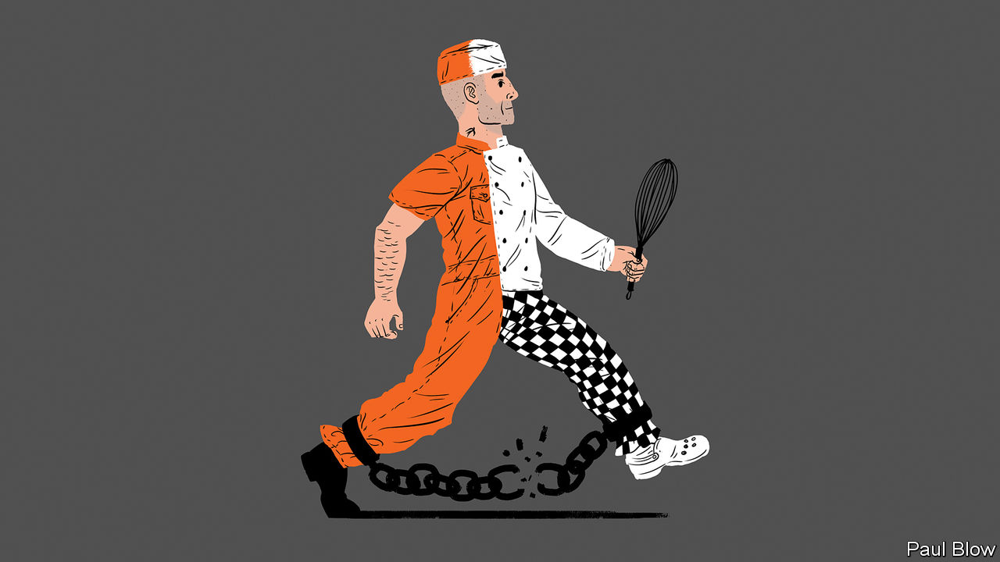

## Bartleby

# Jobs for jailbirds

> Getting prisoners into work seems to reduce reoffending

> Apr 4th 2020

A CONVICTED THIEF is sent to prison and struggles to adjust to his new environment until his culinary talents are discovered. By a very roundabout route, his kitchen skills lead to his rehabilitation. That is the plot of “Paddington 2”, a family film from 2017. It might also serve as the template for Clink. The charity trains prisoners in hospitality and catering, and ran five restaurants and cafés in Britain before the national lockdown brought about by the covid-19 pandemic. It trained 441 prisoners last year. They achieved 225 educational certificates. Over 280 employers have agreed to hire Clink graduates. Some ex-convicts have gone on to become head chefs at hotels.

Prisons are in the news because of the threat covid-19 poses to people locked up in a confined space. Some have been released early. But in normal times, which will one day return, getting prisoners back to work is one of the best ways to help their rehabilitation. A study by the Justice Data Lab, a British government body, conducted between 2009 and 2016 showed that 15% of Clink alumni reoffended, compared with 22% for other jailbirds with similar records.

Clink is not alone. Take Ali Niaz, a former drug dealer who managed to get an A-level in business during his time in prison. After his release, and a course at Madingley Hall in Cambridge, he became a business and life coach. He also runs a social enterprise helping ex-offenders and set up the Feel Good Bakery, where ex-prisoners make sandwiches for office workers (or did until the pandemic, though it is still paying its staff).

Mr Niaz received help from the Responsible Business Initiative for Justice (RBIJ), a transatlantic charity run by Celia Ouellette, a former death-row lawyer in America. She points out that 2.2m Americans, the population of a large metropolis, are locked up. America also has perhaps 5m ex-offenders. RBIJ helps businesses trying to employ both groups.

One of those is Televerde, a call-centre operator from Arizona. Ron Bell, its founder, was involved in prison administration and got a contract with the state of Arizona to provide work and training for female inmates. Now the company operates seven call centres in women’s correctional facilities, focusing on business-to-business marketing and sales. The women work 40 hours a week: part of their wage goes toward their upkeep, part can be spent in prison and the rest goes into a savings account for when they get out.

Around 40% of people at the Televerde corporate office are ex-prisoners. Some released on Friday start work there the next Monday. One former inmate, Michelle Cirocco, who has been with the company for 21 years, has held high executive positions, in charge of marketing and corporate social responsibility.

Not everyone who worked for Televerde while inside will find a job at headquarters when they leave. But the skills they learn are still useful; a study by Arizona State University shows that 94% of ex-Televerde workers have jobs after five years, earning 3.7 times the average wage for former convicts. In Ohio Dan Meyer runs Nehemiah Manufacturing, which was created ten years ago specifically to hire what he calls “second-chance citizens”—not just prisoners but people with a history of drug and alcohol abuse, and those from homeless shelters. The company licenses small brands from multinationals such as Pampers Kandoo, a line of products for toddlers. It employs 180 people, of whom 130 are in the “second chance” category.

Mr Meyer found that getting a job is not the only challenge for those released from prison. They also need help with housing and child care, which is why Nehemiah has employed three social workers. New staff are initially hired for three to six months and around 30-40% drop out in that period. But once they are hired full-time, the turnover rate is only 15%, which he says is low by industry standards. Many of the workers have drug-related problems and the company operates random drug-testing. If employees fail a test, they are offered rehab.

Nehemiah cannot employ all of Ohio’s second-chancers. So Mr Meyer created the Beacon of Hope business alliance. In total, the alliance has 80 members, including Kroger, a supermarket chain. Collectively, they have hired 600 vulnerable people.

Writing individuals off for life is not just callous. It also is economically inefficient. Society will be better if more jailbirds find jobs—be they those released early because of covid-19 or those still serving time.

## URL

https://www.economist.com/business/2020/04/04/jobs-for-jailbirds
