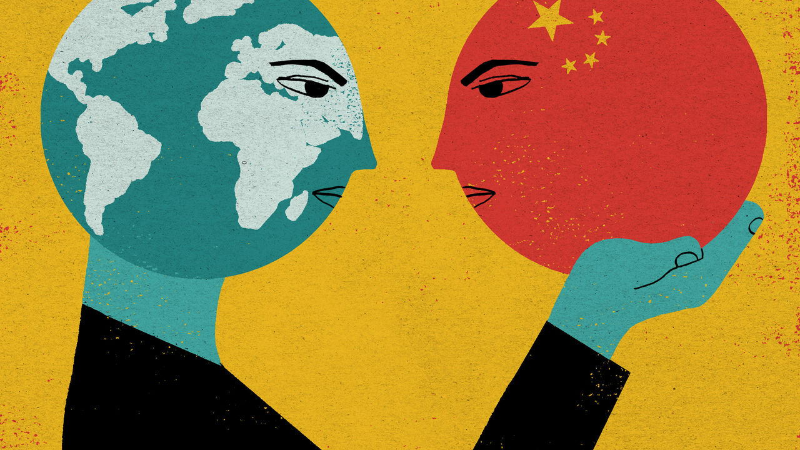

## Chaguan

# China is also an idea, revealing much about Western hopes and fears

> Outsiders with views of China are often talking about themselves

> Apr 4th 2020

Editor’s note: The Economist is making some of its most important coverage of the covid-19 pandemic freely available to readers of The Economist Today, our daily newsletter. To receive it, register [here](https://www.economist.com//newslettersignup). For more coverage, see our coronavirus [hub](https://www.economist.com//coronavirus)

MARCO POLO is a surprisingly dodgy role model for writers on China. Seven centuries have passed since the Venetian merchant published his account of travels in Asia, including 17 years in the service of Kublai Khan, China’s Mongol overlord. Polo’s China is a ruthless but efficient dictatorship, a market of staggering promise, a land of great cities and tireless workers. At the same time, he describes a China so isolated that three ingenious Europeans—Polo, his father and uncle—can help the Khan win a military campaign by building him a set of giant catapults. It is an early example of technology transfer via joint venture. Polo’s portrait of China, combining wonders, horrors and a dose of Western condescension, set a pattern followed by other authors for 700 years.

In recent years, however, some fine historians have begun to debate whether Polo made his Chinese adventures up, or borrowed his tales from Arab and Persian traders. It is odd that neither Mongol nor Chinese records contain any trace of Polo, though he claims to have governed the city of Yangzhou. It is puzzling that Polo’s memoirs never mention tea, chopsticks, calligraphy, foot-binding or the Great Wall. For all that, the truly striking thing, perhaps, is how little it matters whether Polo went to China.

Long before foreigners commonly travelled or worked in China—an actual country linked to the world by trade and by two-way flows of emigration and return—outsiders have held strong opinions about “China”, an Otherland that is as much an idea as a place on the map. “The Chan’s Great Continent”, a classic history of Western thought about China by Jonathan Spence, catalogues the many influential writers on China who never set foot there.

Enlightenment philosophers, notably, used China as a symbol for all that is good, or bad, about human society. Leibniz praised China as a land of order, Confucian morality and religious toleration—but mostly as a way to rebuke Christian monarchs stirring up sectarian hatreds in Europe. In contrast, to promote the merits of dividing state power between separate branches of government, Montesquieu damned China as a despotic state ruled by fear, whose peoples “can be made to do nothing without beatings”.

On the face of it, imaginary notions of China should not matter much during the covid-19 pandemic, which has left governments wrestling with hard questions about life and death. There is, for instance, nothing very abstract about a propaganda campaign under way inside China to stress that most new infections involve cases imported from abroad. Though almost all of these involve Chinese nationals, curbs on foreigners are tightening. The border has been shut to most of them. On March 27th the government shocked embassies in Beijing by declaring a halt to the issuing of new identity cards for most grades of diplomat. This was apparently in response to the flouting of virus controls by a Western envoy. Embassies, in effect, face a ban on staff rotations until at least mid-May.

Yet listen carefully to Western leaders discussing China in this crisis, and time and again their discussion of Chinese policies is a form of introspection. They are really agonising, aloud, about how they found themselves so dependent on a country like China. On March 29th the Mail on Sunday, a British newspaper, quoted government ministers blaming Chinese secrecy over covid-19 for ruining the world economy. How could Britain not now review Sino-British ties, including deals to let Huawei help build 5G networks, a minister asked. That sounds like an argument about China, but is really a cry of alarm about Britain’s sway in a harsh world.

Pushing back against headlines about China delivering medical supplies to Italy and other European countries, President Emmanuel Macron of France warned against becoming “intoxicated” with the boasts of rival powers (meaning, clearly, China). He noted that France and Germany had also sent substantial aid to Italy. Then Mr Macron let slip what really troubles him about this PR contest with China: that it reveals the limits of European solidarity. “I do not want this selfish and divided Europe,” he lamented.

Germany’s chancellor, Angela Merkel, is said to be wrestling with how to position her country in an age of sharp competition between two self-interested giants, America and China. Her choices have been narrowed by a loss of faith among Germany’s elite in the claim, once touted as “change through trade”, that commerce with China will nudge that country towards openness and democracy. China’s defiantly hardline turn leaves Germany in need of a foreign policy shorn of wishful thinking. That in turn condemns Germany to debate what sort of country it wants to be.

As for President Donald Trump, he won office, in part, with fiery speeches about China growing rich at Americans’ expense. Yet during this pandemic he seems strikingly unmoved by ethical questions about China’s conduct. Asked about Chinese propaganda accusing America of infecting China with covid-19, which his own aides have angrily denounced, Mr Trump shrugged. “Hey, every country does it,” he told Fox News, adding that his earlier insistence that covid-19 was caused by a “Chinese” virus was “very strong against China”.

America’s allies, along with many Trump administration officials and members of Congress, worry about China posing an unprecedented challenge to the post-1945 global order and the norms that underpin it. All evidence suggests that Mr Trump’s concerns are narrower and more domestic. His “China” is a proxy for globalisation, and for the failure of elites to shield American workers from competition. As for the actual autocracy called China, Mr Trump takes its ruthless self-interest for granted, and even praises it.

Western leaders disagree about how to handle China partly because the country has become a larger, more daunting and more assertive competitor. It is also because of a crisis of Western unity. As Marco Polo was the first to demonstrate, foreigners with visions of China are often talking about themselves. ■

Dig deeper:For our latest coverage of the covid-19 pandemic, register for The Economist Today, our daily [newsletter](https://www.economist.com//newslettersignup), or visit our [coronavirus hub](https://www.economist.com//coronavirus)

## URL

https://www.economist.com/china/2020/04/04/china-is-also-an-idea-revealing-much-about-western-hopes-and-fears
