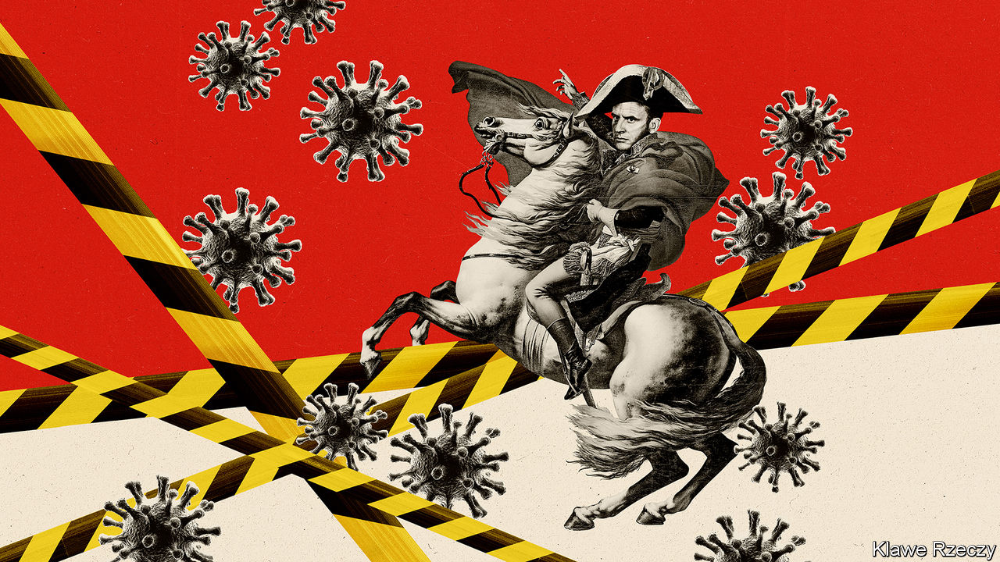
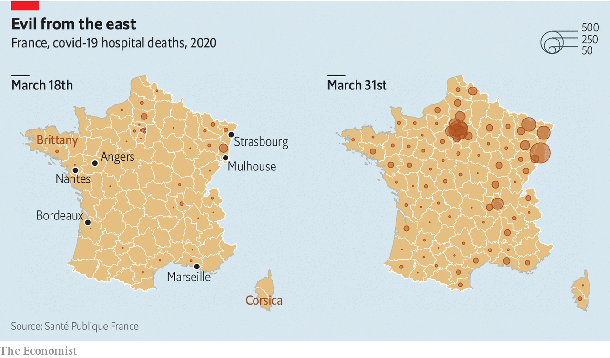

## Mobilising against a pandemic

# France’s Napoleonic approach to covid-19

> The pluses and pitfalls of a centralised approach

> Apr 4th 2020PARIS

Editor’s note: The Economist is making some of its most important coverage of the covid-19 pandemic freely available to readers of The Economist Today, our daily newsletter. To receive it, register [here](https://www.economist.com//newslettersignup). For more coverage, see our coronavirus [hub](https://www.economist.com//coronavirus)

THE TGV bullet-train that pulled out of Strasbourg railway station on the morning of March 26th made French history, but not for speed. Aboard were 20 patients on life-support machines, transferred onto beds mounted atop passenger seats, four to a carriage. Their railway journey took them from eastern France, the region first overwhelmed by covid-19, to critical-care units in Nantes, Angers and other cities in the west. By April 1st converted TGVs had transferred dozens of patients out of the east, and increasingly from Paris, too. This is the first time France has mobilised its high-speed trains for intensive-care transport, part of a national effort to relieve overloaded regional hospitals struggling with the pandemic.

By April 1st France had recorded 57,763 cases of covid-19 and 4,043 deaths. Its trajectory is less awful than that of Italy or Spain, but deaths are far higher than in Germany. As the country braced for worse to come, the government extended its lockdown until April 15th and warned the French: “We are going to live through a very difficult, very tense, very brutal moment.” France has a long history of central rule, and a powerful administrative machinery to enforce it, dating back to the time of Napoleon, and in part to the kings before him. The crisis is revealing the advantages of such a system—but also its limits.

The ancient French dirigiste reflex can be seen behind the swift geographical dispatch of intensive-care patients that began on March 18th. The department of Haut-Rhin saw an early cluster of cases, centred on a five-day evangelical gathering in Mulhouse. By March 17th, when President Emmanuel Macron put the entire country into lockdown, intensive-care units there were already swamped. It turned out that the SNCF, the state-owned railways, last year tested the conversion of ordinary passenger trains into medical transport during a disaster-planning exercise. Now TGVs are part of a countrywide reallocation system, which also involves the armed forces. The air force has flown patients on life-support from eastern France to hospitals in Brittany, Bordeaux and Marseille, while a Mistral-class naval vessel has transported other critically-ill people from Corsica to Marseille. Neighbouring countries have also taken patients from eastern France.

France’s administrative structure has also enabled it to impose and enforce confinement unapologetically. The day after lockdown was announced, the central bureaucracy had, naturellement, drawn up a new form, which each individual must sign to justify any trip out of the home. Policemen and gendarmes, patrolling the near-empty streets, parks and beaches, have since carried out a staggering 5.8m checks on such paperwork and imposed 359,000 fines. There has been scarcely a murmur at this, nor at the government’s “state of health emergency” law which, among other things, gives it powers to control prices of certain products and requisition stocks. Old habits die hard.

The emergency also makes use of the existing command-lines of a centralised bureaucracy. Among his measures to support workers and businesses, Bruno Le Maire, the finance minister, included a “partial unemployment” scheme to help firms avoid redundancies, under which the state pays 84% of employees’ wages. Despite initial wrinkles, it already covers 3.6m employees. Indeed the French seem to be reconnecting enthusiastically with their inner Jean-Baptiste Colbert, finance minister to Louis XIV. On a visit to a medical-mask factory on March 31st, Mr Macron declared that “the day after won’t look like the days before” and that it was now crucial “to produce more in France”. Even the cosy, unloved Parisian elite, which usually meets over dinner in parquet-floored salons, has become a handy network, as bosses of luxury firms and car-parts makers turn factories over to the health effort.

Yet in other ways France is also discovering the shortcomings of such a system. One is that the centrally made decisions can be wrong. Take the shortage of masks. Back in 2012, thanks to disaster planning, France had a stockpile of 1.4bn medical masks. By the time the covid-19 crisis began, however, that stock had dwindled to just 140m. The reason was a change of strategy, which proved flawed, to rely instead on contracts to import rapidly from China and elsewhere.

Another is that it can hinder local initiative. Next to Germany, for example, the French are lagging on testing. Germany’s decentralised health system seems to have helped encourage the rapid development of tests in different laboratories around the country, as well as their early use. “The Napoleonic question is really important,” says François Heisbourg, of the Foundation for Strategic Research, who was involved in France’s disaster planning 15 years ago: “On testing, we have seen a beautiful centralised system failing abjectly.”

Moreover a centralised administration relies on high levels of trust, since there are few alternative sources of authority. Yet public trust also requires patience, which is hard to manage in an emergency. This has been clear during a row over the use of chloroquine to treat covid-19, advocated by Didier Raoult, a microbiologist in Marseille. Even as the French central health authority expressed doubts, long queues appeared on the pavement outside his clinic. Olivier Véran, the health minister, initially kept to protocol by announcing that chloroquine would not be approved before undergoing full clinical tests. As public impatience mounted, on March 26th he decided to authorise its use for covid-19 patients in certain circumstances anyway.

It is a sobering moment for a country with a first-class health system and one of the highest life expectancies in the world. France is hoping that confinement will begin to slow the rate of admissions to intensive care to a manageable level while orders of extra equipment, including much-needed ventilators, come through. In the meantime, hospitals are doing what they can. And Paris, where the streets are as empty as intensive-care units are full, is steeling itself for the worst. ■

Dig deeper:For our latest coverage of the covid-19 pandemic, register for The Economist Today, our daily [newsletter](https://www.economist.com//newslettersignup), or visit our [coronavirus hub](https://www.economist.com//coronavirus)