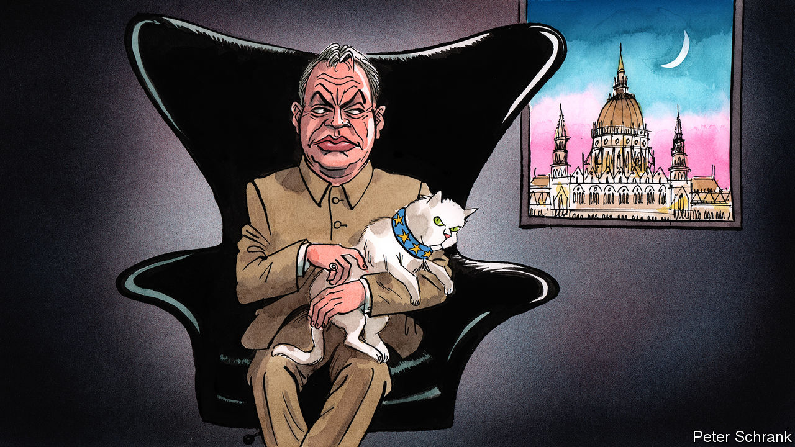

## Charlemagne

# How Hungary’s leader, Viktor Orban, gets away with it

> He takes near-dictatorial powers, while the EU does nothing

> Apr 2nd 2020

LIKE A BOND villain, Viktor Orban cannot resist revealing his plans. The Hungarian prime minister has never hidden his desire to entrench himself in power. Before taking office in 2010, he remarked ominously: “We have only to win once, but then properly.” True to his word, when handed a big enough majority by Hungarian voters, Mr Orban hollowed out the Hungarian state, rewriting its constitution, purging the country’s courts and nobbling the media. In 2013 he told an interviewer: “In a crisis, you don’t need governance by institutions.” Again, he has followed through. A law enacted on March 30th means Mr Orban can rule by decree—bypassing parliament—until the coronavirus crisis is over. In films the villain is thwarted after revealing his hand. But Mr Orban is up against the European Union, not James Bond, so he succeeds.

No one can say there was no warning. Mr Orban’s career—which has encompassed everything from anti-Soviet liberalism to right-wing nationalism via Christian Democracy—has been dedicated to the accumulation and maintenance of power, rather than the pursuit of principle. Those who knew him well saw what was to come. In 2009 Jozsef Debreczeni, the author of a critical biography, warned: “Once he is in possession of a constitutional majority, he will turn this into an impregnable fortress of power.” A combination of careful strategy, political cunning and a dash of luck have made this prediction come true.

To the frustration of those who have spent the past decade trying to stop him via legal means, Mr Orban is more astute than they think. His “reforms” tend to reach the edge of legal acceptability, but no further. If Mr Orban ever does hit an obstacle, he surrenders some gains, while keeping the bulk of them. (The Hungarian leader even has a name for this legal waltz: the peacock dance.) Opposition figures, civil-rights monitors and commentators around the globe have denounced the latest move as a big step towards dictatorship. Yet, so far, the European Commission has pledged only to examine it. This mealy-mouthed response stems from the fact that its lawyers see little glaringly wrong with the act as it is composed. On paper, Hungary’s parliament can end the state of emergency if the government oversteps the mark. In practice, this probably would not happen. Mr Orban’s Fidesz party—over which he has had near-absolute control for nearly three decades—has two-thirds of the seats in parliament. It is in this gap between legal theory and political reality that Mr Orban thrives.

Luck plays its part in Mr Orban’s success. Hungary is a small country. For EU officials, the erosion of the rule of law in Poland, with its 40m citizens, matters far more in practice if not principle. Mr Orban has consequently been free to attack the EU institutions that bankroll his country to the tune of up to 6% of GDP in some years without generating a fatal backlash from Brussels. Hungary slips down the order of business when leaders are busy with other things, such as a pandemic. Mr Orban has also been fortunate in his opponents. In 2006, while Mr Orban sat in opposition, the then Hungarian prime minister was recorded slating his own government. (“Obviously we have been lying our heads off for the past one-and-a-half, two years.”) A mammoth majority for Mr Orban followed. Hungary’s opposition parties have failed to coalesce. When they do manage to rub along, they succeed. Opposition parties won local elections in Budapest last year.

If Mr Orban is lucky in his enemies, he is even luckier in his allies. Fidesz is still a member of the powerful European People’s Party, a group of centre-right parties across Europe that carves up top jobs in the EU. The commission’s president, Ursula von der Leyen, belongs to the same family, as does Angela Merkel. Under the EPP’s umbrella, Mr Orban was treated as an unruly teenager while rearranging the Hungarian state, rather than a tumour in Europe’s body politic. (At one summit, the then European Commission president, Jean-Claude Juncker, joshingly called him “dictator”.) Fidesz was suspended in 2019, when Mr Orban’s contempt for the rule of law became too brazen, but the EPP grandees stopped short of kicking him out. The collapse of centre-right parties in Italy and France mean Fidesz’s delegation of MEPs is the joint third-largest in the group. Political winds are blowing in Mr Orban’s favour. Bluntly, Mr Orban has not been removed because a majority of the group were keen to keep him. It was the EPP’s dwindling band of liberals who winced at Mr Orban’s actions. Now they are outnumbered by a nationalist strand, who broadly agree with Mr Orban on things like shutting out refugees. The Hungarian leader is less of an outlier in the EPP than he first appears.

The tsunami of international criticism, in which Mr Orban has been labelled everything from an autocrat to a latter-day Hitler, will not bother the Hungarian leader or his acolytes. It is a fight they want to have. In their minds, the coming crisis is another chance to prove their critics wrong. They put such arguments in the same bracket as those who criticised Mr Orban’s government for erecting a fence and beating back—often literally—migrants and refugees at Hungary’s border during the migration crisis in 2015. Since then, similar hard-nosed policies have been adopted across the EU (usually minus the beating). Mr Orban does not mind being called a dictator. As long as he stops short of outright tyranny, he can paint foes as hysterical. He can also point out that other democracies grant the government extra powers during an emergency, and pretend his intentions are no different.

Reining in Mr Orban will be hard, but not impossible. “The only language he understands is power and money,” says Andras Biro-Nagy of Policy Solutions, a research institute. Brussels has little legal power to stop Mr Orban, but it does have money. Stemming the flow of EU cash to Mr Orban’s government would hurt. So the EU should do it. And after a decade of ignoring his sins, the EPP should stop providing a figleaf of legitimacy to the bully of Budapest.■