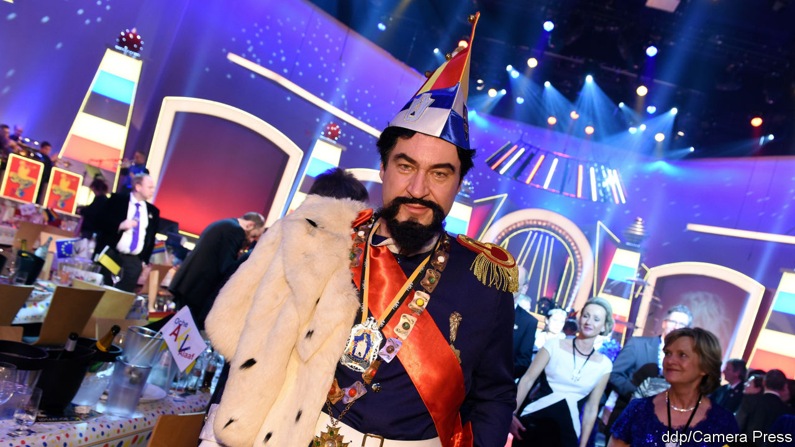
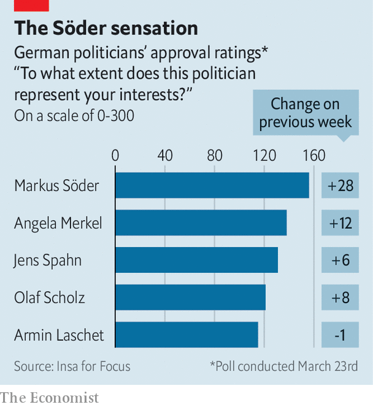

## Bavaria’s action man

# Markus Söder makes his mark

> Might he bid to be Germany’s chancellor?

> Apr 4th 2020MUNICH AND NEUBEUERN

Editor’s note: The Economist is making some of its most important coverage of the covid-19 pandemic freely available to readers of The Economist Today, our daily newsletter. To receive it, register [here](https://www.economist.com//newslettersignup). For more coverage, see our coronavirus [hub](https://www.economist.com//coronavirus)

THE CHATTER is flowing almost as freely as the beer at the Stammtisch (regulars’ table) in Neubeuern, a pretty Bavarian town near the Austrian border. Supporters of the Christian Social Union (CSU), a conservative party that runs the state, have gathered to take stock ahead of local elections. Asked if Markus Söder, the CSU chief and state premier, is doing well, all ten put a hand up. Asked if he would be a good chancellor, the tally falls to six; he would struggle to hold Germany together, says a dissenter. This informal poll was taken before Mr Söder imposed some of Germany’s strictest social-distancing rules. His performance since may have convinced some of the doubters.

Bavaria, a big, rich, swaggering state, has more covid-19 cases than any other. But Mr Söder is having a good crisis. He closed schools early; when other states followed it seemed as if Munich rather than Berlin was driving policy. He inserted himself into national economic debates and left other state premiers, such as Armin Laschet in North Rhine-Westphalia, who has said Germany must think about easing restrictions, looking flat-footed or naive. As others catch up, Mr Söder finds new hobby-horses: his current obsession is ramping up the production of face-masks.

Mr Söder’s elevation to Germany’s de facto corona-chief has surprised many, including his own supporters. Sceptics were legion when he took over in Bavaria two years ago, says Ursula Münch at the Tutzing Academy for Political Education. His ambition, honed for years in the mudpit of Bavarian politics, seemed too raw. He started silly culture wars. In October 2018 he lost the CSU its long-held majority, having tilted rightward in a vain bid to squeeze the populist Alternative for Germany. (He now governs with a smaller party, the Free Voters.)

Yet in the spirit of the outlandish costumes he loves to don in carnival season, Mr Söder simply adopted a new identity. Detecting Germans’ growing climate concerns, he broadcast his love for bees and trees. He found a statesmanlike tone with wide appeal, stressing the economy and technology. Mr Söder hopes to maintain the CSU as a broad church, emulating the party’s other great leaders, Edmund Stoiber and Franz Josef Strauss. “We have gone through a tough process of transformation,” says Markus Blume, the CSU’s general secretary. It seems to have paid off. As Angela Merkel’s Christian Democrats (CDU) slid in the polls, the CSU, its sister party and national coalition partner, stabilised.

Then came covid-19, which gave state leaders, who run health care and public order, a chance to shine. Germans used to viewing Bavarians with a blend of scorn and envy discovered an unfamiliar feeling of respect. “I’m slowly becoming a Söder fan,” says a bewildered TV-watcher in a recent Berlin newspaper cartoon, fearing he has contracted the fever. In a recent poll Mr Söder emerged as Germany’s most popular politician—even outpacing Mrs Merkel.

No wonder people are asking if he might seek the biggest job of all. Mrs Merkel will leave the chancellery at the next election, in autumn 2021, and at some point the CDU/CSU must anoint a joint candidate to replace her. The victor of the CDU’s agonising leadership contest—once due to be settled in late April, but now on pause—would be the obvious choice. But the weakness of the field (which includes Mr Laschet) and Mr Söder’s success running Bavaria had already begun to turn CDU heads. His recent efforts have turned more.

Mr Söder has always insisted he has no interest in quitting Munich for Berlin. Now, when lives are at stake, he dismisses the speculation as indecent. Messrs Strauss and Stoiber both ran, but failed, to become chancellor. Yet the longer Mr Söder outshines his rivals, the more Germans will wonder if he might seek to break that Bavarian losing streak. ■

Dig deeper:For our latest coverage of the covid-19 pandemic, register for The Economist Today, our daily [newsletter](https://www.economist.com//newslettersignup), or visit our [coronavirus hub](https://www.economist.com//coronavirus)

## URL

https://www.economist.com/europe/2020/04/04/markus-soder-makes-his-mark
