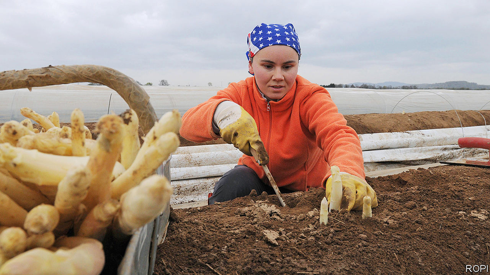

## Farmhands needed

# When borders close, who will pick the crops?

> Lockdowns to curb covid-19 disrupt Europe’s food supply

> Apr 4th 2020BEELITZ AND WARSAW

Editor’s note: The Economist is making some of its most important coverage of the covid-19 pandemic freely available to readers of The Economist Today, our daily newsletter. To receive it, register [here](https://www.economist.com//newslettersignup). For our coronavirus tracker and more coverage, see our [hub](https://www.economist.com//coronavirus)

NO SONG CAPTURES the mood of Germany in spring quite like the 1930 hit “Veronika, the spring is here”: “The girls are singing tra-la-la, the whole world is enchanted. Veronika, the asparagus is sprouting!” April in Germany is Spargelzeit, or “asparagus time”. Purists race to farm stalls to buy the freshest stalks (white, unlike the green summer variety), and serve it up with sliced ham and hollandaise sauce or with breadcrumbs and butter. But this year much of the crop will rot in the fields. Border restrictions to fight covid-19 are keeping the eastern European agricultural workers who help to pick it at home.

Germany normally employs 30,000 seasonal farmhands for the asparagus harvest, with 5,000 in the state of Brandenburg alone. So far in Brandenburg only about half that number have arrived. Germany’s border is open for Poles working in critical sectors, but Polish farm workers hesitate to cross it because their government says any who do will be quarantined for 14 days on their return. In late March, desperate asparagus farmers chartered a plane to fly in 190 Romanians. They nearly failed to get in: on March 25th Germany barred seasonal workers from countries that do not belong to the Schengen border-free zone.

Asparagus is just the tip of a problem that European farmers will soon face. Germany will need almost 300,000 seasonal farmhands this year. France, where strawberry season is approaching, needs 200,000 in the next three months; between a third and two-thirds usually come from abroad. The Netherlands is Europe’s biggest agricultural exporter, but most of the workers who pick tomatoes and cucumbers in its greenhouses are from eastern Europe, and many will not come this year.

Some industries can be put on hold, but not agriculture. On March 30th the European Commission laid out principles to make sure crucial employees, including seasonal farm workers, can cross borders. But Bulgarians and Romanians travelling to western Europe would normally go through Hungary, which shut its border with Romania in mid-March. (It has reopened, but mainly for freight and commuters who live near the frontier.) Even where borders are open, many workers are not coming, worried about contracting covid-19 abroad or being quarantined when they return.

Staying at home means hardship. Nitfie Salimova, a Bulgarian, had planned to go to Belgium in May to pick berries, a job that last year earned her €150 ($160) per day. That is almost half the Bulgarian minimum monthly wage. Her earnings paid for smartphones for her daughters and a Black Sea holiday. The head of a Bulgarian agency that sends 500 workers per year to Germany, Austria and Britain says no one is going now; in fact, scores are heading home.

In Poland the problem is not just loss of jobs in Germany, but a shortage of the Ukrainians who work on Polish farms. Jakub Sztandera, who grows mushrooms in Siedlce, employs 200 workers in his climate-controlled sheds, 90% of them Ukrainian. When Poland closed its borders on March 14th, Ukrainians rushed to leave, and Mr Sztandera is not sure how to replace them. Around 1.3m Ukrainians were estimated to be working in Poland before the border closed. The head of the country’s farmer’s union says that without them the food supply will be at risk.

Some countries hope to limit the damage by letting workers who are already there stay longer. Belgium has lengthened work-permits for foreign farmhands, and Germany has extended the period in which they can work without paying local social security taxes. In the Netherlands a collapse of demand for flowers has left workers who came to pluck tulips with little to do; some have gone to vegetable farms.

Another solution is to recruit locals idled by the shutdown. In Germany a website for farm jobs received thousands of postings on its first day. France’s agricultural umbrella organisation, the FNSEA, says its new jobs site has 150,000 subscribers. An online jobs market in the Netherlands called “Help Us Harvest” has 2,500 openings. But it is not clear how many jobs have actually been filled.

Europe’s farmers would rather not rely on first-timers. Edwin Veenhoeve, an asparagus farmer in the Netherlands, says that in the past 40 years perhaps ten Dutch people had ever applied to work the harvest on his family farm. This month alone 30 have applied. Still, compared with experienced Poles, Romanians and Bulgarians, they are not ideal farmhands, he adds: “Dutch people are used to working Monday to Friday, nine to five. But the asparagus keeps growing seven days a week.” ■

Dig deeper:For our latest coverage of the covid-19 pandemic, register for The Economist Today, our daily [newsletter](https://www.economist.com//newslettersignup), or visit our [coronavirus tracker and story hub](https://www.economist.com//coronavirus)