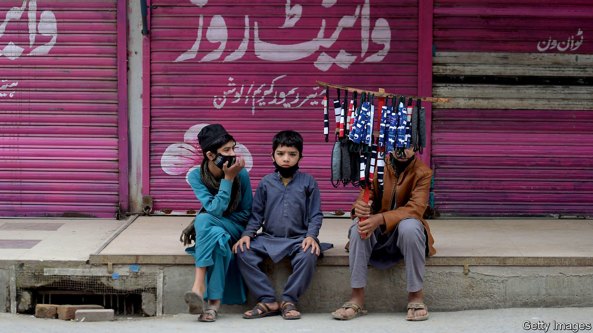
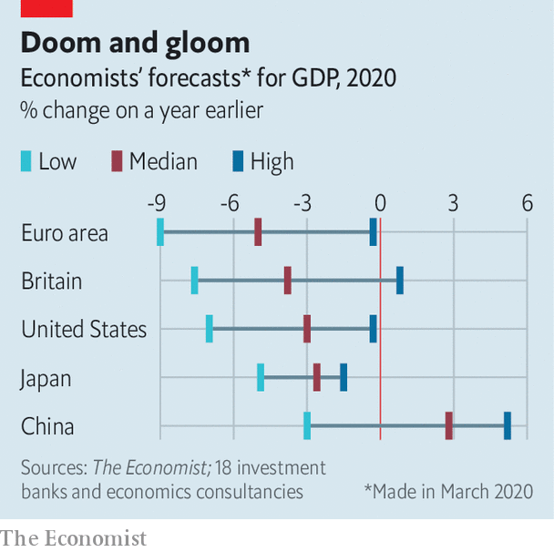

## Doom and gloom

# Economists’ forecasts for GDP growth in 2020 vary widely

> But all expect a dreadful year

> Apr 4th 2020

ECONOMISTS cannot revise down their forecasts of GDP growth for the effects of the coronavirus pandemic fast enough. All agree that 2020 will be dreadful, but some expect recovery to take longer than others, making for a much grimmer year.■

## URL

https://www.economist.com/finance-and-economics/2020/04/04/economists-forecasts-for-gdp-growth-in-2020-vary-widely
