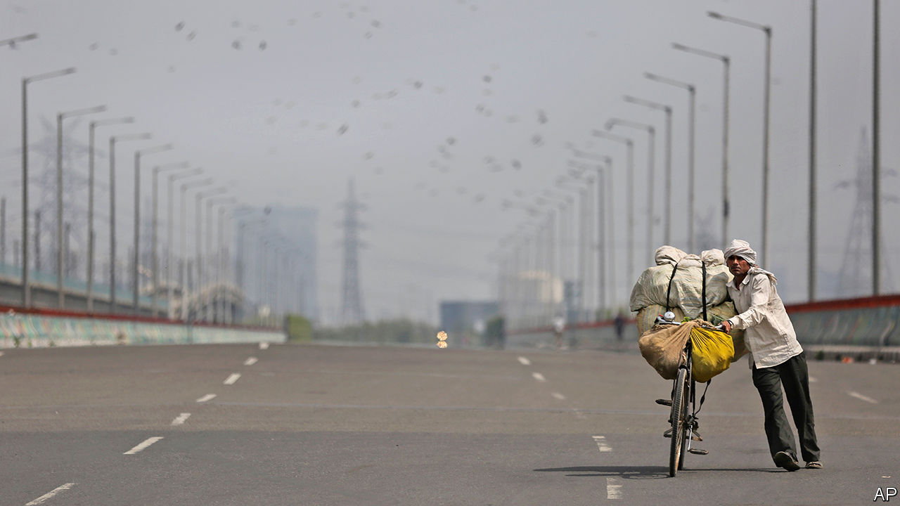
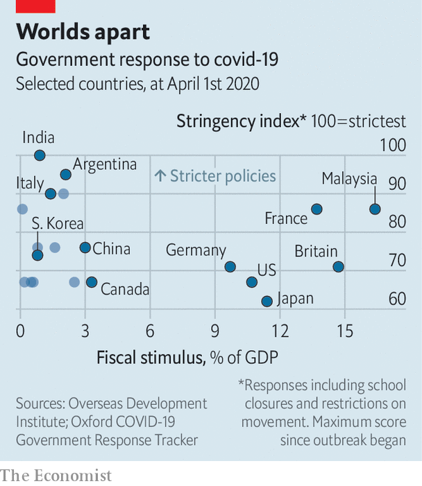
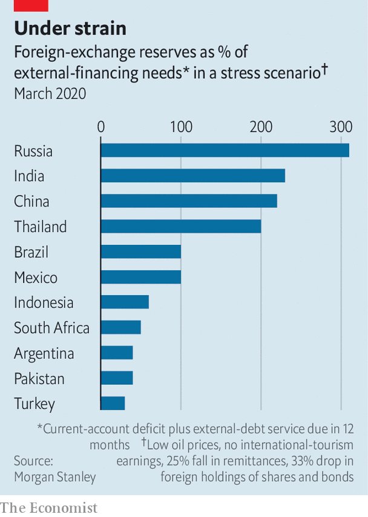

## Stringent and stingy

# Emerging-market lockdowns match rich-world ones. The handouts do not

> Few emerging-economy governments can afford a generous fiscal response

> Apr 4th 2020HONG KONG

Editor’s note: The Economist is making some of its most important coverage of the covid-19 pandemic freely available to readers of The Economist Today, our daily newsletter. To receive it, register [here](https://www.economist.com//newslettersignup). For more coverage, see our coronavirus [hub](https://www.economist.com//coronavirus)

WHEN THE global financial crisis struck emerging economies in 2008, two kinds of exodus ensued. Footloose capital fled their financial markets and migrant labour left their cities for the bosom of their hometowns and villages. Since the “coronacrisis” struck, the first exodus has recurred on an unprecedented scale: foreigners took over $83bn out of emerging-market shares and bonds in March, according to the Institute of International Finance, a banking association, the largest monthly outflow on record. But the exodus of labour has been hampered by governments’ efforts to shut down transport and lock down populations, in order to slow the spread of covid-19.

At least 27 emerging economies have imposed nationwide restrictions on movement, according to a tally kept by Thomas Hale and Samuel Webster of the Blavatnik School of Government at Oxford University. Vietnam became the latest candidate for the list, requiring its citizens to stay home until April 16th. Pakistan’s prime minister, Imran Khan, once warned that a lockdown would bring hunger and ruin. But even Pakistan “has swiftly moved from we can’t afford lockdown, to we can’t afford not to lock down,” notes Charlie Robertson of Renaissance Capital, an investment bank.

All countries have spared “essential” goods and services from restrictions. But what counts as essential? India’s list, derived from a law passed in 1955, at first failed to mention feminine-hygiene products, causing confusion. South Africa scrambled to add toothpaste and baby products to a list of “basic goods” that had omitted them. There have been errors of inclusion too. Days into its lockdown, South Africa’s government discovered that some pubs had been mistakenly awarded certificates to operate.

Even industries deemed essential can suffer from broader restrictions. One pharmaceutical plant in northern India says it can produce, but not ship, its wares. A maker of medicine capsules eventually won approval to keep operating. But by then some of its employees had left town and others were scared to return to work.

Whereas previous crises have imposed a financial constraint on economic activity, this disaster has imposed a “physical constraint”, points out Alberto Ramos of Goldman Sachs, a bank. He expects Latin America to suffer its worst contraction since the second world war, exceeding even its debt crisis of the 1980s. Much depends on how long the lockdowns last. India’s is due to be lifted on April 15th, but restrictions may linger in states with high numbers of infections, points out Priyanka Kishore of Oxford Economics. Several of those states, including Maharashtra and Karnataka, are among the biggest contributors to India’s economy. If 60% of the country remains locked down until the end of April, she calculates, up to 10% of India’s GDP in the second quarter could be lost.

The lockdowns in many emerging markets are as tough as in the rich world, or more so, suggests an index created by Mr Hale and Mr Webster measuring the “stringency” of a government’s response to the pandemic. But unlike their richer counterparts, few emerging-economy governments can match this stringency with an equally generous fiscal response, according to numbers collated by Sherillyn Raga of the Overseas Development Institute, a think-tank (see chart).

Malaysia may be one exception. It has unveiled a relief package with a face value of over 16% of GDP, including loan guarantees, wage subsidies and even free internet during the period of social distancing. Not many other emerging economies can enact anything similar. India, for example, has announced a plan to help the poor worth 1.7trn rupees ($23bn), only about 0.8% of GDP. Even that includes previously budgeted outlays that will merely be spent sooner. South Africa’s fiscal response has been inhibited by rising borrowing costs. Last week Moody’s became the last of the big three credit-rating agencies to strip it of its investment-grade status, calculating that the government’s budget deficit this fiscal year would exceed 8% of GDP and that its debt, including its guarantees to state-owned enterprises, would rise from 69% of GDP to 91% by 2023.

Central banks have been a little more adventurous, cutting interest rates despite the slump in emerging-market currencies. Some, including those in Colombia and South Africa, will emulate America’s Federal Reserve by buying government bonds in the open market to reduce volatility. Indonesia will cut out the middleman: new rules allow its central bank to, in extremis, buy bonds directly from the treasury.

But no emerging market, almost by definition, can afford to ignore its exchange rate entirely. Russia’s central bank, for example, recently refrained from cutting interest rates because the rouble has tumbled so dramatically in the wake of the country’s oil-price war with Saudi Arabia. The tussle caused oil prices to dip below $20 a barrel this week, according to America’s benchmark, for the first time since 2002.

In some countries (such as Argentina), governments still have substantial foreign-currency debt. In others, companies do (Turkey). And in still others (South Africa), a large share of local-currency debt is held by foreigners, who will be reluctant to roll over their holdings if the currency becomes unmoored.

In order to measure countries’ vulnerability, analysts at Morgan Stanley, a bank, have calculated the amount of hard currency emerging economies would need to service their foreign debt this year and cover their trade balance, if oil prices remain low, remittances from overseas workers drop by 25%, export earnings from tourism and travel disappear, and foreigners dump a third of their holdings of shares and bonds. They then compare this amount to these countries’ foreign-exchange reserves (see chart). Many emerging economies would lack enough reserves to meet their needs, leaving them reliant on further foreign borrowing in hostile markets.

In such circumstances, some emerging economies will turn to the IMF. Indeed the fund says over 80 countries have already asked for some form of help in recent weeks. Others may extend their lockdowns into the financial realm. In a report published on March 30th the United Nations Conference on Trade and Development argued that some countries should impose capital controls, with the IMF’s blessing, to “curtail the surge in outflows”. Having prevented labour from moving freely within their borders, some overstretched emerging markets may now be tempted to stop capital moving freely across them. ■

Dig deeper:For our latest coverage of the covid-19 pandemic, register for The Economist Today, our daily [newsletter](https://www.economist.com//newslettersignup), or visit our [coronavirus hub](https://www.economist.com//coronavirus)

## URL

https://www.economist.com/finance-and-economics/2020/04/04/emerging-market-lockdowns-match-rich-world-ones-the-handouts-do-not
