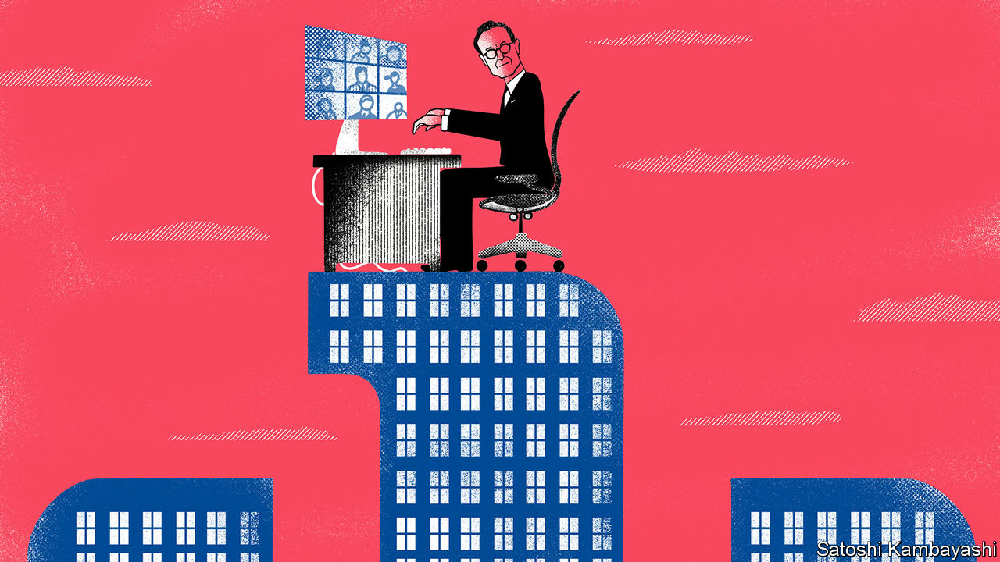

## Lonely work

# How Allianz is dealing with market turmoil

> Europe’s largest insurer is exposed through its life-insurance and its asset-management arms

> Apr 4th 2020BERLIN

Editor’s note: The Economist is making some of its most important coverage of the covid-19 pandemic freely available to readers of The Economist Today, our daily newsletter. To receive it, register [here](https://www.economist.com//newslettersignup). For more coverage, see our coronavirus [hub](https://www.economist.com//coronavirus)

OLIVER BÄTE still goes to his office every day on Munich’s Königinstrasse, next to the English Garden, but it is mostly empty. “You are always alone as a CEO,” says the boss of Allianz, who took the reins of the 130-year-old insurance giant in 2015. And never more so than during a pandemic, when you are in charge of 147,000 employees in over 70 countries, who are looking after hundreds of thousands of customers, many of whom are in financial despair because of covid-19. “Italy is overwhelmed,” says Mr Bäte. Only 30 of its several thousand employees in Milan are at the office.

The company will support clients wherever it can, says Mr Bäte. He is frequently on the phone with officials in Brussels and Berlin, discussing ways to help governments marshal money for programmes to support small and midsized companies.

Thousands of firms are looking to their insurers, as well as the state, to cover some of the costs of shutting down. But neither property-and-casualty nor life-insurance policies generally cover pandemics. This is mainly because the risk is huge and unpredictable, but also because such policies were not until now much in demand. Allianz covers certain elements of a pandemic, such as business interruption for two weeks. But it can only underwrite slices of the risk, says Mr Bäte. Otherwise even the strongest insurer would go bust.

Legal wrangles over policy exclusions loom over the industry. State lawmakers in America (where insurance is regulated at state level) have proposed new laws to force insurers to pay billions of dollars for business interruptions related to mandatory shutdowns. The issue is simmering in Europe, too—though fewer cases are likely to end up in court. Politicians are also urging insurers to lower premiums in other business lines, for instance car insurance, or to divert profits from these to help stricken corporate policyholders. Insurers can make more money than usual from motor policies during lockdowns, since quieter roads mean fewer accidents.

Allianz has many more immediate concerns. As the owner of Euler Hermes, a big provider of credit insurance—which firms buy to protect receivables from loss—Allianz is directly exposed to rising corporate defaults. Mr Bäte vows to try to keep small businesses going by not making drastic cuts to the credit lines it offers with such policies. France is set to offer a reinsurance backstop to limit potential losses for credit insurers that help keep covid-stricken firms afloat; Germany may follow suit.

Allianz’s huge asset-management arm—the world’s second-largest active fund manager—is heavily exposed to the carnage, too. The business, which comprises PIMCO, a bond-fund giant, and the smaller Allianz Global Investors, oversees some $2.3trn and generates up to a quarter of group profits. It had a very good January and February, but in March it was “like turning a light switch off”, says Jackie Hunt, who leads the division. Clients rushed to redeem funds, especially in fixed income, after stockmarkets plummeted (Mr Bäte says Allianz beat an “early” retreat from American equities). Hedging has become more difficult. The cost of protection for a book of variable annuities, for instance, “shot through the roof”, says Mr Bäte. “It’s a hundred million here, a hundred million there.”

Allianz is exposed to markets both in its life-insurance business, as an investor of clients’ premiums, and as an earner of fund-management fees. Ms Hunt thinks the crisis will speed up the move from active to passive management in equities and squeeze fee margins. Yet she insists that this is a time when active managers prove their value, especially in fixed income.

When time allows, Mr Bäte says, he is pushing on with a plan to slim Allianz down and increase efficiency by embracing AI and machine learning. He estimates that up to half of his working day is taken up with covid-related issues. The outlook is unclear: for now, he says, he is not pondering a profit warning. He is preparing for an annual general meeting on May 6th, which for the first time will take place virtually. It will be a lonely day for the gregarious former McKinsey consultant. ■

Dig deeper:For our latest coverage of the covid-19 pandemic, register for The Economist Today, our daily [newsletter](https://www.economist.com//newslettersignup), or visit our [coronavirus hub](https://www.economist.com//coronavirus)

## URL

https://www.economist.com/finance-and-economics/2020/04/03/how-allianz-is-dealing-with-market-turmoil
