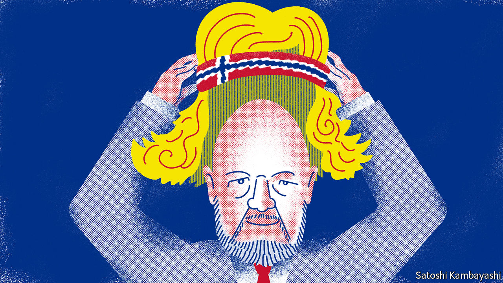

## Buttonwood

# The departing boss of Norway’s oil fund on building an asset manager

> Norges Bank Investment Management is the world’s single largest owner of equities

> Apr 4th 2020

THERE IS A point in a conversation with Yngve Slyngstad when he invokes Bjorn Borg, the Nordic tennis star of the 1970s. The Borg approach—make sure you don’t lose; above all, be solid—is one Mr Slyngstad has instilled in Norges Bank Investment Management (NBIM), the organisation he has run since 2008 from within Norway’s central bank. Its target, to beat a benchmark by 0.25 percentage points a year, is modest. But meeting it has led to immodest wealth.

Mr Slyngstad is to step down later this year when Nicolai Tangen, a London-based hedge-fund manager, takes his place in Oslo. The departing boss resigned in October, 50 years to the day after Norway first struck oil. The same day Norway’s oil fund passed Nkr10trn ($900bn) in value. It is the world’s largest single owner of equities. On average it owns 1.5% of every listed firm globally.

This seemed improbable when Mr Slyngstad joined in 1998. The price of oil was falling towards $10 a barrel. The idea of an oil-reserve fund seemed risible. Yet Mr Slyngstad left a well-paid job in the private sector. What attracted him was autonomy. He and his senior colleagues used it to build a fund manager based on sound principles. Discipline, solidity, minimising errors—these Borg-like tenets are difficult to follow when managing a portfolio. But they are key to investing success.

Norway’s oil fund was set up in 1996. Its founding stemmed from an awareness that oil-producing countries run into trouble. One trap is the “resource curse”, the corruption that mineral wealth often fosters. Another is “Dutch disease”—currency appreciation that then retards the progress of other export industries. The fund is primarily a means to smooth the effect of volatile oil revenues on the government’s budget. All oil revenue is paid into it. It then makes a steady contribution to the budget. A decade-long oil boom created a windfall. The fund came to be seen in a new light, as an endowment for future generations. At its peak last year, it was worth around three times Norway’s annual GDP.

Its wealth is also the fruit of judicious investment. Mr Slyngstad was brought in to build the fund’s equities arm; until then all the money had been in bonds. In principle, a long-horizon investor should tilt towards riskier shares. But even the best principles can be hard to follow. This became clear soon after Mr Slyngstad was made boss. The fund had raised the equity share of its portfolio from 40% towards 60% during 2008. The timing looked bad. The stockmarket crashed in the autumn. A rally in the fund’s bond holdings limited the damage. Still, the fund lost 23%.

There was then a tough decision to make. The principles of the fund called for rebalancing: selling bonds that had gone up in value to buy shares that had become cheaper, thus reaching the 60% equity weight. It takes stomach to buy assets that others are fleeing from. Some funds suspended their rebalancing rules. Was there hesitation? “Yes, of course,” says Mr Slyngstad. It was a big political risk. If the stockmarket did not revive, there would be a reckoning. Even so, the finance ministry gave its blessing. “We ended up buying $175bn of equities, 0.5% of the market, during a huge crisis.” This set the fund up nicely for the ten-year bull market that followed. Rebalancing is now hard-wired into its processes. There are times, such as now, when shares have again fallen a long way and it is easy to lose your nerve. It is usually the worst time to do so.

The fund’s long-term focus means it can be bold during crises. But there are also constraints that do not apply to other investors. The need for transparency rules out dabbling in private-equity funds. NBIM has been a pioneer in socially responsible investment. This might look like Nordic do-goodery and a sop to posturing politicians. But the approach is hard-headed. A lot of decisions to exclude stocks are taken with an eye to long-term returns. Coal shares, for instance, are out because the business does not appear to have a lasting future. Companies in emerging markets that do not pass muster on corporate governance are avoided. In general this has been a way to improve returns.

The tennis analogy is: stay on your baseline; eliminate basic errors; be solid first—and only then, be smart. You will win in the long term. A lot of fund managers see a risk to their careers in looking too far into the future. They may lose clients in the meantime. Things are different at Norway’s oil fund. “The career risk”, says Mr Slyngstad, “is not to implement the strategy.”