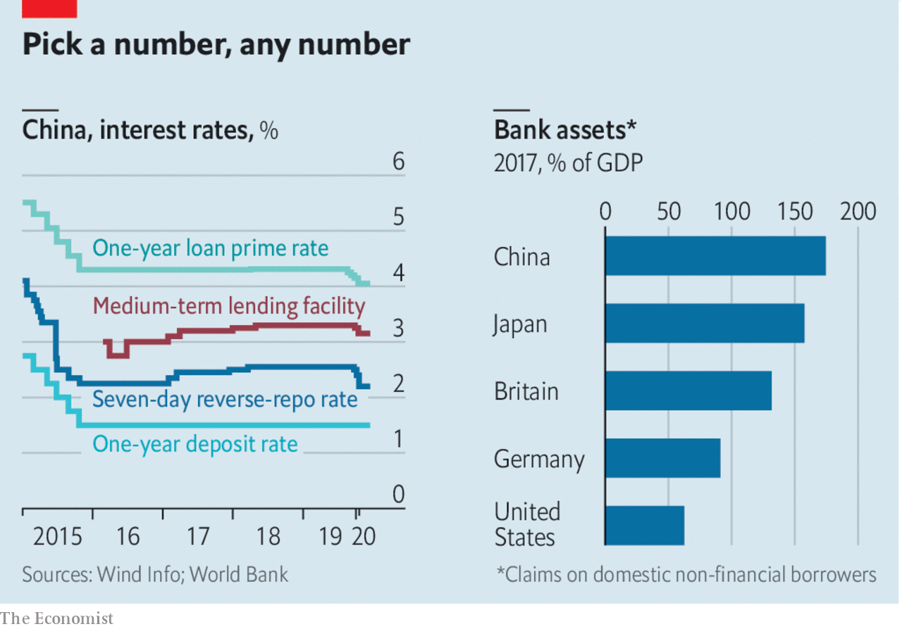

## Free exchange

# What China’s interest-rate muddle says about its financial system

> Ask a Chinese economist what the benchmark rate is, and brace yourself for an avalanche of numbers

> Apr 2nd 2020

IN 1979, WHEN Paul Volcker started jacking up interest rates to quell inflation in America, China launched a radical experiment of its own: it created commercial banks. Deng Xiaoping was trying to steer the country away from central planning. Four decades on, Mr Volcker’s job long done, China’s transition is still unfolding. For evidence of this, look at its interest-rate muddle amid the coronavirus-induced slowdown. Ask a Chinese economist what the benchmark rate is today—a simple question in most countries—and brace yourself for an avalanche of acronyms and numbers.

There are, to name the main contenders, the one-year deposit rate (now 1.5%), the seven-day reverse-repurchase rate (known as the DR007, 2.2%), the medium-term lending facility (MLF, 3.15%) and the one-year loan prime rate (LPR, 4.05%). Each, depending on one’s focus, has a claim to benchmark status. Sorting through all these rates is not merely an exercise in banking esoterica. It is a window into how China manages its financial system.

Start with the basics. China’s central bank is highly interventionist, by design. For years it set loan quotas for banks, told them what sectors to support and dictated the rates at which they took deposits or extended loans. To varying degrees, it still wields these powers. But with the economy ever bigger, Chinese officials know such a broad remit is untenable. So their goal, first declared a quarter-century ago, is interest-rate liberalisation: to let banks make their own decisions. In a fully liberalised system, the People’s Bank of China would focus on a single rate that anchors the economy, adjusting it as needed—the Platonic ideal of any central bank.

Over the past few years China seemed to make strides in this direction. The central bank began phasing out its fixed lending and deposit rates. In their place it emphasised more flexible rates. It developed a wide corridor for guiding rates, anchored by the DR007 (the rate at which banks lend to each other) and the MLF (a monthly open-market facility). Meanwhile the LPR, the rate for lending to prime customers, became the new standard for all loans. Its pricing was based on the MLF, which in turn reflected the DR007. It might sound like a right mess. But squint hard enough and it looks like modern central banking: the People’s Bank keeps interest rates within a target range by managing the level of cash in the financial system.

Yet the covid-19 crisis has shown that this is only part of the story. The central bank has cut its newer, more flexible rates to lower lending costs. But the current debate, fuelled by the central bank itself, is over when it will cut the benchmark deposit rate—that is, one of the traditional fixed rates. That makes it clear that interest rates in China are not yet liberalised. The central bank still has a firm grip on rates paid to savers (the benchmark deposit rate) and a strong, if more nuanced, hold on lending rates (the DR007-MLF-LPR alphabet soup).

Why is it so hard for the government to let go? The explanation can be found in two striking facts about Chinese interest rates. First, they are much lower than one would expect for an economy growing so quickly, coronavirus notwithstanding. The real one-year deposit rate is negative. This is not new. China has long been an exemplar of financial repression, limiting savers’ returns in order to make cheap funds available to finance sky-high investment.

Second, despite the low interest rates, Chinese banks are immensely profitable. According to the latest data, they account for 17% of the market capitalisation of the domestic stockmarket but 39% of the profits of all listed firms. The secret of their success is the spread between what they pay savers and charge borrowers, or the net interest margin. It is not that they are so brilliant at managing their books. Rather, the lack of true rate liberalisation assures them a net interest margin of two percentage points.

Their giant profits mean that banks are often a lightning-rod for criticism in China (evidence that in these troubled times, more still unites the world than divides it). In a report in February, the People’s Bank mounted a defence. Fully 60% of banks’ profits go to replenishing their capital, which lets them extend more loans to businesses and households. Everyone thus benefits, it argued.

In the Chinese context it has a point. Where banks go, so goes the economy. Banks’ assets are worth 175% of GDP, more than in any other country, according to a core measure used by the World Bank (see chart). Many analysts think that China’s banks can expand their loans by about 10% a year while making big enough returns to preserve their capital buffers. In a normal year these new loans would be expected to generate economic growth of about 6%, with a mild rise in total indebtedness. The link between lending and growth is a closed loop that works, assuming no major capital outflows and no sustained declines in asset quality.

Even the coronavirus shock need not break this loop. Of course growth has suffered. But because credit demand is determined by the volume of investment approved by the government, and not animal spirits, loans might accelerate. Such state-led lending is likely to lower efficiency, but that is a long-term problem.

True rate liberalisation constitutes a bigger short-term threat. China got a taste of that over the past decade. The rise of more investment options for savers, such as online money-market funds, forced banks to compete more for deposits. They got around rate caps by marketing investment products with higher yields. But higher funding costs led them to find riskier clients and to increase their own leverage. The dangers were made plain last year when the government helped to rescue three overextended, if peripheral, banks.

So in the name of financial de-risking, regulators have steadily pushed banks back towards the plain-vanilla business of taking deposits and extending loans. Hence the pressure on the central bank to cut deposit rates at the same time as it lowers lending rates. This way, the closed loop—from new loans to new deposits to bank profits, and around to new loans again—will remain intact. And the liberalisation of China’s banking system can wait for a sunnier day, as it always has—and, as a cynic might say, always will. ■

## URL

https://www.economist.com/finance-and-economics/2020/04/02/what-chinas-interest-rate-muddle-says-about-its-financial-system
