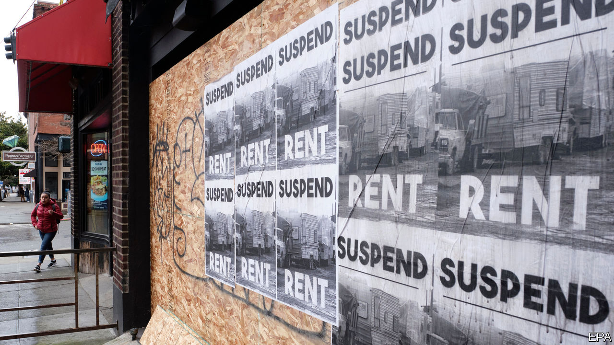
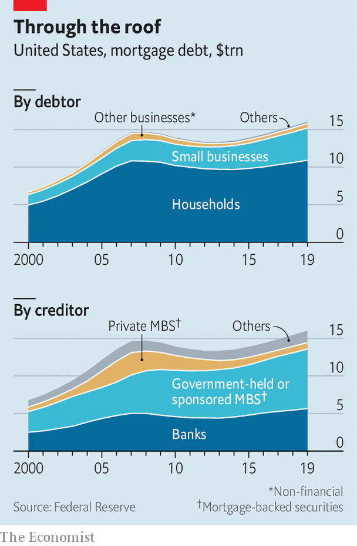

## Bills, bills, bills

# What missed rent and mortgage payments mean for the financial system

> April 1st was payday—and the day that big bills were due

> Apr 4th 2020NEW YORK

Editor’s note: The Economist is making some of its most important coverage of the covid-19 pandemic freely available to readers of The Economist Today, our daily newsletter. To receive it, register [here](https://www.economist.com//newslettersignup). For more coverage, see our coronavirus [hub](https://www.economist.com//coronavirus)

TO MOST WORKING Americans, the first of the month brings both joy and sorrow. It is payday, but also when rent and mortgage payments—their biggest bills—are due. Businesses must shell out wages and rent from revenues earned over the past month. This April 1st is likely to have been even crueller than usual. The government’s efforts to contain the spread of covid-19 have forced retailers to close shop and led to millions of workers losing their jobs. Many households and firms will struggle to pay what they owe. If rent and mortgage payments stop, the financial system risks seizing up.

The bill is huge. Around two-thirds of America’s 120m households own their homes. Together they owed around $11trn in mortgages at the end of 2019. Their monthly payments depend on their deposits and their interest rates, but using national averages as a guide suggests that around $52bn might have been due on April 1st. Another 43m households rent. Zillow, a property firm, estimates that they paid $43bn a month to landlords in 2019.

Few firms own their offices or shops, instead renting from commercial landlords. Green Street Advisors, a property-research company, estimates that total office rent exceeds $10bn a month. Monthly retail rents are worth another $20bn, according to Marcus & Millichap, a commercial-property services and consulting firm.

All told, households and firms owe around $125bn. How much of that might go unpaid? It seems likely that the 3.3m workers who signed up for unemployment benefits in the week to March 21st will have also sought relief from their landlords or their banks. Economists at the University of Chicago reckon that two-thirds of Americans cannot work entirely from home. Many may lose some pay as a result.

Some businesses might be able to keep earning even while their offices are shut. Retailers less so. A slew have already said that they won’t cough up. Nike, a sportswear-maker, says it will service half its rent this month. The Cheesecake Factory, a restaurant chain, plans to pay nothing at all.

The damage done to the financial system depends in large part on how flexible landlords and creditors can be. Government intervention should allow many households to postpone payments. The vast majority of residential mortgages are held, or backed, by government-sponsored entities (GSEs), like Fannie Mae and Freddie Mac (see chart). The government has ordered these to grant forbearance to homeowners, and has imposed a moratorium on foreclosures. The Federal Reserve will buy unlimited quantities of mortgage-backed securities (MBS) issued by GSEs. Small residential landlords should also be well-supported by such measures. These own the majority of rental properties and owe $4.3trn in mortgages.

The commercial sector, though, has less flexibility. Most mortgages for retail and office spaces, which are worth a combined $3trn, are taken out by professional landlords. They are usually owed to one of four groups: banks, life insurers, the holders of commercial MBS or real-estate investment trusts (REITs). Renegotiating payments with banks and insurers, which lend using their balance-sheets, might be manageable. But a quarter of commercial mortgages are owed toMBS holders and to REITs, which are less flexible. The commercial MBS market is governed by rigid rules; REITs are highly leveraged and will quickly suffer if payments stop.

Some middlemen are also being affected in unforeseen ways. For instance, mortgage-service providers—which originate loans and collect payments from homeowners for a fee—complain that they are running short of cash. They typically bet on rising interest rates by short-selling MBS, thereby hedging the risk they take when locking in rates for new customers. But as part of its response to the pandemic, the Fed is buying MBS so quickly that the providers are facing margin calls on the losses on their hedges, before the loans for which they have locked in the rates can be issued. With help from the Fed and the government, many homeowners will be able to delay repayments. Some of the corporate links in the chain may not be so lucky. ■

Dig deeper:For our latest coverage of the covid-19 pandemic, register for The Economist Today, our daily [newsletter](https://www.economist.com//newslettersignup), or visit our [coronavirus hub](https://www.economist.com//coronavirus)