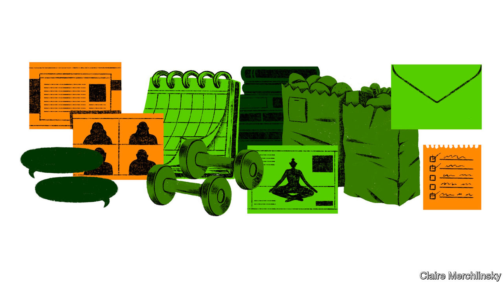

## Only connect

# How will humans, by nature social animals, fare when isolated?

> Covid-19 will harm people’s mental health

> Apr 4th 2020

Editor’s note: The Economist is making some of its most important coverage of the covid-19 pandemic freely available to readers of The Economist Today, our daily newsletter. To receive it, register [here](https://www.economist.com//newslettersignup). For our coronavirus tracker and more coverage, see our [hub](https://www.economist.com//coronavirus)

IN MANY WAYS Claudia (not her real name), a 33-year-old art dealer, feels prepared for the covid-19 lockdown in London. As a recovering alcoholic who has had a “mental breakdown or two”, she has spent time in rehab. Her movements there were restricted. She had to follow a strict routine, waking and eating her meals at the same time each day. That routine is now serving her well. Along with the rest of Britain, she is in lockdown as the country battles to slow the spread of covid-19. Its inhabitants are allowed out of their homes only in the most limited circumstances. The government has told people to avoid meeting anyone they do not live with, even family members.

“On difficult days I tell myself to make the bed, have a shower and eat,” says Claudia. Each morning she writes down things that she is grateful for: she no longer lives in a “sober house” with 12 other women, but in a flat on her own; her sister’s new baby, whom she has not yet met, is healthy. She also avoids social media. Even so, she is anxious: “I worry that in a week or two I will feel like screaming.”

Traumatic events, from natural disasters to war, can damage people’s mental health. The covid-19 pandemic is no different. It has brought the fear of contagion and of loved ones falling sick. It has created huge uncertainty about every aspect of life. And with a fifth of the world under lockdown, protracted isolation is also bringing loneliness, anxiety and depression. Quarantines and “social distancing”, policy measures needed to slow the spread of the novel coronavirus that causes covid-19, are against human nature. Touch and social networks are essential for both people and non-human primates: female baboons who have more grooming partners, or friends, exhibit lower levels of cortisol, a stress hormone.

It has been less than a month since the Italian government imposed a national quarantine, but the strain on people’s mental health is starting to show. More than 13,100 people there have died from covid-19; at least two nurses who were working in intensive-care units where they were treating patients suffering from the disease have killed themselves. The Italian national nursing federation said that one of the nurses who committed suicide, Daniela Trezzi, had been off work ill and that Ms Trezzi was deeply worried that she had infected patients (though the local health authority said she had not tested positive). In Germany, which imposed restrictions after Italy, the finance minister of the state of Hesse, who was said to be deeply worried about the economic impact of the pandemic, killed himself on March 28th.

Awareness of the strain on people’s mental health is growing. In Britain Public Health England, a government agency, along with the Duke and Duchess of Cambridge, released a set of guidelines on “the mental health and well-being aspects of coronavirus” on March 29th. In the same week, 62% of Britons said that they were finding it harder to be positive about the future compared with how they felt before the outbreak, according to Ipsos MORI, a pollster. “People are struggling with the emotions as much as they are struggling with the economics,” said Andrew Cuomo, governor of New York, America’s hardest-hit state, on March 21st. Four days later he set up a free hotline for those whose mental health was suffering.

Some are particularly susceptible to stress during a pandemic. Health-care workers are most exposed to the virus. The sense of camaraderie and of being part of a team that is helping people can buoy their spirits. But many doctors and nurses are being forced to isolate themselves away from their families because they may be infectious, which adds to their strains, points out Dhruv Khullar, a doctor in New York.

The lack of personal protective equipment for medics in many countries will only make that stress worse. Nicholas Christakis, now at Yale, worked as a doctor in the 1990s during the HIV/AIDS epidemic. There was a “lot of fear among health workers that if you looked after an AIDS patient you would contract the disease,” he recalls. But back then they had enough protective equipment. That made the risk of infection, which comes with the job, more bearable. Covid-19 is much easier to catch. “The current situation is like sending a fireman into a building naked,” he says.

Among the population at large, some may be especially worried. Those who have lost their jobs, who now number in the millions, may have lost not just their income, but also their identity, routine and much of their social network, says Jan-Emmanuel De Neve, head of the Wellbeing Research Centre at Oxford University.

Single people who once whiled away their days with friends, or those who live separately from their partners, suddenly find themselves spending most of their time alone. Many who exercise in teams or groups—or simply enjoy spending time outside—have to make do with a cramped living room and online classes. Mike, a 29-year-old Briton who works in finance in Brussels, is relieved that so far he is still allowed out for runs (though police move him along if he sits down to catch his breath): “Otherwise I’d just feel like Robinson Crusoe with Netflix.” Isolation will affect the mental health of even those who appear to be in less danger from the virus: 67% of Britons between the ages of 18 and 34 said they were finding it hard to remain upbeat, compared with 54% of those between the ages of 55 and 75.

If lockdowns stretch on for months, old people will suffer particularly acutely. Even before they were confined to their homes, they were more likely to feel lonely. Elderly women in Europe are more than twice as likely as men to live on their own. They rely on seeing family and friends to keep up their morale, or simply for a routine. Alfredo Rossi, an 80-year-old in Casalpusterlengo, one of the first areas of Italy to be put under lockdown in February, says that what upsets him most about the restrictions is being unable to see his grandchildren who live just 16km (ten miles) away in Piacenza across the River Po.

Domestic violence, already endemic everywhere, rises sharply when people are placed under the strains that come from confined living conditions and worries about their security, health and money, says Phumzile Mlambo-Ngcuka, the head of UN Women, a UN agency. Based on early estimates, she thinks that in some countries under lockdown, domestic violence could be up by about a third.

The scale of the lockdowns is unprecedented. But research into previous traumatic events and other types of isolation offers some clues about the likely mental-health fallout. According to a rapid review of the psychological effects of quarantines, published on March 14th in the Lancet, a British medical journal, some studies suggest that the impact of quarantines can be so severe as to result in a diagnosis of post-traumatic stress disorder (PTSD). The condition, which may include symptoms such as hyper-vigilance, flashbacks and nightmares which can last for years, became a formal psychiatric diagnosis in 1980, when veterans were still experiencing stress from the Vietnam war, which ended in 1975.

One study from 2009 looked at hospital employees in Beijing who in 2003 were exposed to severe acute respiratory syndrome (SARS), which, like covid-19, is caused by a coronavirus. The authors found that, three years later, having been quarantined was a predictor of post-traumatic-stress symptoms. Another study, from 2013, used self-reported data to compare post-traumatic-stress symptoms in parents and children who had been quarantined because they lived in areas affected either by SARS or the H1N1 outbreak in 2009, with those who had not. It found that the mean post-traumatic-stress scores were four times higher in children who had been isolated. Among the parents who had been quarantined, 28% reported symptoms serious enough to warrant a diagnosis of a trauma-related mental-health disorder. For those who had not been in isolation, the figure was 6%.

The longer a quarantine goes on, the greater the effect on people’s mental health. Another study, which also looked at the impact of SARS, found that those who were quarantined for more than ten days were significantly more likely to display symptoms of PTSD than those confined for fewer than ten days.

Cynthia Dearin, a consultant in Australia who spent four years in Iraq between 2006 and 2010 in various military camps that restricted her movement, said that whenever she returned to Iraq after a “decompression break”, she felt an “instant Baghdad depression”. Living in a war zone is very different from living through a pandemic, but she sees parallels in the loss of freedom and the sense of danger. “We also had the choice to leave the lockdown,” she reflects. “What is different now is that nobody can escape.” In Iraq many of her contemporaries turned to alcohol to numb the boredom and the fear. Increased sales of alcohol suggest that many are doing the same today. In Britain they were up by two-thirds in the week to March 21st compared with 2019, according to Nielsen, a market-research firm.

Those who have willingly isolated themselves in less traumatic circumstances may provide examples of how to ease the current crisis. In addition to the loneliness they experience, astronauts, who spend prolonged periods away from their loved ones or indeed any other human beings, suffer from disturbed sleep, heart palpitations, anxiety and mood swings. Cooped up together, they may also fall out with their fellow crew members.

Couples who suddenly find themselves in enforced proximity may sympathise. There are reports that some cities in China, such as Xi’an and Dazhou, have seen a spike in divorce proceedings since the lockdown was lifted in parts of the country in early March. Writing in the New York Times, Scott Kelly, a former astronaut who spent a year on the International Space Station, suggested that keeping a routine and writing a journal can help ease loneliness. He also encouraged people to get outside, if they could. He found that after “being confined to a small space for months, I actually started to crave nature—the colour green, the smell of fresh dirt, and the feel of warm sun on my face.”

Even under the tightest restrictions, people find ways to cope. “People are rediscovering that they live in roads full of people,” says Robin Dunbar, an anthropologist and evolutionary psychologist at Oxford University. Neighbours can be irritating, but in a crisis they can also be a comfort.

Groups have formed in many places to support local vulnerable people. According to Julianne Holt-Lunstad, an expert in loneliness at Brigham Young University, studies have shown that those who feel they have “supportive people” in their social networks are less likely to react to stressful circumstances than those who do not. Simply knowing you have others on whom you can rely can reduce spikes in blood pressure and heart rate, she says.

Abigail, a 32-year-old charity worker in Brussels, says that her student neighbours used to get on her nerves because they played loud music. But as she spends the lockdown alone, she has got to know them. She now welcomes their music: “They bring the party.” In Belgium, Britain, Italy and the Netherlands people have started to clap and bang pans from their windows and doors to thank medics and other essential workers.

Talking to friends and family over video calls helps, too—though the clunkiness of much of the software makes them an imperfect substitute for an encounter in person. A pixelated version of spending time with a friend merely slows down the “rate of decay” of that relationship, says Professor Dunbar, but will never be able to replace the experience of seeing someone in the flesh. “You have to see the eyeballs—the whites of the eyes—and be able to physically hold on to them,” he says, in order to maintain a friendship and feel a social bond. For Claudia that moment will come when her football team, which for her is both exercise and a kind of group therapy, can meet up once more, rather than just chat virtually. “It is going to be beautiful,” she says. ■

Dig deeper:For our latest coverage of the covid-19 pandemic, register for The Economist Today, our daily [newsletter](https://www.economist.com//newslettersignup), or visit our [coronavirus tracker and story hub](https://www.economist.com//coronavirus)

## URL

https://www.economist.com/international/2020/04/04/how-will-humans-by-nature-social-animals-fare-when-isolated
