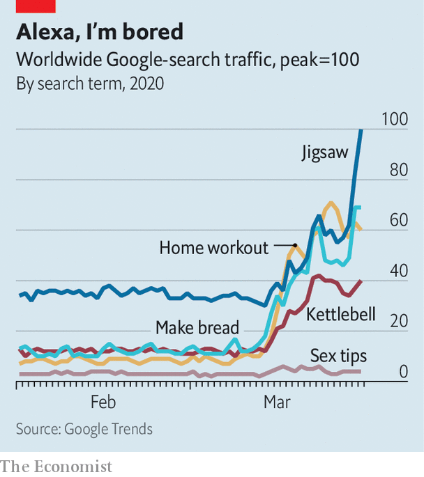

## Net benefits

# With millions stuck at home, the online wellness industry is booming

> Fitness, cooking and meditation can all be taught remotely

> Apr 4th 2020

Editor’s note: The Economist is making some of its most important coverage of the covid-19 pandemic freely available to readers of The Economist Today, our daily newsletter. To receive it, register [here](https://www.economist.com//newslettersignup). For our coronavirus tracker and more coverage, see our [hub](https://www.economist.com//coronavirus)

“UP OFF YOUR chairs and just start lifting those feet,” chirps a woman sporting green leggings as she marches energetically. Diana Moran, a fitness expert known as the Green Goddess, was a staple of 1980s British breakfast television. Now in her 80s, she is making a comeback. In a new morning slot she is encouraging older people, many of whom are in isolation to avoid infection, to stay active. As lockdowns force the world to stay at home indefinitely, many are turning to their screens to stay sane.

Meditation apps, digital fitness classes and online cookery courses are booming. Zoom, a videoconferencing service now worth around $40bn through which many such classes are broadcast, has become one of the most important “social wellness” companies, reckons Beth McGroarty of the Global Wellness Institute, a research group. Those stuck inside are desperate for company.

On YouTube average daily views of videos including “with me” in the title—convivial baking, studying and decluttering are all available—have increased by 600% since March 15th compared with the rest of the year. Last week DJ D-Nice, an American disc jockey, drew over 100,000 virtual partygoers to his “Club Quarantine” on Instagram Live.

The stuck-at-home are also keen to improve themselves (see chart). Downloads of the top five recipe apps doubled in China during February’s lockdown. In Britain John Lewis, an upmarket department store, has reported a five-fold increase in sales of its Marcato pasta machine compared with typical sales for this time of year. Kettlebells and yoga mats are selling like toilet paper. Joe Wicks, a trainer who posts workout videos online, saw subscriptions to his channel more than double after he launched live physical-education lessons for kids no longer able to burn off their energy at school. During the first week of classes 15m viewers joined in.

The popularity of live group activities challenges the idea that you have to be physically present to be together. People who work out in groups are more committed and get more health benefits than those doing so alone. It is also showing just how much can be “experienced” from the comfort of the couch, raising the bar for experiences such as concerts and classes in the post-covid world.

Even before the pandemic, fitness fans wondered whether paid-for online platforms such as Peloton, a home exercise-bike company, could replace gyms. That debate will pump up further if gyms go bust because of the shutdowns.

It seems more likely that the strange but temporary state of lockdown will boost sectors that were already growing. Mental-health apps were flourishing before covid-19. Downloads of the five most popular “mindfulness” apps grew by 85% in 2018. In the last week of March Headspace, a meditation app, saw a 19-fold jump in users completing a calming exercise and a 14-fold surge in those doing a “reframing anxiety” session.

Dig deeper:For our latest coverage of the covid-19 pandemic, register for The Economist Today, our daily [newsletter](https://www.economist.com//newslettersignup), or visit our [coronavirus tracker and story hub](https://www.economist.com//coronavirus)