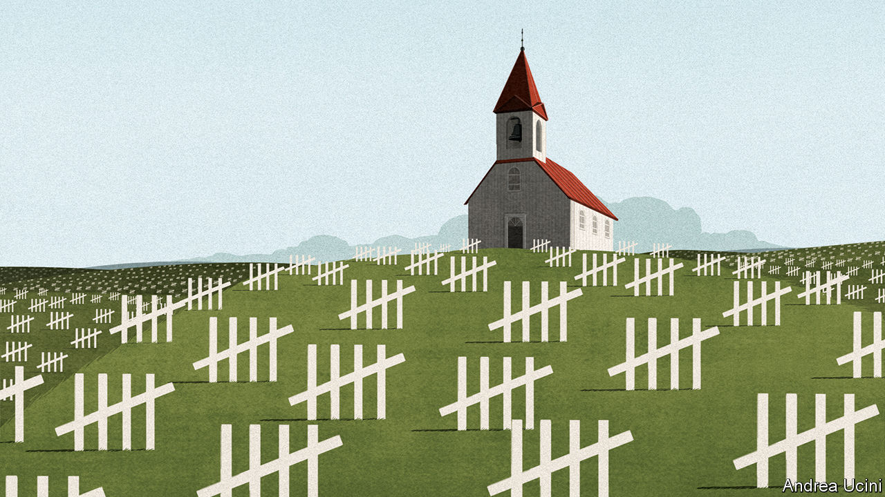

## A grim calculus

# Covid-19 presents stark choices between life, death and the economy

> The trade-offs required by the pandemic will get even harder

> Apr 2nd 2020

Editor’s note: The Economist is making some of its most important coverage of the covid-19 pandemic freely available to readers of The Economist Today, our daily newsletter. To receive it, register [here](https://www.economist.com//newslettersignup). For our coronavirus tracker and more coverage, see our [hub](https://www.economist.com//coronavirus)

IMAGINE HAVING two critically ill patients but just one ventilator. That is the choice which could confront hospital staff in New York, Paris and London in the coming weeks, just as it has in Lombardy and Madrid. Triage demands agonising decisions (see [Briefing](https://www.economist.com//briefing/2020/04/02/the-tough-ethical-decisions-doctors-face-with-covid-19)). Medics have to say who will be treated and who must go without: who might live and who will probably die.

The pandemic that is raging across the world heaps one such miserable choice upon another. Should medical resources go to covid-19 patients or those suffering from other diseases? Some unemployment and bankruptcy is a price worth paying, but how much? If extreme social distancing fails to stop the disease, how long should it persist?

The governor of New York, Andrew Cuomo, has declared that “We’re not going to put a dollar figure on human life.” It was meant as a rallying-cry from a courageous man whose state is overwhelmed. Yet by brushing trade-offs aside, Mr Cuomo was in fact advocating a choice—one that does not begin to reckon with the litany of consequences among his wider community. It sounds hard-hearted but a dollar figure on life, or at least some way of thinking systematically, is precisely what leaders will need if they are to see their way through the harrowing months to come. As in that hospital ward, trade-offs are unavoidable.

Their complexity is growing as more countries are stricken by covid-19. In the week to April 1st the tally of reported cases doubled: it is now nearing 1m. America has logged well over 200,000 cases and has seen 55% more deaths than China. On March 30th President Donald Trump warned of “three weeks like we’ve never seen before”. The strain on America’s health system may not peak for some weeks (see [article)](https://www.economist.com//united-states/2020/04/02/covid-19-and-americas-political-system). The presidential task-force has predicted that the pandemic will cost at least 100,000-240,000 American lives.

Just now the effort to fight the virus seems all-consuming. India declared a 21-day lockdown starting on March 24th. Having insisted that it was all but immune to a covid-19 outbreak, Russia has ordered a severe lockdown, with the threat of seven years’ prison for gross violations of the quarantine. Some 250m Americans have been told to stay at home. Each country is striking a different trade-off—and not all of them make sense.

In India the Modi government decided that its priority was speed. Perhaps as a result it has fatally bungled the shutdown. It did not think about migrant workers who have streamed out of the cities, spreading the disease among themselves and carrying it back to their villages (see [article](https://www.economist.com//asia/2020/04/02/lockdowns-in-asia-have-sparked-a-stampede-home)). In addition, the lockdown will be harder to pull off than in rich countries, because the state’s capacity is more limited. India is aiming to slow its epidemic, delaying cases to when new treatments are available and its health-care system is better prepared. But hundreds of millions of Indians have few or no savings to fall back on and the state cannot afford to support them month after month. India has a young population, which may help. But it also has crowded slums where distancing and handwashing are hard. If the lockdown cannot be sustained, the disease will start to spread again.

Russia’s trade-off is different. Clear, trusted communications have helped ensure that people comply with health measures in countries like Singapore and Taiwan. But Vladimir Putin has been preoccupied with extending his rule and using covid-19 in his propaganda campaign against the West. Now that the virus has struck, he is more concerned with minimising political damage and suppressing information than leading his country out of a crisis. That trade-off suits Mr Putin, but not his people.

America is different, too. Like India, it has shut down its economy, but it is spending heavily to help save businesses from bankruptcy and to support the income of workers who are being laid off in devastating numbers (see [article](https://www.economist.com//united-states/2020/04/01/how-high-will-unemployment-in-america-go)).

For two weeks Mr Trump speculated that the cure might be worse than the “problem itself”. Putting a dollar figure on life shows he was wrong. Shutting the economy will cause huge economic damage. Models suggest that letting covid-19 burn through the population would do less, but lead to perhaps 1m extra deaths. You can make a full accounting, using the age-adjusted official value of each life saved. This suggests that attempting to mitigate the disease is worth $60,000 to each American household. Some see Mr Trump’s formulation itself as mistaken. But that is a comforting delusion. There really is a trade-off, and for America today the cost of a shutdown is far outweighed by the lives saved. However, America is fortunate to be rich. If India’s lockdown fails to stop the spread of the disease its choice will, tragically, point the other way.

Wherever you look, covid-19 throws up a miasma of such trade-offs. When Florida and New York take different approaches, that favours innovation and programmes matched to local preferences. But it also risks the mistakes of one state spilling over into others (see [Lexington](https://www.economist.com//united-states/2020/04/02/ron-desantis-is-donald-trumps-and-the-coronaviruss-favourite-governor)). When China shuts its borders to foreigners almost completely, it stops imported infections but it also hobbles foreign businesses. A huge effort to make and distribute covid-19 vaccines will save lives, but it may affect programmes that protect children against measles and polio.

How should you think about these trade-offs? The first principle is to be systematic. The $60,000 benefit to American households, as in all cost-of-life calculations, is not real cash but an accounting measure that helps compare very different things such as lives, jobs and contending moral and social values in a complex society. The bigger the crisis, the more important such measurements are. When one child is stuck down a well the desire to help without limits will prevail—and so it should. But in a war or a pandemic leaders cannot escape the fact that every course of action will impose vast social and economic costs. To be responsible, you have to stack each against the other.

A second principle is to help those on the losing side of sensible trade-offs. Workers sacked in forced shutdowns deserve extra help; children who no longer get meals at schools need to be given food. Likewise, society must help the young after the pandemic has abated. Although the disease threatens them less severely, most of the burden will fall on them, both today and in the future, as countries pay off their extra borrowing.

A third principle is that countries must adapt. The balance of costs and benefits will change as the pandemic unfolds. Lockdowns buy time, an invaluable commodity. When they are lifted, covid-19 will spread again among people who are still susceptible. But societies can prepare in a way that they never did for the first wave, by equipping health systems with more beds, ventilators and staff. They can study new ways to treat the disease and recruit an army of testing and tracing teams to snuff out new clusters. All that lowers the cost of opening up the economy.

Perhaps, though, no new treatments will be found and test-and-trace will fail. By the summer, economies will have suffered double-digit drops in quarterly GDP. People will have endured months indoors, hurting both social cohesion and their mental health. Year-long lockdowns would cost America and the euro zone a third or so of GDP. Markets would tumble and investments be delayed. The capacity of the economy would wither as innovation stalled and skills decayed. Eventually, even if many people are dying, the cost of distancing could outweigh the benefits. That is a side to the trade-offs that nobody is yet ready to admit. ■

Dig deeper:For our latest coverage of the covid-19 pandemic, register for The Economist Today, our daily [newsletter](https://www.economist.com//newslettersignup), or visit our [coronavirus tracker and story hub](https://www.economist.com//coronavirus)

## URL

https://www.economist.com/leaders/2020/04/02/covid-19-presents-stark-choices-between-life-death-and-the-economy
