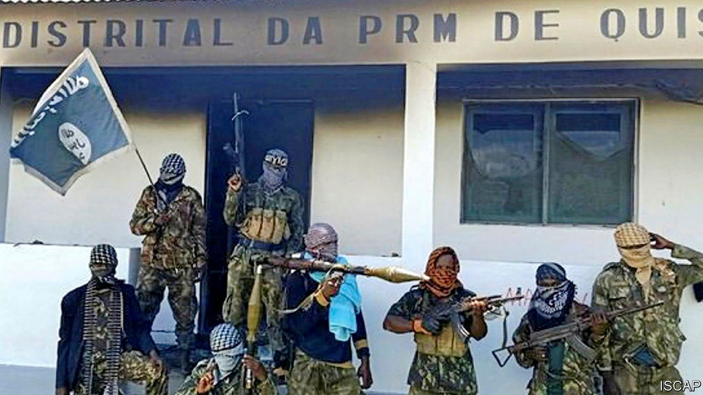

## Gas, guns and guerrillas

# Jihadists threaten Mozambique’s new gasfields

> The government’s response to a mysterious revolt is cruel and ineffective

> Apr 2nd 2020

MANY KINDS of misfortune make a country prone to conflict; Mozambique has them all. It is poor. FRELIMO, its ruling party, is predatory and corrupt. Much of its vast territory is barely governed at all. It has a recent history of civil war: a 15-year inferno that ended in 1992 and cost perhaps 1m lives, and a milder six-year uprising involving the same rebel group, RENAMO, which formally ended last year. Into this explosive mix, two blazing matches have been tossed: jihadist terror and the discovery of natural gas.

As we report this week, a poorly understood insurgency is spreading in Cabo Delgado, a province in northern Mozambique (see [article](https://www.economist.com//middle-east-and-africa/2020/04/02/mozambiques-mysterious-conflict-is-intensifying)). So far the conflict has killed more than 1,000 people, aid workers estimate, and forced at least 100,000 to flee their homes. Recent weeks have seen some of the boldest attacks yet. Young men with guns and Islamist slogans are not merely burning villages and beheading people. They have also started to capture towns, albeit temporarily, slaughtering government forces and then retreating to the bush.

On March 23rd they briefly overran Mocimboa da Praia, a transport hub near what may be Africa’s largest-ever gas project. The huge reserves off the coast of Cabo Delgado have attracted pledges of investment worth tens of billions of dollars from multinational firms. Gas gives Mozambique the hope of a more prosperous future—but also a prize worth fighting over. Already insecurity, as well as covid-19 and low oil prices, are slowing exploration. If Mozambique wants to realise its dream of becoming “Africa’s Qatar”, it must pacify Cabo Delgado.

To do so it must be honest. The government describes the uprising as a foreign conspiracy to keep the country poor. That is nonsense. Although there are indeed foreign preachers and fighters among the jihadists, the insurgency is mostly local in origin, born of marginalisation. Muslims are a minority in Mozambique, and the largely Muslim north, which is far from the capital, has long been neglected. It is only in the past year that the jihadists there have formally affiliated to Islamic State, and it is not clear that IS supplies it with much besides inspiration.

The government’s counter-insurgency tactics are inept, too. It has so far relied on ill-trained conscripts, thuggish police and Russian mercenaries. It has rounded up young men on the flimsiest evidence and beaten or summarily shot them, according to Human Rights Watch, an NGO. Such brutality alienates the population. It has locked up journalists who report on the conflict and threatened aid workers who air grievances. This constricts the flow of accurate information. A better approach would involve properly paid and trained troops, who speak local languages and respect human rights, as well as schemes that deal with the province’s poverty and inequality.

Neighbours, especially South Africa, the biggest regional power, and Tanzania, which borders Cabo Delgado, should press the Mozambican government to behave better. They should also share intelligence with it. Right now they are preoccupied by covid-19, but the insurgency will probably outlast the pandemic. A summit about Islamist violence scheduled for May should go ahead, albeit virtually. Western countries should tell Mozambique to let aid agencies and journalists do their jobs.

Energy firms, which include giants such as ExxonMobil and Total, could do more as well. They have sought to cocoon themselves from the violence by hiring private-security firms. That is not enough. Their projects will remain insecure unless they can show that the benefits of their investments flow to ordinary Mozambicans, not just the FRELIMO elite. If Mozambique were to fall apart again, it would be a tragedy. If jihadism were to take root, it could spread to neighbouring countries, as it has in the Sahel. Mozambique, and Africa, deserve better. ■

## URL

https://www.economist.com/leaders/2020/04/02/jihadists-threaten-mozambiques-new-gasfields
