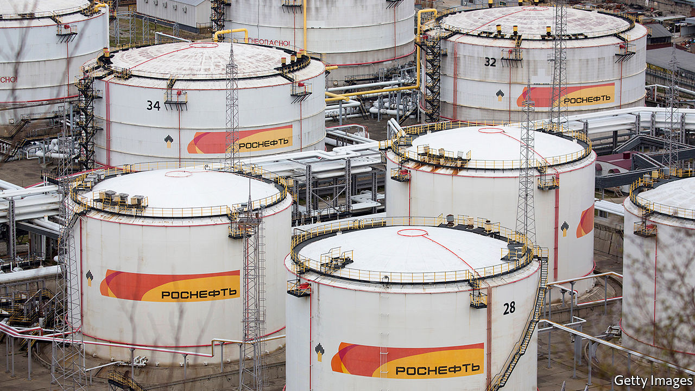

## Rosneft’s sleight of hand

# Why Putin’s favourite oil firm dumped its Venezuelan assets

> Russian taxpayers are left holding the can

> Apr 2nd 2020

ROSNEFT is responsible for 40% of Russia’s oil output, but it is much more than just another oil firm. A large chunk of its shares are owned by the Russian state. Its boss, Igor Sechin, is one of Vladimir Putin’s closest henchmen. A former spook, like the Russian president, he has been at the big man’s side since the 1990s. In 2004-06 Rosneft gobbled up the remains of Yukos, Russia’s largest private oil firm, which was dismembered after its boss challenged Mr Putin. Since then Rosneft has been both a tool of Kremlin power and a driver of policy in its own right. Bear this in mind when trying to make sense of the announcement, on March 28th, that it has sold all its Venezuelan assets to an unnamed Russian government entity.

For years the Kremlin has propped up Venezuela’s dictatorship, first under Hugo Chávez, then under his protégé, Nicolás Maduro. Russia has supplied loans, weapons and, lately, mercenaries to keep the regime in power, largely to annoy the United States. America, like many democracies, does not recognise the election-stealing Mr Maduro as Venezuela’s president, and has slapped severe sanctions on his country. Last week it unsealed indictments of Mr Maduro and his cronies for alleged drug-trafficking (see [article](https://www.economist.com//the-americas/2020/04/02/the-unintended-consequences-of-indicting-nicolas-maduro)). Mr Sechin calculates that, if America supports democracies in Russia’s backyard, Russia should support despots in America’s.

Rosneft’s role in all this has been to practise bare-knuckle petropolitics. It has traded Venezuelan oil to help Mr Maduro get around American sanctions. Rosneft lent his government $6.5bn in 2014-18, to be repaid in oil. At the end of last year it was still owed at least $800m, though the figures are murky.

Thanks to a low oil price, sanctions and the Maduro regime’s spectacular corruption and ineptitude, Venezuela is in no position to repay all its debts. But this is not too much of a problem for Rosneft, since it can dump its Venezuelan assets on to Russian taxpayers. They will no doubt be delighted to hear that they have paid for this with 9.6% of Rosneft’s own shares (worth more than $4bn), thus reducing their stake to just over 40%. The deal gives Mr Sechin ever tighter control of the firm. Minority shareholders, including BP and Qatar’s sovereign-wealth fund, which each hold just under 20%, have yet to comment.

The main aim of the deal, it seems, is to help Rosneft escape the consequences of doing business with a pariah. Over the past two months America has penalised the company’s trading arms for handling Venezuelan oil. These sanctions are global in scope and affect its customers, too. Sinochem International, the trading arm of a Chinese state-owned refinery, has rejected Rosneft’s oil. The Kremlin’s solution is to distance Rosneft from Venezuela while reassuring the Venezuelan kleptocracy that it still has Russia’s backing. “I received a message from brother president Vladimir Putin who ratified his comprehensive strategic support for all areas of our [relationship],” tweeted Mr Maduro.

These shenanigans come at a turbulent time in the oil markets. The price of crude has fallen by half in the past month, as covid-19 has crushed demand and Saudi Arabia has opened its taps to punish Russia for refusing to extend an OPEC deal to curb production. The Kremlin would like cheap oil to drive American shale producers, whose costs are higher, out of business. This is a risky game. Russia has alienated the Saudis, who might draw closer to America as a result. Rosneft can survive oil at $25 a barrel. But under Russian law the royalties it pays to the Russian state fall sharply as the oil price slides. As covid-19 spreads in Russia, Mr Putin will have to draw on the country’s reserves to help ordinary people cope. Mr Sechin’s sleight of hand has solved a problem for Rosneft, but not for Russia. ■