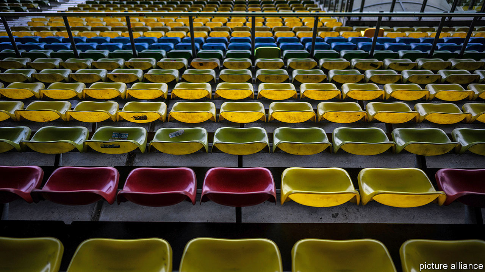
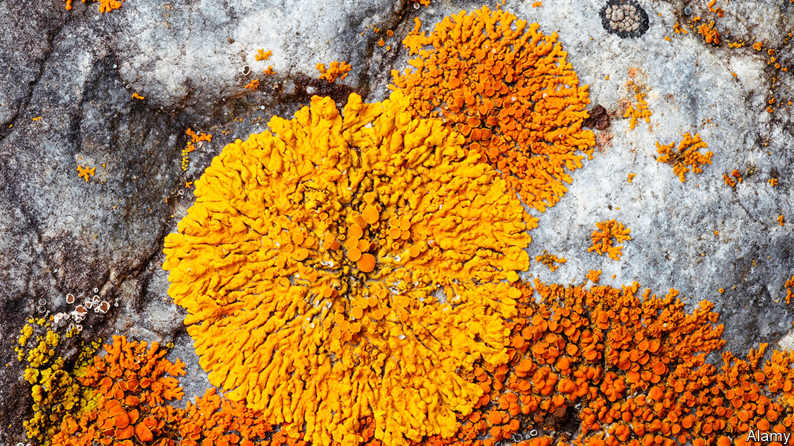

## On covid-19, Bolivia, sports, rivers, lichen

# Letters to the editor

> A selection of correspondence

> Apr 2nd 2020

One aspect has been ignored in The Economist’s and the wider media coverage of covid-19: the national security implications (“[The lockdown and the long haul](https://www.economist.com//briefing/2020/03/19/in-europe-and-around-the-world-governments-are-getting-tougher)”, March 21st). The rapid spread of the virus in Europe and North America and the somewhat confused and erratic response of governments demonstrates how unprepared we are to respond to the threat of biological warfare, despite spending hundreds of billions of dollars on defence.

Drawing on lessons learned from this pandemic, governments should enact legislation that will help us respond to future emergencies. In addition we could stockpile essential equipment such as portable hospitals and testing kits to help public health systems respond effectively. In the context of defence spending, these measures are not particularly expensive. For example, the latest American aircraft-carrier cost $13bn. Perhaps this money could have been better spent preparing us for future bio-warfare threats.

There is no question in my mind that malicious groups are watching this situation with great interest and may be considering how to take advantage of our weaknesses.

ROBERT MORLEYFormer staff member on the National Security CouncilRichmond, Texas

For comparison, the global influenza pandemic of 1918-20 infected up to 500m people and killed up to 50m. Today we are light years away from these figures and will not reach them because of the global advances in medical research that our technology enables.

What remains inexplicable is how America, the world’s powerhouse, can have been so ill-prepared. All reliable evidence demonstrates that it is near the bottom of Western countries for testing. The federal Centres for Disease Control and Prevention was inept in dealing with what was coming. The system of checks and balances is supposed to ensure that even if a president does not realise the gravity of a situation, institutions like the CDC are ready to spring into action. The CDC’s delayed response may be the gravest mistake so far in combating covid-19 worldwide.

GEORGE ROUSSEAUEmeritus professor of historyOxford University

The IMF and the World Bank have made $62bn in funding available to combat covid-19. Yet funding for malaria is only half of the $6bn that the World Health Organisation requests each year. I understand the fear of this coronavirus, but malaria infects 228m people each year and kills 400,000. Perhaps if we rebrand malaria as a new phenomenon it will make the headlines and get the funding it deserves.

RACHEL ZWEIGFayetteville, Arkansas

I would like to suggest the use of “physical distancing” rather than “social distancing”. As a sociologist I am stunned at the many ways people have overcome social distancing while having to keep a physical distance.

PROFESSOR PATRICK KENISSchool of Economics and ManagementTilburg UniversityTilburg, Netherlands

Quarantine artI am 18 years old and was studying for my A Levels in Economics, Mathematics and Latin until the current pandemic arose. I am an aspiring economist and investment banker and I have spent the past two years studying, reading and researching around all aspects of the subject to fully immerse myself in it and expand my knowledge.

While strengthening my university application last year, I subscribed to The Economist to keep on top of current affairs. I had kept all volumes of the magazine from September to December of 2019, and since Britain has been put into lockdown, I decided to make use of them. As well as a keen academic, I also love art and creativity (although I don’t often have time for it) so I took this unique moment of quietness to create a collage of interesting images and words from my collection of Economist magazines. If you look closely many of the words and images are juxtaposed to encourage the viewer to consider new ideas and issues in the world of politics and economics.

I have attached an image of my collage and wanted to send it in to you to share my use of your magazine. Although covid-19 has caused undoubtable pain and disruption to all of our lives, for those of us fortunate enough to be healthy and safe, it is interesting to see the new and innovative things that we spend our time doing in this break from normality.HANNAH PARKINSONLiverpool

In Bolivia we are certainly enjoying the bouquet of freedom after 14 years of Evo Morales ([Bello](https://www.economist.com//the-americas/2020/03/05/bolivia-after-the-ouster-of-evo-morales-a-leftist-strongman), March 7th). The former president never “used natural-gas revenues to build schools, roads and clinics”. Instead, he built football fields with synthetic grass. Today Bolivia is going through a dire public-health situation precisely because of the lack of hospitals and medical equipment in rural areas.

Bolivia under Mr Morales was a dysfunctional democracy that squandered the money it earned from commodities in a blend of corruption, pharaonic projects and short-term social programmes. Those revenues vanished in scandals and vanity projects. Mr Morales built a museum for himself to exhibit his sports outfits. He erected a lavish building that destroyed the colonial aesthetic of the historic centre of La Paz and named it the House of the People, emulating Nicolae Ceausescu in Romania. The largest economic boom became the greatest missed opportunity in Bolivian history.

JAIME APARICIOAmbassador of Bolivia to the Organisation of American StatesWashington, DC

Your leader lamenting the cancellation of sports fixtures referred to the Romans who understood the importance of bread and circuses, “keeping the public not just fed, but entertained, too” (“[The game’s the thing](https://www.economist.com//leaders/2020/03/21/as-covid-19-causes-sports-cancellations-what-can-be-done)”, March 21st). But although our modern coliseums lie dormant, e-sports beckon like never before. La Liga, Spain’s top-tier football league, recently held an online tournament using EA Sports’ FIFA 20 video game. Some 170,000 people tuned in to watch a player with Real Madrid win the final. That’s more than double the capacity of Madrid’s Santiago Bernabéu stadium. The biggest obstacle to game streaming has been the inability of the sporting establishment to recognise its huge reach. The business world may now finally wake up to its potential, not just to augment but enhance the world of sports entertainment.

JONNY SHAWChief strategy officerVCCP New York

Kudos to The Economist for supporting the morale-boosting potential of the return of professional sport, albeit in a reduced capacity. In 2012 I watched a distant Champions League final between Chelsea and Bayern Munich, having just fought in my first battle in Afghanistan with the British army. A sporting event has enormous normalising power. Occasionally, as today, life throws up challenges that ensure you never again take the small things for granted.

ROBIN LYONLondon

The construction of artificial barriers to restrict the flow of rivers and protect land (“[Putting the wiggles back in rivers](https://www.economist.com//britain/2020/03/07/re-engineering-britains-rivers)”, March 7th) was widespread in the late 19th and early 20th centuries. This was particularly the case for alpine rivers in U-shaped glacial valleys, which carry large amounts of sediment after heavy rainfall. Two such rivers came to public attention in the 1920s and 1930s. James Joyce even alluded to these rivers as “burst” in “Finnegans Wake”.

The first was the Thur with its source in the Swiss Alps flowing through the Zurich Canton that Joyce lived in. The second was the Waiho flowing out of the Southern Alps of New Zealand near Greymouth. One of Joyce’s sisters lived in the Greymouth convent and sent pieces of local interest to her brother that he occasionally used, albeit creatively but recognisably in “Finnegans Wake”. Both rivers have caused destructive flooding after their flows were constrained and slowed a century ago, exacerbating problems caused by large deposits of gravel accumulated over time.

GERALD SMITHWellington, New Zealand

“[A little lichen relief](https://www.economist.com//the-americas/2020/03/19/canadas-quest-for-a-national-lichen)” (March 21st) notes that Iceland, Scotland and the Faroe Islands have issued stamps depicting lichen, giving their people a lichen likeness, one might say. I must, however, ask: do they like licking lichen?

KEITH SNIDERAlexandria, Virginia