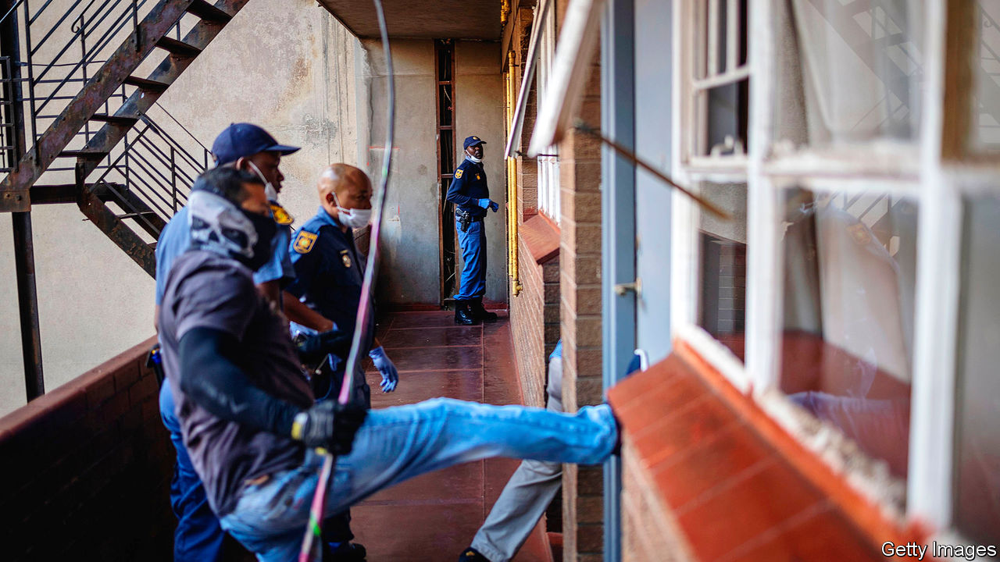

## Viral violence

# Some African governments are enforcing lockdowns brutally

> Stay home or be whipped

> Apr 4th 2020JOHANNESBURG

Editor’s note: The Economist is making some of its most important coverage of the covid-19 pandemic freely available to readers of The Economist Today, our daily newsletter. To receive it, register [here](https://www.economist.com//newslettersignup). For more coverage, see our coronavirus [hub](https://www.economist.com//coronavirus)

DURING APARTHEID in South Africa, policemen who wanted to control crowds often reached for the sjambok—a vicious, three-foot-long whip traditionally made of rhino hide. That symbol of brutality was banned in 1989. But it is back in use as police enforce a 21-day lockdown meant to slow the spread of covid-19.

On March 30th in Hillbrow, a gritty part of Johannesburg, an unmarked police car cruised the streets before a plainclothes officer got out and chased residents who were deemed to be defying the rules. He beat them with his sjambok—no questions asked, no warnings given. Asked to explain, the uniformed driver of the vehicle said that people had to be taught to comply. Orders came from “the top”, he claimed.

Many African governments have told their people to stay at home to slow the spread of the virus. On March 22nd Rwanda became the first country in sub-Saharan Africa to impose a nationwide lockdown. Others have followed suit, including Botswana, South Africa and Uganda. On March 30th Nigeria shut down Abuja, the capital, and Lagos, Africa’s largest city.

There is a logic to these measures. Although most of the 49 African countries known to have covid-19 have fewer than 100 confirmed cases, their health systems will buckle if the virus spreads rapidly. Governments also want to stem the flow of people from cities to the countryside, where medical services are especially scarce.

Yet these measures are fiendishly difficult to enforce. Lagos is not London. Roughly half of African city-dwellers live in slums. Most earn a living doing informal work. There is little space to isolate oneself and a persistent need to go out for food, water or work. Policies to replace lost income have been slow in coming.

That would imply security forces ought to tread carefully. Sadly, few are doing so. When not sjambokking pedestrians, South Africa’s police have been firing rubber bullets at shoppers outside a supermarket and even at nurses protesting against a lack of protective gear.

Rwanda’s first fatalities linked to the pandemic came when police shot dead two people, allegedly because they had defied its lockdown. Kenyan police have beaten dozens and set off tear-gas to enforce a dusk-to-dawn curfew. On March 31st they shot and killed a 13-year-old boy who was standing on his third-floor balcony in Nairobi. In Uganda, where the state criminalises gay sex, the police used social-distancing rules to arrest 20 people who were living in an LGBT shelter.

The use of excessive force does not bode well. Lockdowns will not work unless they have public support. And that support will be withheld if governments abuse their poorest citizens in the midst of a pandemic. Covid-19 has many nasty side-effects. The bulldozing of human rights should not be one of them. ■

Dig deeper:For our latest coverage of the covid-19 pandemic, register for The Economist Today, our daily [newsletter](https://www.economist.com//newslettersignup), or visit our [coronavirus hub](https://www.economist.com//coronavirus)