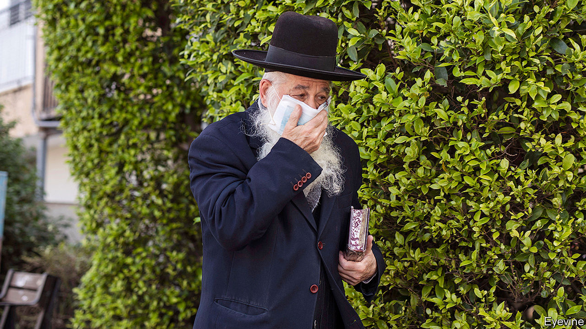

## Insular, but not isolating

# Why covid-19 has spread among Israel’s ultra-Orthodox

> Open schools and crowded prayers accelerate contagion

> Apr 4th 2020BNEI BRAK

Editor’s note: The Economist is making some of its most important coverage of the covid-19 pandemic freely available to readers of The Economist Today, our daily newsletter. To receive it, register [here](https://www.economist.com//newslettersignup). For more coverage, see our coronavirus [hub](https://www.economist.com//coronavirus)

THIS WAS to be the week when Binyamin Netanyahu, the prime minister of Israel, finally won. After three inconclusive elections in the span of a year, he had all but convinced his bitter rival, Benny Gantz, to join him in government. There were still some things to be worked out, such as how fast to annex parts of the occupied West Bank, and who would lead the justice ministry and thus oversee Mr Netanyahu’s corruption trial. But Mr Gantz’s Blue and White party had already split, with about half its representatives supporting a coalition deal that would leave Mr Netanyahu in office until September 2021, when he would hand over to Mr Gantz.

Alas, the outbreak of covid-19 is getting in the way. On March 30th Mr Netanyahu isolated himself after an aide came down with the virus. Mr Netanyahu tested negative for the disease and left quarantine days later. But he went back into isolation after the health minister was diagnosed with the virus on April 1st. Both the aide and the minister are ultra-Orthodox. The outbreak is raging among their fellows.

Take the ultra-Orthodox city of Bnei Brak, which has the second-most cases in Israel despite being its ninth-largest city. Ultra-Orthodox quarters of Jerusalem also have more infections than neighbouring ones, underlining how the virus is spreading more quickly among this community, which is about 12% of the population.

For weeks after most Israelis began social-distancing at the behest of the government, life continued as normal in ultra-Orthodox communities, which retain a large degree of autonomy. The study of the Torah and Talmud did not stop in ultra-Orthodox schools even though the rest of Israel’s education system shut down on March 12th. Prayers continued in crowded synagogues, despite data showing they were hubs of infection. Only at the end of March did ultra-Orthodox rabbis, who initially said the “Torah protects and saves”, at last stop their followers praying in public.

Other factors made things worse. For example, the ultra-Orthodox are forbidden by their rabbis from owning televisions and radios. They can buy mobile phones, but these are blocked from accessing the internet and messaging apps. That meant that public-health information was slow to arrive. Many failed to receive text messages sent by the government telling them that they had the virus. And it was not hard for the infected to spread the disease. The ultra-Orthodox tend to have large families and often live in cramped quarters. Bnei Brak is Israel’s most crowded city, with 27,000 residents per square kilometre, three times the density of Tel Aviv.

Mr Netanyahu, who relies on the support of ultra-Orthodox parties, was reluctant to close synagogues. Police were sent into ultra-Orthodox areas only after the rabbis themselves ruled that prayers should be held in private. On April 1st the prime minister restricted movement into and out of Bnei Brak. But some in the city are ignoring the government, holding prayers and keeping study halls open.

For decades the ultra-Orthodox have been allowed to run their own affairs, with government funding. Most neither serve in the army nor work. Many Israelis resent this. As the ultra-Orthodox begin using up scarce medical supplies, more questions will surely be asked about their unique position in Israeli society. ■

Dig deeper:For our latest coverage of the covid-19 pandemic, register for The Economist Today, our daily [newsletter](https://www.economist.com//newslettersignup), or visit our [coronavirus hub](https://www.economist.com//coronavirus)