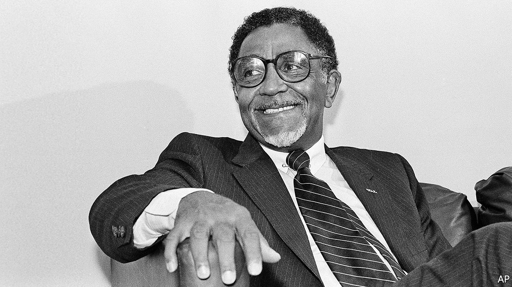

## Justice like waters

# Joseph Lowery died on March 27th

> The preacher and fiery civil-rights campaigner was 98

> Apr 2nd 2020

AS HE RAN home crying, the hot tears coursing down his cheeks, he knew exactly what he had to do. He would find his father’s pearl-handled .32. He knew where it was. Then he would run back to the family store while the white police officer was still there, the one who had told him “Get back, nigger! Don’t you see a white man coming in the door?” and had smacked him in the belly with his nightstick—and he would shoot him dead.

Luckily his father stopped him in time, saving his child-self from being lynched by the outraged whites of Huntsville, Alabama. And it seemed to Joseph Lowery that a seed was planted that day, a seed of struggle. It could have made him hate: just one more insult among the many he was used to, being born black. Instead, it grew towards love. He had learned non-violence. Several years later, when he had given up struggling against the Lord’s call to be a Methodist preacher, the New Testament repeated the lesson: do good to them that hate you. Or as he liked to put it later in one of his rhymes, not suppressing a smile, “An eye for an eye and a tooth for a tooth, will leave us all blind and gummin’ our food.”

That conviction grew all the stronger when he met Martin Luther King. (He liked the guy from the start, even though he was Baptist.) Together in 1957 they founded the Southern Christian Leadership Conference that led, with prayers, sit-ins and marches, the civil-rights campaigns of the 1960s: for desegregated lunch counters, for equality in hiring and education, for the vote. When Martin was killed, at 39, in 1968 the SCLC fell on hard times for a decade, but in 1977 he took over as president and broadened what it did. Now it raised its voice against poverty and discrimination in general, against police brutality and the death penalty, as well as for peace in all corners of the world. Justice would roll down like waters, and righteousness like a mighty stream.

He felt no fear in speaking truth to power. Both Jimmy Carter and Bill Clinton felt the hot lash of his tongue for failing to raise up people out of poverty. Both Bushes, senior and junior, were scolded publicly over Iraq: for war, billions more, but no more for the poor. After the march on Selma in 1965 he presented a voting petition to Governor George Wallace—going like Moses through the Red Sea, through a Blue Sea of state troopers—and told him frankly that God would hold him accountable. Though he might seem a mild fellow, with his spectacles and jokes, he had a fire in him that fire-hoses couldn’t wash out. For years he had thought that social justice on Earth had little to do with the kingdom of Heaven. Now he knew that a minister’s job was also to make Earth more heavenly.

Besides, non-violence had wrought a spiritual change in him. He had become a new creature, perplexing to his enemies, as everyone in the movement had. The first proof came early. In Mobile in 1955 he and another minister rode one day in the front of the bus to Prichard, a more racist town. When a white passenger came up to bawl them out he quietly told him to sit down, and the man obeyed. Pretty soon, no black person on Mobile’s buses had to give up his seat to a white. After this success Martin asked him to help with the year-long bus boycott in much bigger Montgomery, which in 1956 led to the desegregation of buses all over America. Patience paid off. Love worked. They were crazy, perhaps; but good crazy.

Time and again as he campaigned the Lord protected him. (Preachers were useful to Him for that streaming down of justice: independent, strong and servants of the people, not servants of chambers of commerce.) The Lord made him decide to take a train back to Nashville on the night his motel room in Birmingham was blown apart. He held him and his wife Evelyn in the palm of His hand when Klansmen’s bullets whooshed over his head, and through their car, in Decatur, where he was supporting a mentally disabled black man accused of raping a white woman. The Lord even organised it that when he and others were judged by an Alabama court to have libelled a state official, the Supreme Court in 1964 overturned the judgment, and his car, which had been seized, was bought back at auction by a member of his flock.

In each of these trials the old anger would flash through him, and with prayer he would hold it back. The hardest point came on that spring day when Martin was shot in Memphis, a rare day when he was not at his side. He curbed his grief by pouring energy into the two big United Methodist churches, Central and Cascade, which he ran in Atlanta for many years, building up membership mightily. But he poured even more into the SCLC, Martin’s organisation as he saw it, by keeping that flame burning and by reminding Americans what sort of man his friend had been. A doer, not a dreamer; a revolutionary who challenged the capitalist system and the powers that be, whose birthday should be marked every year with marches against the injustice and inequality that still stalked the land. The job was far from finished. And they had marched too long, bled too profusely, to give up striving now.

He believed deeply in that struggle. But he also knew that God’s plan was bound to work out. Crooked places would be made straight, the lion would lie down with the lamb and every tear would be dried. Sometimes he could feel God moving in history, nudging it along. It happened when the boss of Morrison’s cafeterias in Montgomery, who refused to desegregate his lunch counters, dropped dead just before the Civil Rights Act; and it happened when a black man in 2008 ran for president of the United States.

At Barack Obama’s inauguration he was asked to give the benediction. He was delighted to; that way, he would get the last word. Time for a rhyme, but a heartfelt one. He prayed for a day when black would not be asked to get back, brown could stick around, yellow would be mellow, and white would embrace what was right. “The Star-Spangled Banner” was the only thing that followed him.

As an anti-war campaigner it was not a piece he liked, with all that “bombs bursting in air” stuff. But it sounded better than ever then. It was not the anthem that had changed; the country had changed. Say amen! And amen! In the fierce cold of that January day, hot tears coursed down his cheeks.■