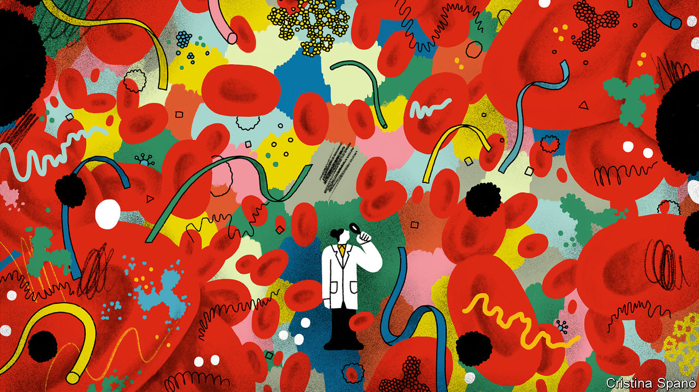
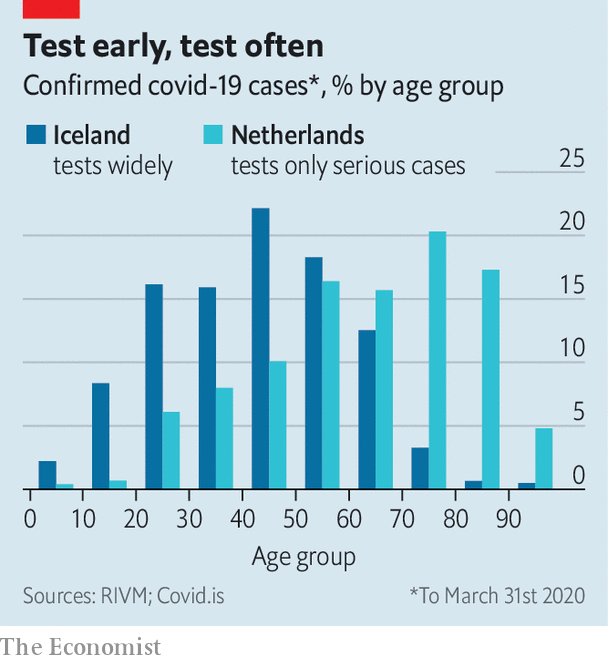

## The coronavirus pandemic

# An antibody test for the novel coronavirus will soon be available

> Use it wisely

> Apr 2nd 2020

Editor’s note: The Economist is making some of its most important coverage of the covid-19 pandemic freely available to readers of The Economist Today, our daily newsletter. To receive it, register [here](https://www.economist.com//newslettersignup). For more coverage, see our coronavirus [hub](https://www.economist.com//coronavirus)

WHEN A NEW virus invades the human body, the immune system leaps into action. First to the scene are antibody molecules of a type called immunoglobulin M (IgM). These bind with proteins on a virus’s surface, disabling it and marking it for destruction by cells called macrophages. A few days later the system produces a second type of antibody, immunoglobulin G (IgG), to continue the fight. IgMs are short-lived. They stick around in the bloodstream for three or four weeks before disappearing. IgGs, however, are the basis for a much longer-term form of immunity. This can last for many years, or even a lifetime.

Kits that test for these two types of antibodies when they have been raised specifically by SARS-CoV-2 should soon become available. The virus causing the covid-19 is already being detected with genetic tests, which look directly for current signs of infection in nasal or throat swabs. Tests to detect antibodies will also be able to identify those who have had infections in the past and may now be immune. In the short term, this will be important because it will permit the authorities to identify who may return to their jobs without risk of infecting others. That is particularly valuable in the cases of doctors, nurses and the numerous other health-care workers needed to look after those who are seriously ill. It will also help in the longer run, by revealing how far the virus has spread through a population, and thus whether or not herd immunity is likely to have built up. Herd immunity is the point where insufficient infectible individuals remain in a population for a virus to be able to find new hosts easily, and it is therefore safe to lift social-distancing and stay-at-home rules.

SARS-CoV-2 antibody tests have already been deployed in limited numbers in China, Singapore and South Korea. Several Western governments, including those of America and Britain, have been buying up millions of surplus antibody tests from China for use in their own countries. Several other types of these tests have also been developed by companies around the world. None, however, has yet been approved for widespread use—for, though such tests are reasonably easy to manufacture, ensuring that they give useful and reliable results is taking a lot of effort.

Each different design of test uses its own recipe of chemicals and processes. Physically, however, many resemble the self-contained plastic sticks employed in the version made by Biopanda Reagents, a British firm. A user first pricks a fingertip. Then he or she introduces a few drops of blood into an opening at one end of the stick. Inside, the blood goes through a series of chemical processes that can identify particular antibodies. It takes around 15 minutes to get a result, and this is displayed in a similar fashion to that used by a typical pregnancy test—the positive identification of an antibody resulting in a coloured line next to its label on the test stick.

There are three interesting signals. A solitary positive for IgM means the person has had a very recent (potentially current) infection. Positives for both IgM and IgG mean the user was infected some time within the past month. A positive for IgG alone means that the infection occurred more than a month ago, and the user should now be immune to a repeat of it. (A negative result probably means no infection, though it could also mean that it is too early in the course of an infection for antibodies to have appeared, since the first IgMs typically turn up only 7-10 days after an infection has begun.)

Before regulators can approve a test for widespread use, they need to validate it. How useful it is can be summarised by two numbers determined during this validation: its sensitivity and its specificity.

A test’s sensitivity refers to how good it is at detecting the thing it is meant to detect—in this case the IgM and IgG antibodies associated with SARS-CoV-2. A sensitivity of 95% means that, from 100 blood samples known (by other means, such as previous genetic testing) to be infected, the test will reliably tag 95 correctly as having the pertinent antibodies. The remaining five would be identified as having no antibodies present—in other words they would be false negatives.

The other significant number, a test’s specificity, measures how good that test is at detecting only the antibodies it is meant to detect. There are seven human coronaviruses and, ideally, a test would detect only antibodies produced in response to SARS-CoV-2. A test with 98% specificity means that, of 100 known uninfected blood samples, 98 will come back (correctly) as negative and the final two will come back (falsely) as positive. Such false positives could have many causes. A common one is cross-reaction, in which a test responds to the wrong antibodies.

To work out a test’s sensitivity and specificity, it needs to be checked against hundreds of samples of known status. Given the novelty of SARS-CoV-2, and therefore the lack of easy access to relevant blood samples, this takes time. The British and American authorities are assessing several tests, but have released no validation data as yet, and have been tight-lipped about when they will do so.

An ideal test would be 100% sensitive and 100% specific. In reality, there will always be a trade-off between the two. Make a test acutely sensitive, so that it gives a positive signal with even the tiniest amounts of a relevant antibody present, and it will get less specific. This is because such a fine chemical hair-trigger is likely to be set off by antibodies similar to, but not identical with the target. And vice versa.

This trade-off is not always a bad thing, for it allows different sorts of test to be used in different circumstances. For example, if the intention of testing is to identify doctors and nurses who have antibodies to SARS-CoV-2, so that they can safely return to work with infected patients, because they are themselves now immune to infection, then the most important thing is for a test to have a low rate of false positives. In other words, it needs a high specificity.

By contrast, if the idea is to gather transmission data, sensitivity is the priority. If someone were identified as having had an infection, further tests could trace which of that person’s acquaintances were also infected, or had once been infected and were now immune. In these circumstances, a few false positives would not be a disaster. They would probably show up eventually, because those around the allegedly infected individual would not be infected as often as expected. A false negative, though, would mean lost information and a consequent lack of contact-tracing. That would be significant.

Testing of this sort will let doctors understand how a local cluster of infections grows, and therefore what action to take in order to break the chain (meaning, in practice, who needs to be quarantined). This kind of contact-tracing and isolation has been employed to great effect in South Korea through the use of genetic tests for the virus. Antibody tests will enhance the process, by capturing data on those infected in the past as well as the present.

Children are another group who could profitably be monitored using antibody tests. It is now well established that they are less likely than adults to present the symptoms of covid-19, and rarely suffer severe disease. It remains unclear, though, to what degree they are being infected “silently”, and are thus able to pass the infection on to others around them while apparently remaining healthy themselves. Antibody tests will reveal a fuller picture.

Antibody tests will no doubt also be in demand from members of the public wanting to know their immune status—for their peace of mind if nothing else. This might be cause for conflict. Even when they are cleared for general use it will take time for manufacturers to ramp up the production of tests, and those working in health care and one or two other important areas, like teaching, policing and delivering groceries to stores and markets, will surely be at the head of the queue to be tested. It is therefore hardly surprising that unvalidated kits, purportedly for domestic use, are already being offered for sale by unscrupulous online suppliers. Britain’s medical regulator, for one, has had to take down several fraudulent websites and is warning people not to use any home-testing kits they find being sold online.

Even when more kits do become available (and with due acknowledgment to the different putative uses of different sorts of test) the next goal for most countries after protecting crucial members of the workforce will be population-level surveillance. This will, as a by-product, provide information to individual members of the public. But its primary purpose will be to track how the epidemic is progressing.

One of the most important elements of this analysis will be determining the rate of silent infection—with all the implications that brings for herd immunity. Comparing recent test data from the Netherlands and Iceland hints at the gap in current knowledge of just how much silent infection there may be. Both countries use genetic testing for the virus, but the Netherlands only tests those with severe symptoms of covid-19, whereas Iceland has been testing widely, even people without symptoms. Unsurprisingly, but crucially, the Icelandic approach has revealed far more infections in younger people than the Dutch one (see chart). Moreover, according to Kari Stefansson, who is leading the Icelandic project, 50% of those who have tested positive reported no symptoms.

Mass testing will be laborious. It will mean taking regular blood samples from millions of people, even though the actual analysis will be done by robots in centralised high-throughput laboratories. To save effort, such projects might piggyback on a country’s blood-transfusion services, for donated blood is already subject to rigorous screening for pathogens.

German scientists have announced plans to start, this month, a reasonably large-scale surveillance project. It will monitor blood samples taken regularly from 100,000 participants. Those proving immune may be given a certificate exempting them from restrictions on working or travelling. If nothing else, that would certainly be an incentive to sign up. ■

Dig deeper:

For our latest coverage of the covid-19 pandemic, register for The Economist Today, our daily [newsletter](https://www.economist.com//newslettersignup), or visit our [coronavirus hub](https://www.economist.com//coronavirus)