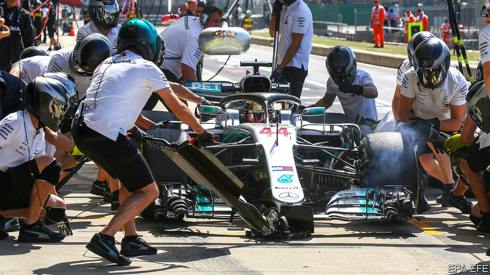

## The coronavirus pandemic

# Formula 1 comes up with a breathing machine for covid-19 patients

> Racing-car engineers are applying their expertise to medicine

> Apr 4th 2020

Editor’s note: The Economist is making some of its most important coverage of the covid-19 pandemic freely available to readers of The Economist Today, our daily newsletter. To receive it, register [here](https://www.economist.com//newslettersignup). For more coverage, see our coronavirus [hub](https://www.economist.com//coronavirus)

THE SEVEN Formula 1 teams in Britain have high-tech engineering centres stuffed with the latest production equipment. And they employ hundreds of staff with the talent to use this gear to design, test and manufacture parts rapidly, in the days between races. With the season suspended, they have been collaborating on ways to help produce ventilators, which are needed urgently to treat patients suffering from covid-19. This week one team, Mercedes-AMG, obtained approval for a device which it can quickly manufacture by the thousand.

The machine is not a ventilator, but a breathing aid of a type known as a continuous-positive-airway-pressure (CPAP) device. These are typically used to assist people who have breathing problems to sleep more soundly. The machine delivers air at slightly above atmospheric pressure via a mask placed over the nose and mouth. This helps keep open the alveoli of the lungs. (These are the sacs from which blood absorbs oxygen, and into which it dumps carbon dioxide.) That reduces the effort of breathing. Additional oxygen can also be added. According to reports from Italy, around half of patients given CPAP treatment have avoided the need for invasive mechanical ventilation, in which a tube is inserted down a patient’s throat.

Mercedes-AMG worked with a team at University College, London, to take apart, copy and improve an off-patent CPAP machine in a matter of days. As it was based on an existing design the British government’s medical regulator was able to fast-track approval. The team also worked with Oxford Optronix, a small British firm that makes oxygen monitors. The first 100 devices have now been delivered to University College Hospital and other London hospitals for clinical trials. These are expected to take three or four days. If they are successful, the team reckons it can make 1,000 of the CPAP machines a day at its base near Northampton, and distribute them thence to other hospitals around the country.

“The speed with which the team developed the device is remarkable,” reckons Duncan Young, a professor of intensive-care medicine at Oxford University, who is not part of the project. Patients too unwell for simple oxygen masks, but not ill enough to need a ventilator, can be treated with a CPAP machine, says Dr Young. This could, he adds, save lives by freeing up ventilators for those in urgent need of them.

Dig deeper:For our latest coverage of the covid-19 pandemic, register for The Economist Today, our daily [newsletter](https://www.economist.com//newslettersignup), or visit our [coronavirus hub](https://www.economist.com//coronavirus)