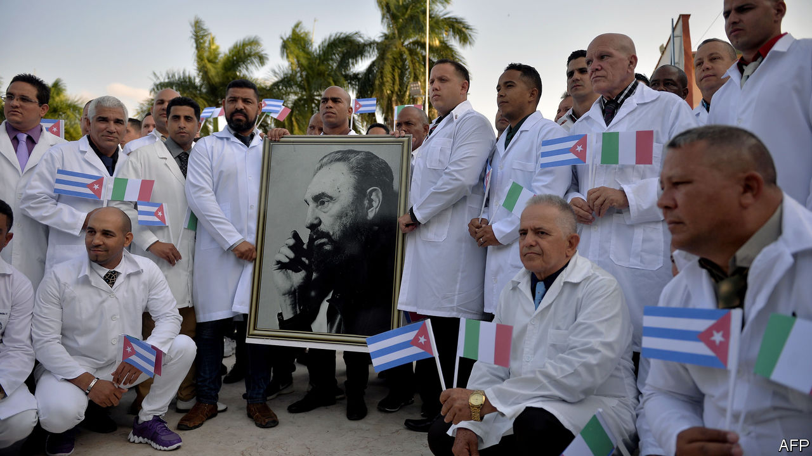
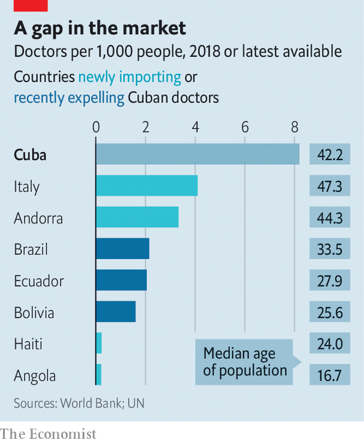

## Mercy and money

# Cuba’s doctors are in high demand

> The communist island’s practice of exporting medical workers has a dark side

> Apr 4th 2020FLORENCE AND MEXICO CITY

Editor’s note: The Economist is making some of its most important coverage of the covid-19 pandemic freely available to readers of The Economist Today, our daily newsletter. To receive it, register [here](https://www.economist.com//newslettersignup). For more coverage, see our coronavirus [hub](https://www.economist.com//coronavirus)

WHEN THE number of patients mounts but the number of healers does not, whom do you call? That was the question for Giulio Gallera, the health minister in Lombardy, the Italian region worst hit by covid-19. The army was erecting a field hospital with 32 beds in a car park in Crema, 50km (30 miles) south-east of Milan. But what about doctors to attend them? “Someone said to me: ‘Write to the Cuban ministry of health,’” recalls Mr Gallera. Barely a week later, on March 22nd, 52 medics arrived from Havana, waving Cuban and Italian flags. Locals sent them warm clothing and bicycles for their commute.

Cuba’s Central Medical Collaboration Unit, which for six decades has sent doctors across the world, is having a busy month. Some 14 countries, from Angola to Andorra, have received a total of 800 doctors and nurses. Politicians in Buenos Aires and Valencia in Spain, and indigenous groups in Canada, are pressing national governments to request Cuban brigades.

Cuba trains a staggering number of doctors for its size and wealth (see chart). Even though its population of 11m is not young, it has doctors to spare. More than usual are available. In the past 18 months 9,000 have left Brazil, Bolivia, El Salvador and Ecuador, where leftist presidents have recently lost power. According to Granma, Cuba’s state-owned daily newspaper, the number of doctors and nurses abroad fell from more than 50,000 in 2015 to 28,000 in 2020.

Cuba started exporting doctors out of a mix of humanitarianism and a desire for good publicity. Since 2006, when Raúl Castro assumed the presidency from his brother, Fidel, the practice has become a vital prop to the economy. Portugal, which has received Cuban doctors since 2009, pays €50,000 ($55,000) a year for each one. Venezuela has long supplied cheap oil to Cuba in exchange for its 20,000-strong medical contingent. Last year, when Cuba’s government published detailed trade statistics for the first time, medical services made up 46% of exports and 6% of GDP.

Cash-for-carer deals are less good for the doctors themselves. The communist government typically keeps three-quarters of health workers’ salaries (which still leaves them better off than they would be at home). Many complain of horrid working conditions. To discourage defection (or “brain theft”) Cuban officials in host countries confiscate doctors’ passports and withhold part of their share of their salary until they come home. It does not always work. The United States, which damns the programme as human trafficking, offered permanent residency to Cuban doctors in other countries from 2006 to 2017. More than 7,000 accepted. On March 24th the State Department warned countries using Cuban doctors to be on the alert for abuse.

But countries like Italy need help, and Cuba needs cash. Covid-19 has stopped tourism, a big source of income. Remittances from the United States will fall. Even before the pandemic Cuba was in trouble: in October it missed debt payments to creditor countries. One creditor is Italy, which might have accepted medical help as in-kind debt payment, says Rodrigo Olivares-Caminal, a professor at Queen Mary University in London. It is not clear whether all new host countries are paying up. Andorra is, says its finance minister. Cuba generally keeps such details quiet but tends to charge richer countries more, says John Kirk, of Dalhousie University in Nova Scotia.

If it is to send doctors overseas, it will have to avoid a Lombardy-style outbreak at home. It prides itself on prevention. Neighbourhood spies check on whether pregnant women get prenatal care as well as on their loyalty to the Communist Party. Medical students have taken the temperatures of 500,000 elderly Cubans to detect cases of covid-19. Cuba has recorded 212 cases, compared with 1,284 in the Dominican Republic, which has nearly as many people.

With the stakes so high at home, medical adventurism abroad may seem reckless. But the government craves the kudos it brings and hopes no one will notice that it benefits so much more than the medical emissaries. After the release last year of “Chernobyl”, a television mini-series, pundits touted the role of Cuban doctors in treating children for radiation poisoning. Cubans hope that the doctors in Lombardy will one day be seen as covid-19 heroes. ■

Dig deeper:For our latest coverage of the covid-19 pandemic, register for The Economist Today, our daily [newsletter](https://www.economist.com//newslettersignup), or visit our [coronavirus hub](https://www.economist.com//coronavirus)

## URL

https://www.economist.com/the-americas/2020/04/04/cubas-doctors-are-in-high-demand
