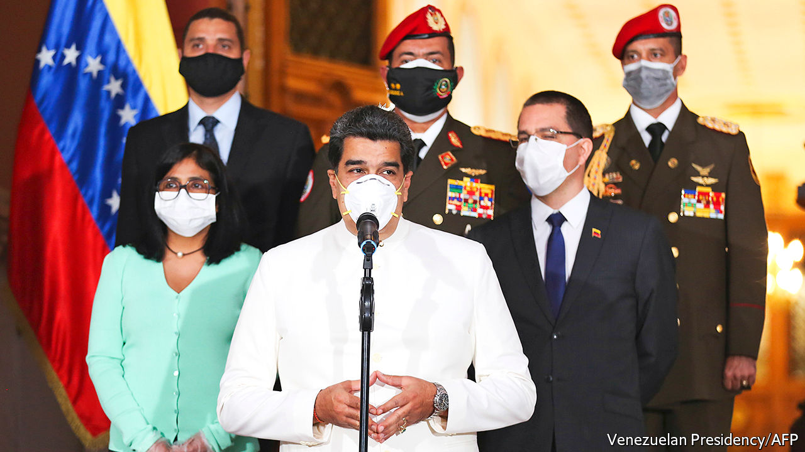

## Maduro rap

# The unintended consequences of indicting Nicolás Maduro

> The threat to jail Venezuela’s dictator may make it harder to remove him

> Apr 2nd 2020

IT WAS, INSISTED William Barr, the United States attorney-general, “good timing”. Amid the covid-19 pandemic and a collapse in global oil prices, on March 26th America’s Department of Justice unsealed indictments on drugs charges of Nicolás Maduro, Venezuela’s dictator, and members of his inner circle. No longer should his regime be seen as merely corrupt and incompetent, argued Mr Barr. Now he has formally labelled it criminal—a drug gang masquerading as a government. The State Department offered rewards for information leading to the arrest of the accused ringleaders: $15m for Mr Maduro, $10m for Diosdado Cabello, the thuggish head of the pro-government “constituent assembly”.

The administration of Donald Trump seems to hope that the indictments will finally remove a regime that has been subject to punishing sanctions since early last year. But branding Mr Maduro a criminal blunts any incentive he might have to relinquish power. On March 31st the Trump administration changed its tone a bit. It suggested a “democratic transition framework” that envisages a role for the regime.

Venezuela’s situation is terrifying. Under Hugo Chávez, who became president in 1999, high oil prices hid the costs of the regime’s economically illiterate policies. But since 2013, when Mr Maduro took over, the economy has shrunk by two-thirds and a seventh of the population, now about 28m, has emigrated. Covid-19 will make things far worse. A nationwide lockdown imposed by the government on March 17th will add to the effects of a plunge in global oil prices. Remittances from Venezuelans living abroad are slumping. Exports of gold and even narcotics are stagnating. Luis Oliveros, an economist based in Caracas, expects the economy to shrink by 15% this year, double the contraction he had forecast before covid-19.

Venezuela has even less scope than other Latin American countries to borrow to soften the effects of the crisis. It has already defaulted on its debts. On March 15th Mr Maduro appealed to the IMF, which the regime has long reviled, for $5bn of assistance. The fund rebuffed him because some members do not recognise the regime as the legitimate government.

So far, Venezuela has had just 144 confirmed cases of covid-19. The economic slump and the regime’s pariah status had prompted airlines to reduce flights to the country, which bought time before the pandemic struck. But without testing and contact-tracing the disease will spread. The health system barely functions. The Global Health Security Index, which was developed by the Economist Intelligence Unit, ranks its preparedness for an epidemic 176th among 195 countries. Half of its 306 public hospitals have no face masks, according to Médicos por la Salud, an NGO.

“We only have running water for half the day,” says a doctor in the main public hospital in the city of San Felipe, the capital of Yaracuy state. Personal protection equipment from China was promised but has not arrived, he says. The state-run El Algodonal hospital, supposedly among the better ones in the capital, has no ambulance, no X-ray machine, no functioning morgue and, for half the week, no water or electricity. On March 30th it was treating two patients with covid-19.

With disaster looming, the regime and the opposition, led by Juan Guaidó, the head of the democratically elected National Assembly, had begun to talk to each other. On March 25th three opposition mayors appeared with Héctor Rodríguez, the pro-regime governor of Miranda state, which includes parts of Caracas, at an event to promote joint public-health measures. Henrique Capriles, who ran against Mr Maduro in an election in 2013, called on the opposition and the regime to face facts: Mr Maduro controls the country while Mr Guaidó, who is recognised by the United States and dozens of other democracies as Venezuela’s interim president, has international support. “This pandemic has to create an opportunity to seek an accord,” he said. Mr Maduro, who has repeatedly said that he is open to “dialogue” with the opposition even as he persecutes it, renewed the offer on March 25th. If the opposition did not want to recognise him as president he would participate “just as Nicolás Maduro”. There was talk of forming a unity government to deal with the pandemic.

Mr Barr may have torpedoed that. The charges allege that in the late 1990s Mr Maduro, Mr Cabello, Hugo Carvajal, a former director of military intelligence, and Clíver Antonio Alcalá, then an officer in the armed forces, founded a drug-running organisation called the Cartel of the Suns, named for an insignia on army uniforms. In league with the FARC, a Colombian guerrilla outfit, the group “sought to flood” the United States with cocaine, say the indictments. Computer discs discovered in a raid on a FARC camp in Ecuador in 2008 allegedly revealed contacts between the group and Chávez’s government, in which Mr Maduro was foreign minister. Separate charges claim that Vladimir Padrino López, the defence minister, conspired to transport cocaine on American-registered aircraft from Venezuela to Central America. Its destination was the United States.

“There’s no doubt that there is widespread corruption and penetration of the Venezuelan state by organised crime, particularly drug-trafficking,” says Geoff Ramsey of the Washington Office on Latin America, a think-tank. But he doubts that all the charges could be proved in court. “Some of the evidence is from witnesses who have...a clear incentive to play along with prosecutors,” he says. Venezuela is a relatively small player in the cocaine trade. In 2018 six times more passed though Guatemala than through Venezuela. Many observers suspect that the Trump administration cares less about dislodging Mr Maduro than about winning Florida, home to many Venezuelan and Cuban exiles, in the American presidential election this year. 

The main indictments had been sealed for several years. Pushing for publication were hardline advisers to the president, including Marco Rubio, a senator from Florida. Arguing against was the State Department. It worried that revealing the charges would undermine efforts to persuade Mr Maduro’s associates, including the defence minister, to betray him. The United States has minimum sentences for people convicted of large-scale drug-trafficking, notes Mr Ramsey. Although the constitution bars extradition, “these people now know they could end up in a jail cell in Miami” if the government in Venezuela changes.

Perhaps recognising that the truncheon alone would not work, the State Department has offered a plan that sounds more conciliatory. The National Assembly would choose a transitional government, which would prepare for free elections, under a formula that would give pro-government chavista legislators a say in its composition. Neither Mr Maduro nor Mr Guaidó could lead it. American sanctions would be lifted, which would help Venezuela cope with the pandemic. But nothing in the State Department plan spares Mr Maduro the threat of extradition should he lose power, as he surely would in a free election.

For now, he is using the pandemic to reassert control. He has prohibited public gatherings. In the midst of nationwide fuel shortages, he has given control of petrol distribution to the army, which will cash in on the black market as it now does in food. His threats against Mr Guaidó are more menacing. On March 30th, without naming the opposition leader, he warned that the regime would soon be “coming to knock on your door”. While Mr Maduro and Mr Barr are brandishing handcuffs, the threat from covid-19 can only grow. ■