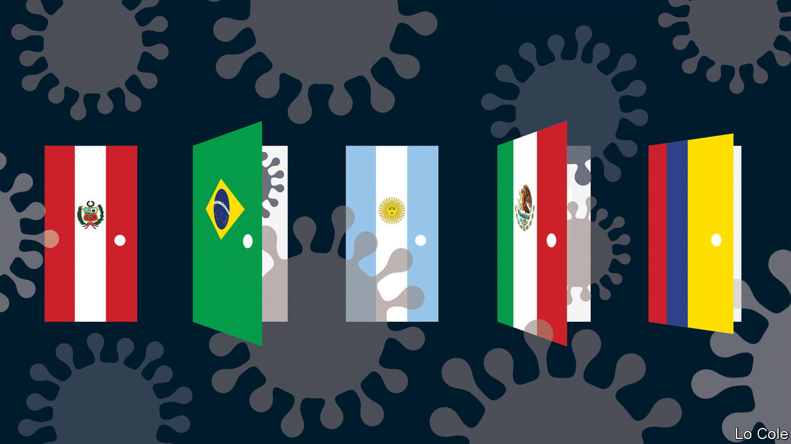

## Bello

# The wisdom and witlessness of Latin America’s leaders

> A reward, for now, for those who have acted decisively to fight the pandemic

> Apr 4th 2020

Editor’s note: The Economist is making some of its most important coverage of the covid-19 pandemic freely available to readers of The Economist Today, our daily newsletter. To receive it, register [here](https://www.economist.com//newslettersignup). For more coverage, see our coronavirus [hub](https://www.economist.com//coronavirus)

SINCE HE TOOK over as Peru’s president two years ago Martín Vizcarra, an otherwise nondescript politician, has not flinched from taking bold decisions. He pushed political reforms through by referendum. Faced with a serially obstructive Congress, last year he shut it down, calling a fresh legislative election. Characteristically, he was the first Latin American leader to react to covid-19 by imposing a lockdown and curfew, on March 15th when his country had only 71 reported cases. Peruvians appreciate this restriction on their liberties for the public good. In an Ipsos poll his approval rating soared from 52% to 87%.

That is the pattern in Latin America. In Argentina Alberto Fernández, who took over a politically divided country in December, has seen his popularity rise to over 80% after he imposed a quarantine and sealed borders. In Colombia the new mayor of Bogotá, Claudia López, stole a march over a hesitant national government when she imposed a four-day trial lockdown. Chile’s Sebastián Piñera, whose presidency seemed moribund after protests, has deployed testing and sealed off hotspots. His popularity has crept up, from 10% in December to 21%.

Their approach contrasts with that of the populist presidents of Brazil, Jair Bolsonaro, and Mexico, Andrés Manuel López Obrador, often called AMLO. Both have given priority to protecting weak economies. Both spent weeks denying the seriousness of the virus and refusing to respect social-distancing measures recommended by their health ministries.

In Mexico, according to Alberto Díaz-Cayeros, a political scientist at Stanford University, the government’s caution was rooted in trust in the capacity of the health service to deal with the threat. That approach worked against swine flu in 2009. It underestimated covid-19, which spreads aggressively, with many symptomless cases. On March 24th the government pivoted, shutting schools and banning non-essential activity. Six days later, with the virus out of control, it declared a state of emergency.

AMLO has muddled the message about social distancing. Mr Bolsonaro went further, actively sabotaging efforts to control the virus. In Brazil state governors have imposed lockdowns, including in São Paulo and Rio de Janeiro. These measures are popular. Mr Bolsonaro’s heedlessness is less so. City residents staged pot-banging protests against the president. That prompted a counter-attack. Mr Bolsonaro railed against the governors, issued a video proclaiming “Brazil cannot stop”, and urged supporters to stage cavalcades against quarantines. Only on March 31st, with 201 deaths in Brazil, did he (briefly) recognise the seriousness of the virus, calling for a “pact” against it “to save lives without leaving jobs behind”. He then reverted to his earlier rhetoric.

What political consequences will these actions have? Though he is still popular, AMLO’s approval rating was declining before the virus, because of his failure to halt crime or to revive the economy. That trend seems set to continue. As for Mr Bolsonaro, some think his actions merit impeachment, for threatening the constitutional right to life. His strategy appears aimed at shoring up his base. Polls show he retains the support of a third of respondents. That should be enough to keep his job, depending on how many Brazilians die.

Those who have acted decisively are benefiting from the public’s instinct to rally round their leaders at a time of danger. But sustaining the quarantines in a region where many live precariously will be hard. Take Argentina, where Mr Fernández already faced a stricken economy. His government has made some emergency handouts of money and food in poor areas on the periphery of Buenos Aires, where his Peronist political movement has long run things. Even so, the Peronists “are very worried, they fear a social explosion and losing control”, says Sergio Berensztein, a political consultant. He thinks the government may have to make quarantine more selective and flexible, at the risk of prolonging the epidemic. Much the same goes for Peru.

Covid-19 struck Latin America when its leaders and institutions had fallen into disrepute, because of economic stagnation, corruption and poor public services. Management of the pandemic requires a huge effort to help those in need. It may also offer an opportunity for redemption. Leaders who impose quarantines could save the lives of 2.5m Latin Americans, according to epidemiologists at Imperial College, London. They have to find ways to make citizens remember that, even as economic hardship bites.

Dig deeper:For our latest coverage of the covid-19 pandemic, register for The Economist Today, our daily [newsletter](https://www.economist.com//newslettersignup), or visit our [coronavirus hub](https://www.economist.com//coronavirus)

## URL

https://www.economist.com/the-americas/2020/04/04/the-wisdom-and-witlessness-of-latin-americas-leaders
