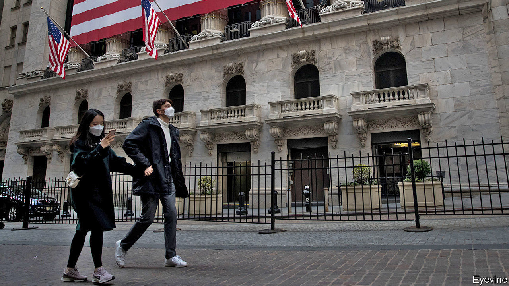
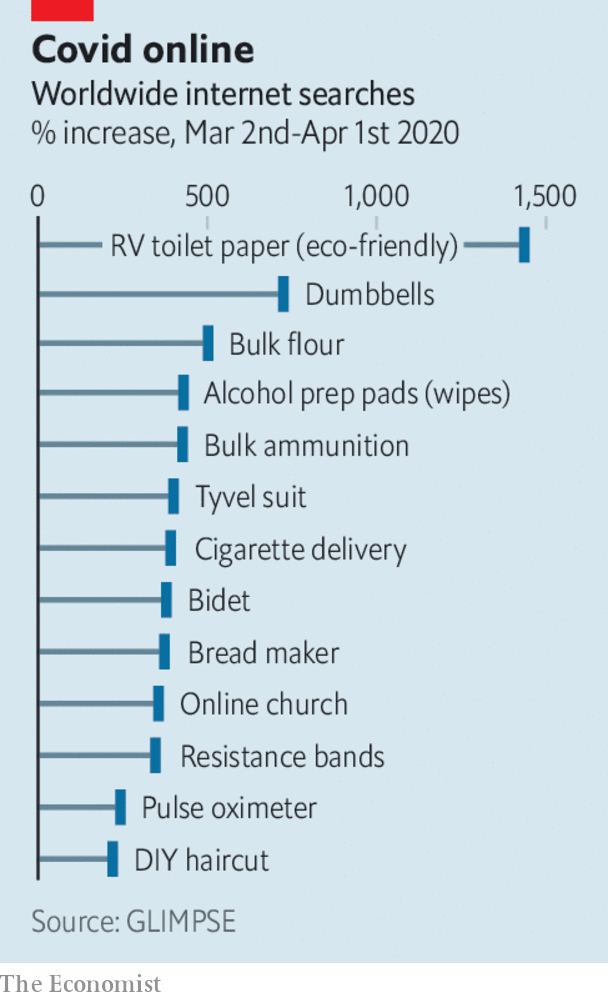

# Business this week

> Apr 2nd 2020

After a few days of relative calm, stockmarkets were once again beset by volatile trading. Many global markets recorded their worst quarter since the start of the financial crisis in 2008. The S&P 500 fell by 20% over the three months; the Dow Jones Industrial Average was down by 23%. London’s FTSE 100 dropped by 25%, its worst quarter since 1987. Commodity prices also slumped. The price of Brent crude oil plunged by 55% in March, but rose this week amid hopes that Saudi Arabia and Russia might end their price war.

The European Central Bank told banks in the euro zone to suspend dividend payments so that they can increase their lending capacity. After the Bank of England mooted similar rules, big British banks did the same. Non-financial companies are under no such obligation. Shell took out a $12bn credit facility, which should ensure it continues its shareholder dividends.

With investors flocking to the haven of the dollar, the Federal Reserve created a new facility to help many foreign central banks access the greenback and stabilise the market.

The British government expanded its rescue package for workers and companies to include paying employers’ national-insurance and statutory pension contributions up to a wage cap of £2,500 ($3,100) a month.

India’s central bank announced a raft of measures to help exporters and state governments. This came after it cut its benchmark interest rate by three-quarters of a percentage point, to 4.4%.

More than 80 emerging-market economies have turned to the IMF for help in recent weeks, according to the fund, and more are likely to follow suit. Its current estimate for the finance needs of emerging markets is $2.5trn. See [article](https://www.economist.com//finance-and-economics/2020/04/04/emerging-market-lockdowns-match-rich-world-ones-the-handouts-do-not).

China’s official manufacturing index rose sharply in March, bouncing back from a record low in February. The national statistics agency said that more than half of the businesses it surveyed had resumed production, though the situation was still far from normal. Similar indices for Japan, South Korea and other Asian countries pointed to sharp contractions in their factory output.

Australia tightened its rules on foreign takeovers amid concern that businesses struggling because of covid-19 restrictions, particularly in the airline industry, could be snapped up cheaply.

New York’s attorney-general reportedly asked Zoom to beef up its security and privacy procedures. Now that most office workers are based at home demand for the videoconference app has soared. The FBI warned separately that it had received many reports of Zoombombing, where online meetings are hijacked by trolls to display pornographic or hate images.

Using civil-defence powers enacted during the Korean war, Donald Trump ordered General Motors to start making hospital ventilators, and criticised the carmaker for being slow in its response and wanting “top dollar”. GM had already begun working on plans to produce the life-saving machines.

Under pressure from American sanctions, Rosneft, a Russian oil firm, sold its assets in Venezuela to the Russian government. See [article](https://www.economist.com//leaders/2020/04/02/why-putins-favourite-oil-firm-dumped-its-venezuelan-assets).

More American retailers who have had to close their stores during the coronavirus outbreak forced their shop workers to take a leave of absence. Gap said it was “pausing” staff pay but would continue to offer benefits. Macy’s, which was struggling before the crisis, told its 125,000 employees that it would continue to pay health insurance until at least the end of May.

OneWeb, a startup seeking to provide cheap internet connectivity through a network of satellites, filed for bankruptcy protection pending a sale of the business. It blamed covid-19, having reportedly failed to secure a loan from SoftBank, one of its investors. Meanwhile, it emerged that SoftBank has pulled out of a deal to buy back $3bn-worth of shares from investors in WeWork, a startup that saw its planned IPO implode last year.

Xerox abandoned its $30bn hostile takeover bid for  HP because of market uncertainty.

March was the best month on record for British supermarkets, with sales rising by a fifth compared with the same month in 2019, according to retail research. Sales of frozen food were up by 84% (Iceland’s revenue rose the most among the big chains). With pubs closed, alcohol sales jumped by an intoxicating 67%. An analysis of global search trends over March showed a sharp rise of interest in eco toilet paper, bidets, weights equipment and bulk ammunition.

## URL

https://www.economist.com/the-world-this-week/2020/04/02/business-this-week
