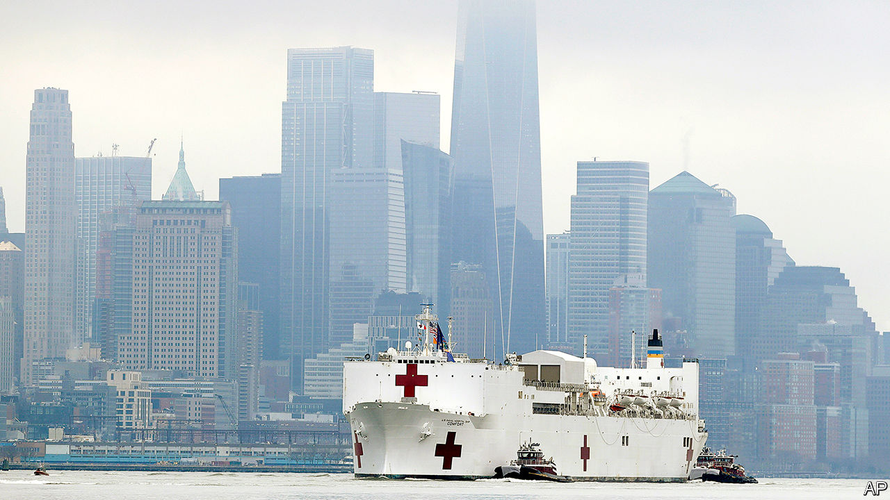
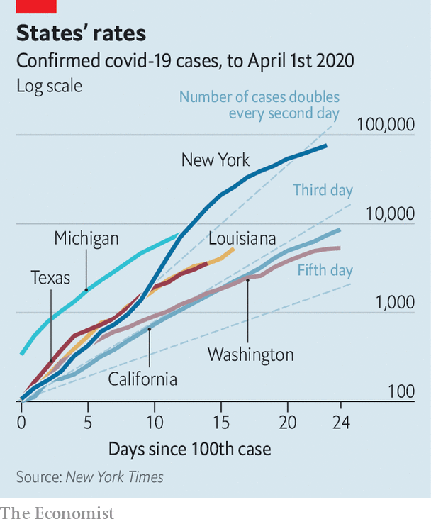

## Uniting the states

# Covid-19 and America’s political system

> How will a decentralised country that spans a continent fight what is now the world’s largest outbreak?

> Apr 2nd 2020NEW YORK AND WASHINGTON, DC

Editor’s note: The Economist is making some of its most important coverage of the covid-19 pandemic freely available to readers of The Economist Today, our daily newsletter. To receive it, register [here](https://www.economist.com//newslettersignup). For our coronavirus tracker and more coverage, see our [hub](https://www.economist.com//coronavirus)

HAVING SAILED past the Statue of Liberty, the USNS Comfort docked at a pier on the west side of Manhattan. The spot where cruise ships once picked up passengers for the Caribbean now holds a naval hospital ship with the capacity to treat 1,000 patients—all to relieve the hospitals of New York City struggling with rampaging covid-19. Eager passers-by thronged to the shoreline to photograph the Comfort, briefly disregarding the advice to distance themselves from strangers.

New York City has become the desperate centre of the epidemic in America, with a quarter of the country’s cases. Although the caseload is projected to get worse, hospitals are already on the brink. As Eric Wei, the chief quality officer of the state’s public hospitals, says: “The indicators I’m looking at are flashing red.”

On a recent morning, nurses and staff wept as they walked into Elmhurst hospital in Queens, which has been flooded with patients. They fretted about shortages of masks, gloves and ventilators. Some hospitals have resorted to hooking two patients up to the same ventilator, which ought to work but is not what they are designed for. James Gasperino, the head of critical care at Brooklyn Hospital Centre, is discussing rationing care with the ethics committee. One field hospital has been set up in Central Park, another at Flushing Meadows. Kiosks around the empty streets display ads aimed at retired health-care workers, asking them to help. New York University is offering medical students early graduation if they enlist in the effort. About 70,000 such workers have volunteered so far.

Unfortunately these scenes could well be repeated elsewhere in America. New hotspots of infection, with rapidly growing case-counts, include Chicago, Detroit and New Orleans. Smaller towns are not immune either: Albany, New York, and Albany, Georgia, are both struggling with outbreaks. Successful containment will require weeks of lockdown. Whether that will work depends on whether America’s many moving parts—federal agencies, states, cities, school districts and hospital systems—can become more disciplined.

President Donald Trump once suggested that America would be open for business by Easter. Since then, the country has overtaken China and everywhere in the rich world in terms of confirmed cases. The rise has not halted: as of April 1st America had 217,000 positive tests (the true number of cases will be far higher) and 5,140 deaths. Over the past two weeks, confirmed cases and deaths have been growing at a daily rate of 26% and 30%, respectively. The scientists advising the president are now suggesting that between 100,000 and 240,000 Americans will die even if current social-distancing measures are kept in place.

Facing these statistics, Mr Trump extended advice on social distancing for a month. The president, having once claimed that the first 15 cases would soon go “down to close to zero” now says that his administration will have done “a very good job” if deaths are kept below 200,000.

Already, most Americans are taking extraordinary precautions. Three-quarters of the country has been advised to stay at home. Almost all schools are closed. Yet the projections of 100,000 or more deaths over the course of the epidemic are conditional on continuing this effort for weeks, months even. They surge above 1m if restrictions are prematurely relaxed.

All national epidemics are made up of many local epidemics, each with its own trajectory. The Institute for Health Metrics and Evaluation (IHME), a well-respected research group, has forecast that the apex of New York’s cases will come on April 9th, when 11,600 intensive-care beds will be needed (compared with the 718 available in normal times) and when deaths could peak above 800 a day. The worst times for other states will come later. California is projected to experience the greatest number of daily hospitalisations on April 28th; for Virginia, that point would not arrive until May 20th. Though the dragged-out epidemic means longer disruption to the economy and ordinary lives, it also makes the disease easier to fight. Although IHME’s modelling suggests cases in New York will overwhelm its medical capacity several times over, California and Virginia are not, as yet, projected to have such difficulty.

Public-health authority in America is devolved to the states. The federal government provides cash and guidance, but its legal oversight is largely limited to movement between states (such as on aeroplanes). As a result, governors and mayors are the primary deciders on whether to close schools, gyms and museums and when to lift shelter-in-place orders. The decentralised response will mean that some states fare better than others.

California and Washington, states that saw some of the first cases in the country, installed relatively stringent measures early and have seen a slower growth in caseloads than other states that acted later (see chart). Borders between states are unlikely to be shut. That suggests one shortcoming of the federalised system: laxer controls in one state risk recrudescence in others.

Yet so far the decentralised system has also been a saving grace. Were matters entirely in the hands of the federal government, which botched the initial phase of the epidemic, things could have been much worse. A faulty test design and weeks of bureaucratic red tape blinded public-health authorities at a critical moment. At the same time, Mr Trump was downplaying the risk, and the coronavirus task-force he set up suffered from infighting.

If states like California and Washington had not acted when they did, their hospitals might already be overwhelmed. Even until recently Mr Trump has been squabbling with Democratic governors he sees as insufficiently deferential and grateful, like Gretchen Whitmer in Michigan (“way in over her head”, he tweeted on March 27th ) and Andrew Cuomo of New York (“I think New York should be fine, based on the numbers that we see, they should have more than enough,” Mr Trump said on March 30th). But unlike the pseudo-crises of his administration, this real one cannot be badgered or blustered into submission.

Epidemiologists and, now, the White House think that America will remain closed for at least the next few weeks, its economy mothballed. Before states can relax restrictions, their epidemic curves must be bent. “The best thing we can do for the economy is get the virus under control […] And then we can open the economy back slowly and systematically, and have a much better chance that it remains open,” says Ashish Jha of the Harvard Global Health Institute. There must be sustained declines in new infections over a long period, perhaps two weeks. There must also be enough testing capacity to contain new clusters. After lagging behind, America is now consistently testing 100,000 people a day. Still, three times as many tests may be needed, says Dr Jha, to trace all the contacts of the newly infected and for random sampling. And hospitals must have the capacity to absorb the added demand that relaxation of social distancing could bring. It is possible to do all this in a month. But it is more likely that Mr Trump will have to extend his directives beyond May 1st.■

Dig deeper:For our latest coverage of the covid-19 pandemic, register for The Economist Today, our daily [newsletter](https://www.economist.com//newslettersignup), or visit our [coronavirus tracker and story hub](https://www.economist.com//coronavirus)

## URL

https://www.economist.com/united-states/2020/04/02/covid-19-and-americas-political-system
