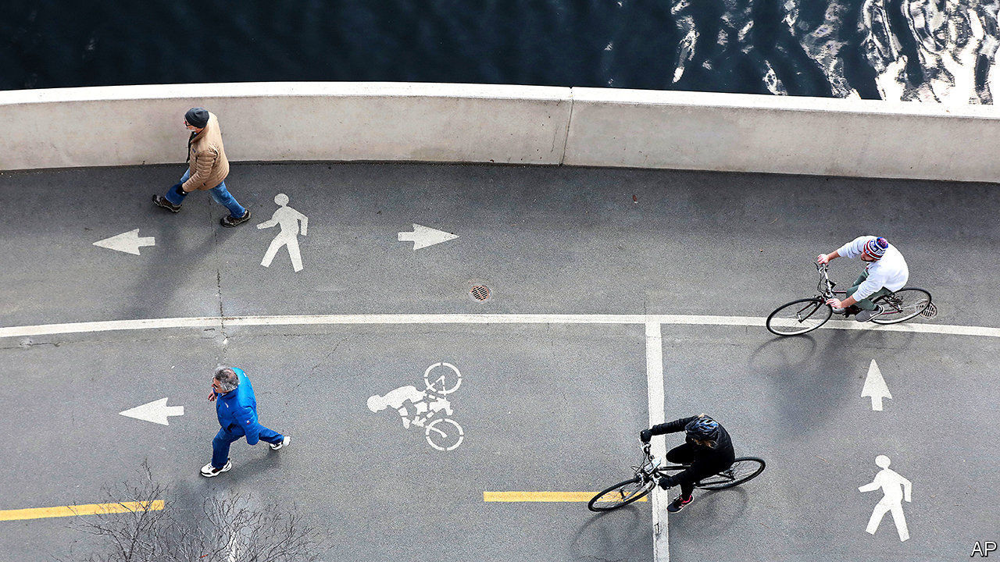
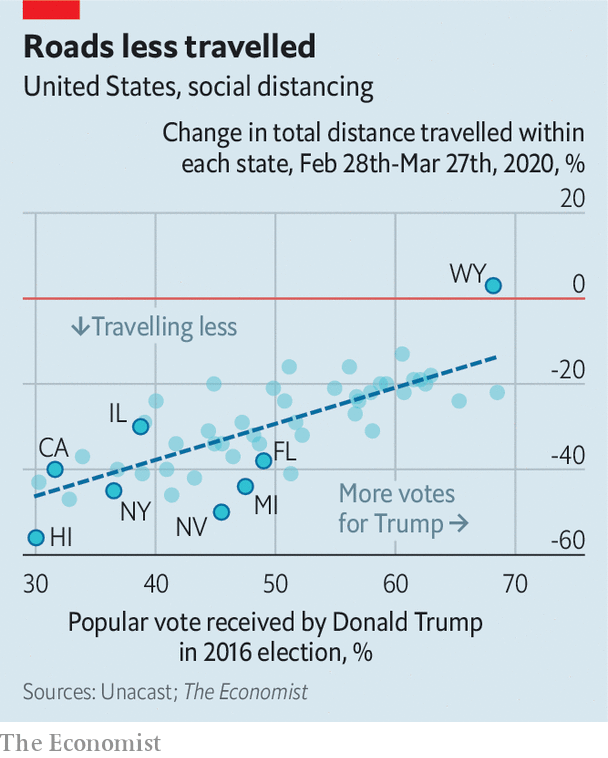

## Motion sickness

# Democrats seem to take social distancing more seriously than Republicans

> GPS data from mobile phones reveal how Americans are moving

> Apr 4th 2020

Editor’s note: The Economist is making some of its most important coverage of the covid-19 pandemic freely available to readers of The Economist Today, our daily newsletter. To receive it, register [here](https://www.economist.com//newslettersignup). For our coronavirus tracker and more coverage, see our [hub](https://www.economist.com//coronavirus)

“AMERICA IS all about speed; hot, nasty, bad-ass speed,” runs a line from a 2006 film, “Talladega Nights”, supposedly quoting Eleanor Roosevelt. Restricting Americans’ freedom of movement was always going to be hard. GPS data show how hard. They also suggest a worrying partisanship.

The evidence comes from a company called Unacast, founded by two Norwegians in New York in 2014. It aggregates location data from mobile phones to track and analyse people’s movements on behalf of retailers and property companies. Such data become available when users download, say, restaurant-finding apps. This makes it possible to measure the total distance logged on mobile phones by county, state and nation.

The most interesting data are those from state and county levels. In Nevada people halved the total distance they travelled between February 28th and March 27th. In Wyoming they travelled around more. (The average national reduction was 30%). The biggest declines in distance were in the north-east and Pacific coast. In the South, Midwest and Plains states declines have been modest.

There are several reasons. Midwestern and Plains states have relatively few cases of covid-19. This may make people take the crisis less seriously. They are also sparsely populated. When your nearest neighbour is a mile away, you may think you are self-isolating already.

But the Unacast data suggest that politics is also playing a role. All the states where people have cut travel by more than 44% are Democratic (that is, they voted for Hillary Clinton). Of the 25 states where people have cut back by 29% or less, all but three voted Republican. The pattern is repeated at county level. In Florida, people in Democratic counties on the Atlantic coast, such as Miami-Dade and St. Johns, have restricted their movements more than those in Republican-counties on the Gulf coast and in the Panhandle.

Democrats seem to be taking the crisis more seriously than Republicans. In a poll by the Pew Research Centre, 59% of Democrats said covid-19 is a major threat to the health of Americans; only 33% of Republicans said that. The Unacast data suggest people are acting on their opinions, risking infection from, and spreading, a virus that has killed more Americans than the 9/11 attacks.

Dig deeper:For our latest coverage of the covid-19 pandemic, register for The Economist Today, our daily [newsletter](https://www.economist.com//newslettersignup), or visit our [coronavirus tracker and story hub](https://www.economist.com//coronavirus)

## URL

https://www.economist.com/united-states/2020/04/04/democrats-seem-to-take-social-distancing-more-seriously-than-republicans
