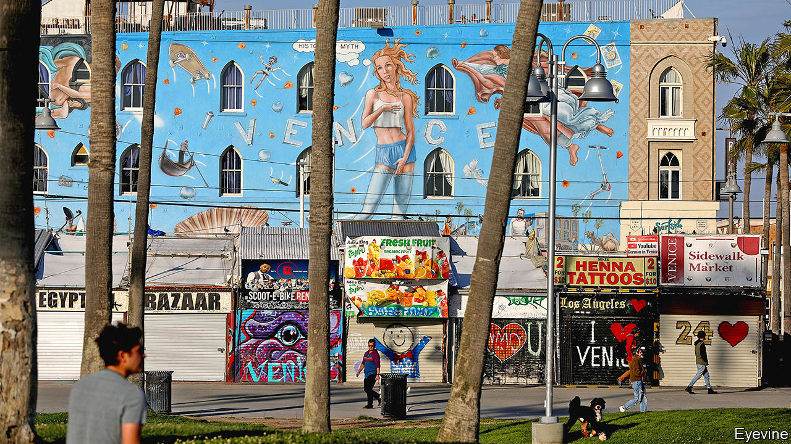
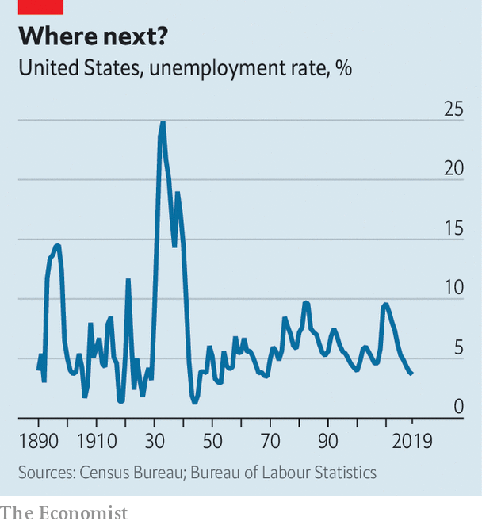

## Trough to peak

# How high will unemployment in America go?

> The financial crisis looks a better reference point than the Depression

> Apr 1st 2020

Editor’s note: The Economist is making some of its most important coverage of the covid-19 pandemic freely available to readers of The Economist Today, our daily newsletter. To receive it, register [here](https://www.economist.com//newslettersignup). For our coronavirus tracker and more coverage, see our [hub](https://www.economist.com//coronavirus)

IN AUGUST 2005 the unemployment rate in Louisiana was 5.4%, close to its all-time low. Then Hurricane Katrina hit. The storm destroyed some firms, while others were forced to close permanently. Within a month, Louisiana’s unemployment rate had more than doubled.

Now America as a whole faces a similar shock. From a five-decade low, early data suggest unemployment is shooting upwards, as the onrushing coronavirus pandemic forces the economy to shut down. Millions of Americans are filing for financial assistance. The jobs report for March, published shortly after The Economist went to press, is a flavour of what is to come—though because the survey focused on early to mid-March, before the lockdowns really got going, it is likely to give a misleadingly rosy view of the true situation. How bad could the labour market get?

GDP growth and the unemployment rate tend to move in opposite directions. Unemployment hit an all-time high of around 25% during the Great Depression (see chart). The coronavirus-induced shutdowns are expected to lead to a year-on-year GDP decline of about 10% in the second quarter of this year. Such a steep fall in economic output implies an unemployment rate of about 9% in that quarter, based on past relationships, which would be roughly in line with the peak reached during the financial crisis of 2007-09.

But the coronavirus epidemic is not like past recessions. For one thing, hiring could be even lower than is typical. Delivery firms notwithstanding, surveys suggest that firms’ hiring intentions are as low or lower than they were in 2008. And applying for a job is especially difficult with cities in lockdown. Even without a single virus-induced layoff, hiring freezes would lead to sharply rising unemployment. For instance, young people entering the labour market for the first time now would struggle to find work.

The decline in GDP associated with the lockdowns is also particularly concentrated in labour-intensive industries such as leisure and hospitality. Mark Zandi of Moody’s Analytics, a research firm, calculates that more than 30m American jobs are highly vulnerable to closures associated with covid-19. Were they all to disappear, unemployment would probably rise above 20%. Research published by the Federal Reserve Bank of St Louis is even gloomier. It suggests that close to 50m Americans could lose their jobs in the second quarter of this year—enough to push the unemployment rate above 30%.

The numbers will probably not get that bad. In part that is a matter of statistical definitions. To be officially classified as unemployed, jobless folk need to be “actively seeking work”—which is rather difficult in the current circumstances. Some people could end up being counted as “economically inactive” rather than unemployed, which would hold down the official unemployment rate (a similar phenomenon occurred in Louisiana after Katrina).

America’s economic-stimulus bill will be a more genuine check on rising joblessness. The $350bn (1.6% of GDP) set aside for small firms’ costs is enough to cover the compensation of all at-risk workers for perhaps seven weeks, according to our calculations, making it less likely that bosses will let them go. Other measures in the package should support consumption, and thus demand for labour. In a report published on March 31st Goldman Sachs, a bank, argued that unemployment will peak in the third quarter of this year at nearly 15%—an estimate that is roughly in line with those of other forecasters.

A big jump in unemployment is less of a problem if it quickly falls once the lockdown ends. Louisiana offers an encouraging precedent. After a few bad months in late 2005, the state’s unemployment rate dropped almost as sharply as it had risen, falling in line with the rest of the country. Whether the economy will prove so elastic this time is another matter. Travellers and restaurant-goers will be cautious until some sort of vaccine or treatment is widely available; social-distancing rules, even if relaxed, will continue for some time. Goldman Sachs’s researchers reckon that it will take until 2023 for unemployment to fall back below 4%. The lockdowns should be temporary, but the economic consequences will feel much more permanent.■

Dig deeper:For our latest coverage of the covid-19 pandemic, register for The Economist Today, our daily [newsletter](https://www.economist.com//newslettersignup), or visit our [coronavirus tracker and story hub](https://www.economist.com//coronavirus)