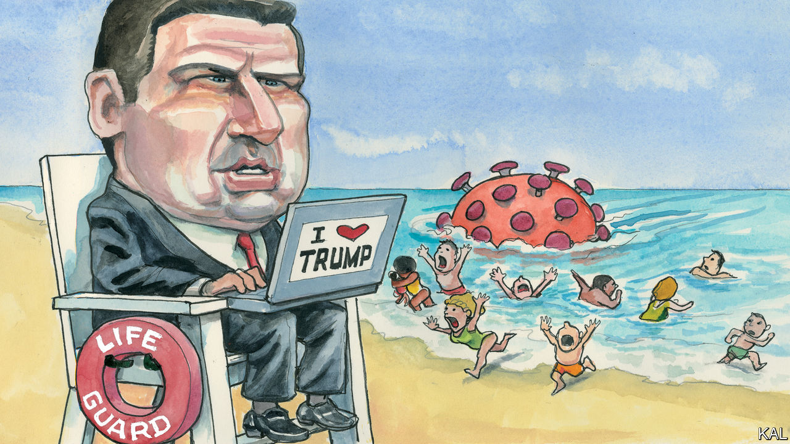

## Lexington

# Ron DeSantis is Donald Trump’s and the coronavirus’s favourite governor

> A shadow over the Sunshine State

> Apr 2nd 2020

Editor’s note: The Economist is making some of its most important coverage of the covid-19 pandemic freely available to readers of The Economist Today, our daily newsletter. To receive it, register [here](https://www.economist.com//newslettersignup). For our coronavirus tracker and more coverage, see our [hub](https://www.economist.com//coronavirus)

THOMAS JEFFERSON’S dictum that good governance comes “not by the consolidation or concentration of powers, but by their distribution” has never looked more apposite. While the administration has floundered against the coronavirus, most state governors have stepped up.

Andrew Cuomo of New York is the pandemic’s breakout star. His grimly informative press briefings are a reminder of what sanity in high office looks like. His approval rating is nearly 90%. But Jay Inslee of Washington state, Gavin Newsom of California, Larry Hogan of Maryland and Mike DeWine of Ohio, two Democrats and two Republicans, have been similarly impressive. All were shuttering businesses and enforcing social distancing while Donald Trump questioned whether the pandemic was much of a thing.

Mr Newsom’s prompt action may have spared California the level of crisis Mr Cuomo is facing. Mr Hogan, chair of the National Governors’ Association, suggested he would keep Maryland locked down even if Mr Trump ordered him not to: “You can’t put a time-frame on saving people’s lives.” Yet there is an exception to this pattern. In Florida, a state with a large, unusually mobile population and more old people than almost any other, Ron DeSantis seems to have taken his public-health advice from the president.

The image of American hubris against the coronavirus is of Florida’s beaches packed with Spring Breakers. Mr DeSantis had refused to close them—thereby drawing instant comparisons with the mayor of Amity Island in the “Jaws” films. A heat map of the cell-phone signals emitted by a crowd of fun-seekers on Fort Lauderdale beach—almost two months after America had recorded its first coronavirus case—suggests they have since fanned out all across America.

Florida alone had over 7,000 confirmed coronavirus cases at the time of writing and the number was doubling every three-to-four days. But most of its businesses were still free to operate, Mr DeSantis having refused to lock the state down. Under mounting pressure from anxious Floridians, he said he would do so from April 3rd, fully two weeks after Mr Newsom.

To idle millions of workers is no small decision. Yet the 41-year-old Mr DeSantis has denied himself the benefit of the doubt with a wretchedly political performance. His daily messaging has been neurotically in step with the White House, not Florida’s public-health experts. This makes his slowness to act look designed to placate a president who—until this week—was liable to take any economy-dampening measure as a personal affront.

Mr DeSantis meanwhile aped the president’s histrionics by ordering senseless roadblocks to catch infected New Yorkers, warning cruise ships not to land sick “foreigners” and lambasting critical journalists. In one way, his tactics worked. Where Mr Cuomo claims to have received a fraction of the medical supplies he has requested from the federal government, Florida has got every mask and ventilator it has asked for. Even so, Mr DeSantis’s pandemic response has looked increasingly reckless. It also indicates how Mr Trump is—and is not—changing his party.

The contrasting performances of Mr DeWine and Mr DeSantis, both of whom took office last year, are no accident. The 73-year-old Ohioan won election based on a record for pragmatism accrued during four decades in public life. Mr DeSantis entered Florida’s Republican governor’s primary as an undistinguished, little-known congressman. He won it by proclaiming his devotion to Mr Trump, who promptly endorsed him, thereby knocking out the DeWine equivalent, Florida’s respected agriculture commissioner.

Eschewing dull policy talk (to the extent that some questioned whether he even had a platform), Mr DeSantis copied Mr Trump’s campaign tactics, too. He warned Floridians not to “monkey this up” by electing his African-American opponent, Andrew Gillum. He derided Congresswoman Alexandria Ocasio-Cortez, a hate-figure on the right, as “this girl…or whatever she is”. His obsequiousness towards Mr Trump was so extreme that he made a joke of it in a campaign ad that depicted him teaching his infant children Trump slogans, while building a wall out of toy bricks.

Anyone might think he was a diehard economic populist. On the contrary, Mr DeSantis is a pretty standard-issue small-government conservative, albeit with a pragmatic streak of his own. For example, he has sought to redress the environmental vandalism of his predecessor, Rick Scott, by appointing high-level science and climate-resilience advisers and investing in watershed conservation. This has won him plaudits across the political divide—even as Mr Trump has periodically called on him to honour his debt to the president. Last year Mr DeSantis passed legislation to ban havens for illegal immigrants known as “sanctuary cities”. In a state where a fifth of the population is foreign-born, this was divisive—and also unnecessary. There were not any in Florida.

For all the disruption to conservatism he promised, Mr Trump has changed it at an elite level remarkably little. He has promoted opportunists such as Mr DeSantis, willing to ingratiate themselves to him, not populist firebrands. This is at least better than it might have been (remember Steve Bannon?). So, it must be said, is Mr DeSantis: his pre-pandemic governorship was far better than his campaign gave reason to expect. Even so, the virus has exposed the weakness of a patronage system with Mr Trump at its apex.

Mr DeWine is able to compensate for Mr Trump’s shortcomings because he owes him nothing. Mr DeSantis owes him everything—which forces him to accentuate them. Much good may that do him.

Floridians appear to be turning against him. They of all Americans recognise a bungled disaster response. Meanwhile Mr Trump, having at last recognised the disaster America faces, is making nice with all the governors. He says they are America’s front line. This suggests he means to blame them for what is to come.■

Dig deeper:For our latest coverage of the covid-19 pandemic, register for The Economist Today, our daily [newsletter](https://www.economist.com//newslettersignup), or visit our [coronavirus tracker and story hub](https://www.economist.com//coronavirus)