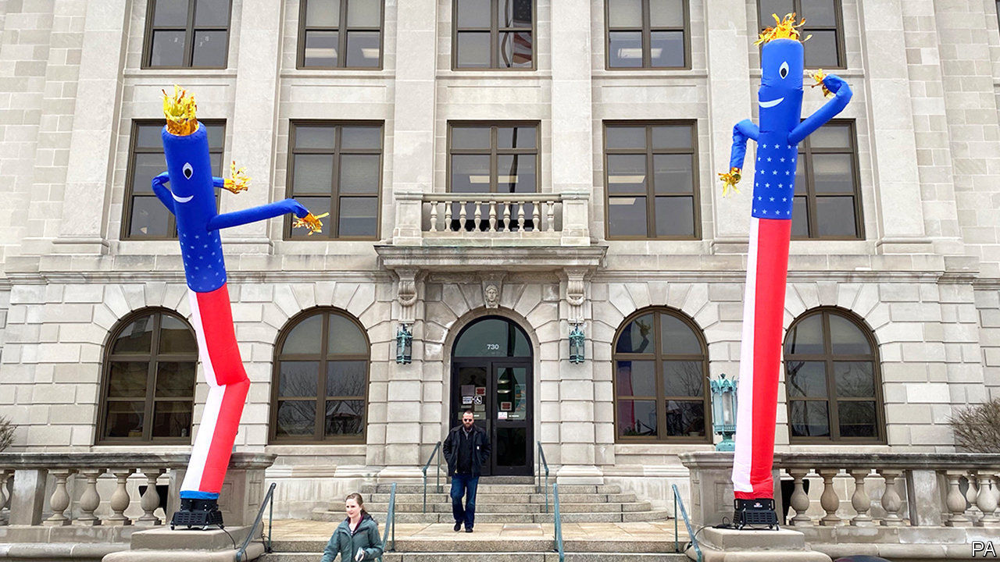

## Petri-dish democracy

# Wisconsin’s chaotic elections

> Local squabbles prefigure a national debate

> Apr 4th 2020CHICAGO

Editor’s note: The Economist is making some of its most important coverage of the covid-19 pandemic freely available to readers of The Economist Today, our daily newsletter. To receive it, register [here](https://www.economist.com//newslettersignup). For more coverage, see our coronavirus [hub](https://www.economist.com//coronavirus)

FOURTEEN STATES have postponed primaries because of coronavirus. Although voters in Alaska and Wyoming will carry on in April, their primaries now involve only postal ballots. So what’s special about Wisconsin? As The Economist went to press the Badger State was still planning to hold its spring elections as usual, including voting in person, on April 7th. The contests are for the Democratic presidential nominee and also for local offices and the state Supreme Court.

Officials are not blasé about the pandemic. A “safer at home” order from the governor, Tony Evers, is keeping most people in their houses while shutting schools, businesses and more. “When you close bars in Wisconsin, you know it’s gotten serious,” says a parched resident. Nor is it certain the elections will be held. On April 1st a federal judge began hearing a case—combining various lawsuits—that could decide how and when polling happens. An appeal is likely, so a decision could drift towards the eve of voting.

Worsening public-health and practical troubles are overtaking the legal arguments. An assessment on March 30th found that more than half of all the state’s counties lack the required number of staff to run polling stations. The National Guard may have to make up a shortfall of almost 7,000 workers, replacing volunteers who typically are elderly and at risk of infection. In Milwaukee, which is holding a mayoral race, perhaps a dozen polling stations can be manned, not the usual 180. One political observer calls it “an unholy mess”.

What is baffling is how debate about holding the vote has dragged on. Officially Democrats, including Mr Evers, would back postponement of the state’s primary, although some worry that the pandemic could turn out to be worse later. In reality, most would prefer a wholesale switch to postal voting. Mr Evers last week called for officials to send each registered voter an absentee ballot, just in case. More than 1m voters have applied for them anyway, up from 250,000 in the spring election of 2016. The Democratic Party expects a surge in turnout, which, along with early voting, typically helps their side.

But the governor cannot make any change without the nod of Republicans, who run the legislature. They are not affected by the Democratic primary contest but are concerned about elections for hundreds of municipal officials, from county boards to councillors and mayors of cities, and most of all a tantalising election of a state Supreme Court justice. No plan exists for what to do about these if voting were put off. “Election law everywhere has never seriously considered holding an election in the middle of a contagious virus,” says Charles Franklin of Marquette University.

Republicans oppose ending in-person voting, likening any change to poll-rigging. Not coincidentally, they rely on older, small-town and rural voters who, polls suggest, are less fearful of the pandemic. “Our electorate is more likely to show on election day,” says Brian Reisinger, a conservative lawyer. Without them, his party would struggle against Democrats’ expected support from absentee and early voters.

Why does this matter? Interest in the presidential primary has waned, although Joe Biden will be road-testing his strength in blue-collar parts of a crucial swing state. It is the court race that really sets Wisconsin political hearts aflutter. Conservatives have a 5-2 advantage on the bench, but one of their incumbents is up for re-election in a tight race. The equivalent contest last year was decided by fewer than 6,000 votes.

That judicial race is politically important because of two significant cases on the court’s docket. It may rule, possibly before November, on whether 200,000 supposedly out-of-date registered names can be purged from the voting roll, and on what kind of voter IDs should be acceptable at polling stations. Democrats fear this could hurt them. The court will also have a big say on redistricting plans next year. Republicans fret that a new liberal-minded judge might press the court to unpick earlier reforms, perhaps to restore some powers stripped from public-sector unions.

Wisconsin’s experience also sheds light on what it means to campaign and, perhaps, vote in the midst of a pandemic. A battle is looming in many states on how much to extend postal voting. Democrats are keen. Republicans say changes to electoral practice, especially during a campaign, are unacceptable. Ben Wikler, who leads the Democrats in Wisconsin, says Republicans want to “disenfranchise” voters with over-strict rules on postal ballots. His state has long been “a Petri dish for seeing how the GOP behaves” everywhere, he says.

Marquette’s Mr Franklin draws lessons for other states. “Wisconsin is a peek into the future,” he says, a reminder to other states to “make decisions sooner”, to get bipartisan agreement on basic matters like how to run an election and to give officials time and money to print, distribute and count a huge pile of absentee ballots. Parties, too, have to think about how they can reach voters at home when knocking on doors is off-limits. Wisconsin’s Democrats have the additional challenge of rethinking their plans for Milwaukee to host 50,000 people at the party’s national convention in July. The pandemic looks likely to strike down that event, too. ■

Dig deeper: