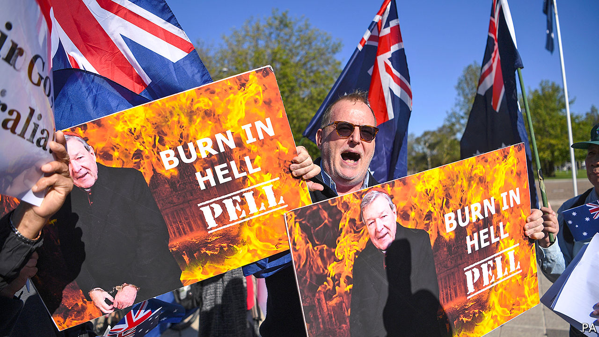

## Judges v jury

# An Australian court overturns a cardinal’s conviction for sexual abuse

> George Pell, once the Vatican’s main financial manager, was accused of molesting two choirboys

> Apr 8th 2020SYDNEY

THE JURY that in 2018 found George Pell guilty of sexually assaulting two choirboys deliberated about its verdict for five days. But it did not think about the evidence carefully enough, Australia’s High Court ruled on April 7th. It overturned the conviction and ordered Mr Pell, a cardinal who used to be the Vatican’s top financial manager, released. If the jury had been “acting rationally on the whole of the evidence”, the seven judges ruled unanimously, it “ought to have entertained a reasonable doubt” about his guilt.

The charges date to 1996, when Mr Pell was Archbishop of Melbourne. He was accused of molesting the boys in the cathedral’s sacristy, or dressing-room, after a Sunday mass. The guilty verdict was initially subject to a gagging order, in order not to prejudice possible future proceedings. Only months later were the media allowed to report on it. A little over a year ago the prelate began his six-year jail sentence, which was upheld by an appeals court in the state of Victoria last year.

The High Court was troubled, however, by the other courts’ reliance on the testimony of a single witness. One of the two choristers died in 2014, so the conviction was “wholly dependent upon the acceptance of truthfulness and reliability” of the surviving one, the High Court’s judges observed. Even though the witness was “credible and reliable”, they said, the jury should have had its doubts.

Cardinal Pell’s lawyer had pointed to the “sheer unlikelihood” that he would have found himself alone with the boys amid the “hive of activity” in the cathedral. Indeed, evidence from other witnesses should have raised logistical questions about whether he could have committed the crimes of which he was accused, the court said. As a result, the ruling concluded, there was “a significant possibility that an innocent person has been convicted”.

Australian judges do not like to overturn their juries’ decisions, for fear of denting faith in criminal justice, says Rick Sarre of the University of South Australia. Rulings like this are fairly uncommon. To some, the acquittal is a sign of a system working. But it has rattled many Australians. As the cardinal walked free, vandals emblazoned the words “no justice” over the cathedral in Melbourne.

It is hard to “satisfy a criminal court that the offending has occurred beyond the shadow of a doubt”, acknowledged the surviving choirboy, as he accepted the court’s decision. But the Survivors Network of those Abused by Priests, a support group, took the decision as a sign that “the powerful have won.” Victims may lose their faith in the criminal justice system, argues the group’s coordinator for Australia, Steve Spaner. If fewer of them come forward as a result, he fears, crimes will go unpunished.

Australia has long wrestled with claims of sexual abuse of minors. In 2018 the prime minister, Scott Morrison, issued a lengthy apology to survivors. After the High Court’s ruling, Daniel Andrews, the premier of Victoria, issued a statement telling victims: “I believe you.” Yet some of the cardinal’s supporters feel that justice has eluded them, as well. An innocent man was imprisoned by a biased jury, they say, and the judges who heard the initial appeal upheld its decision. “Nobody is safe” in such a system, one pundit railed.

While some consider it unseemly for judges to overrule a jury, others would like to entrust them with more authority. Victoria is the only state in Australia that does not allow well-known defendants to be tried by a judge alone, if they fear that the public mood is against them, notes Matthew Collins, a barrister. Nick Papas, Victoria’s former chief magistrate, would like the state to adopt the same procedure. ■