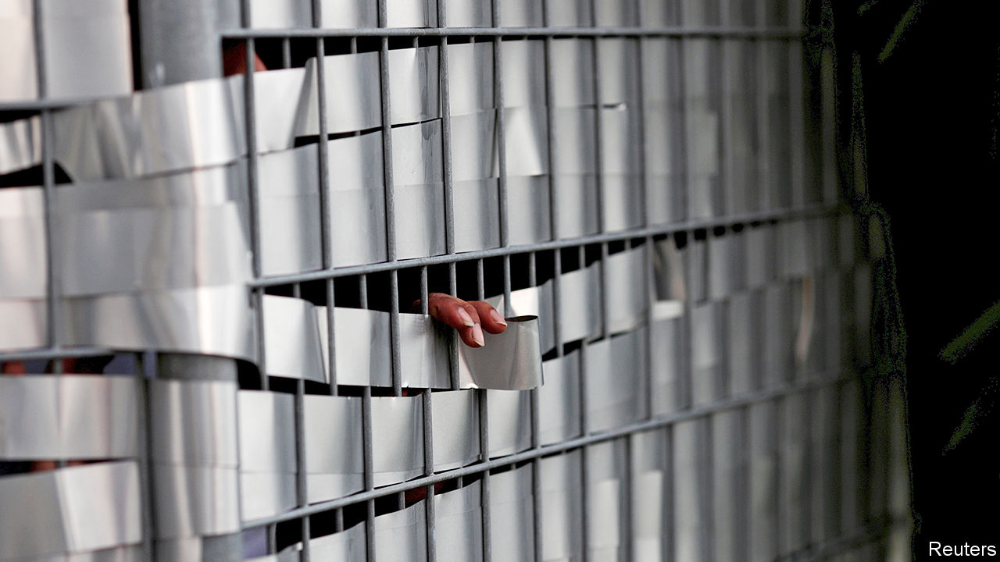
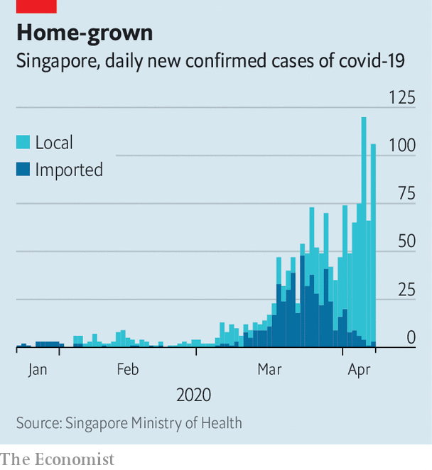

## No way out

# Not even Singapore has been able to avoid a lockdown

> The efficient city-state’s contact-tracing has not stopped the virus

> Apr 11th 2020SINGAPORE

Editor’s note: The Economist is making some of its most important coverage of the covid-19 pandemic freely available to readers of The Economist Today, our daily newsletter. To receive it, register [here](https://www.economist.com//newslettersignup). For our coronavirus tracker and more coverage, see our [hub](https://www.economist.com//coronavirus)

“NO ESCAPE,” READS the pest-control van parked near the entrance to S11 Dormitory @ Punggol, a residence for migrant workers in Singapore. Its warren of low-slung metal-clad buildings houses some 13,000 male labourers, 63 of whom have been moved to hospital after catching covid-19. The rest are among the 20,000 migrant workers ordered to remain in compounds like S11 for two weeks to stop the spread of the coronavirus. Faced with a sudden spike in new cases, almost all of them contracted locally (see chart), the government has decided to adopt much more stringent measures to slow the spread of the virus.

For most Singaporeans, the new regime, instituted on April 7th, will not be quite as strict. They will be allowed out of their homes to buy food and medicine and to exercise. This “circuit-breaker”, as the government calls it, will remain in place for at least a month. Previously, shops and restaurants had remained open, although patrons were supposed to remain a metre apart and no more than ten people were supposed to gather in one place. Even bars had been able to keep going, as long as they served food. Schools, too, had continued to operate. All will now be closed. Anyone meeting people with whom they do not live risks six months in prison, a fine of S$10,000 ($7,000) or both. Singapore, which had won praise from the World Health Organisation (WHO), among others, for its measured but effective approach to the coronavirus, is no longer able to preserve a semblance of normality.

Singapore had been able to take a less draconian approach because of its initial success in containing the disease. On January 22nd it began taking the temperatures of air passengers arriving from China, the day before the Chinese government stopped travel into and out of Wuhan. Soon afterwards it began banning visitors from areas badly affected by the virus. By the end of March the government had advised against all non-essential journeys abroad, closed its borders to non-residents and suspended all religious services.

All the while efficient contact-tracing teams—including members of the police and the army—identified and isolated thousands of people possibly infected with the virus. Members of the armed forces have been making up to 2,000 calls a day to hunt for potential carriers. Those told to stay at home for 14 days have been monitored assiduously to ensure compliance. (Unco-operative types face prosecution or the loss of their residency rights, if they are not citizens.)

Yet in spite of everything, the virus continues to spread. The effort to find and isolate cases linked to the initial outbreak in Wuhan was successful. But from March, as many Singaporeans returned home because of the proliferating coronavirus restrictions in other countries, some infections clearly slipped through the net. Hence the new restrictions. “One important objective is to apply brakes from time to time to slow down the momentum of this transmission,” explains the health minister, Gan Kim Yong.

Singapore’s approach continues to evolve. Take face masks. Initially Singaporeans were advised that they did not need to wear them unless unwell. Then on April 3rd, in his third televised address on covid-19, Lee Hsien Loong, the prime minister, said that the government would no longer discourage their use and would, in fact, distribute reusable ones to every household. Singapore’s testing regime may alter too. Currently people’s travel history and symptoms are among the factors considered before they are tested for the coronavirus. But health officials say the approach is reviewed regularly and that wider testing might be adopted in future.

The government has not said much about how it thinks the pandemic will play out in Singapore. Unlike Britain’s, for example, it has not shared the models it is using to predict the number of cases or deaths. Singapore has a relatively vulnerable population by the standards of the region, since the virus poses a greater risk to elderly people and some 10% of residents are over 65. The migrant workers quarantined in crowded dormitories are another group to watch. And as the number of cases rises it becomes harder to trace the contacts of the sick, hampering one of the most effective elements of Singapore’s response.

Planning is under way for a long campaign against covid-19. Officials intend to turn parts of Singapore Expo, a convention centre with some 100,000 square metres of floor space, into a quarantine facility for recovering patients. One of Changi airport’s four terminals will suspend operations for 18 months to save running costs, suggesting that the government does not expect air travel to recover fully for a long time.

A good indicator of how confident the authorities are about their handling of the epidemic will be provided by the timing of the next election. It is due within a year, and the government had been rumoured to be on the verge of calling a snap poll before the virus put such considerations on hold. The publication of new electoral boundaries last month set tongues wagging again. So too did the introduction of a bill in parliament on April 7th to ensure a safe election in spite of covid-19. Among other measures, the legislation would allow citizens whose movements have been restricted for reasons of public health to vote from wherever they have been told to stay. With the election, as with the virus, Singapore’s government is leaving little to chance. ■

Dig deeper:For our latest coverage of the covid-19 pandemic, register for The Economist Today, our daily [newsletter](https://www.economist.com//newslettersignup), or visit our [coronavirus tracker and story hub](https://www.economist.com//coronavirus)

## URL

https://www.economist.com/asia/2020/04/11/not-even-singapore-has-been-able-to-avoid-a-lockdown
