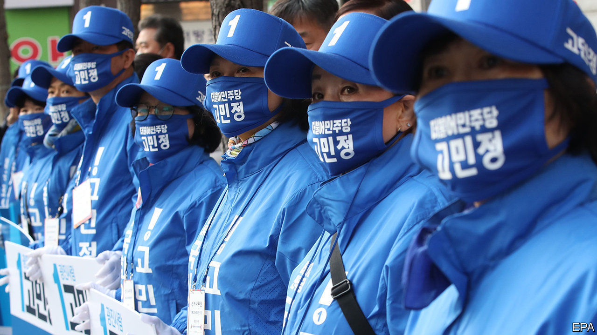

## Voting amid the virus

# South Korea presses on with an election

> The big parties are trying to game the electoral system

> Apr 11th 2020SEOUL

Editor’s note: The Economist is making some of its most important coverage of the covid-19 pandemic freely available to readers of The Economist Today, our daily newsletter. To receive it, register [here](https://www.economist.com//newslettersignup). For our coronavirus tracker and more coverage, see our [hub](https://www.economist.com//coronavirus)

AT FIRST GLANCE it looked like any old campaign event. A crowd thronged around a stage in a narrow street in central Seoul. Dancers in bright pink hoodies performed a lacklustre routine to a K-pop tune. But the dancers wore face masks that matched their hoodies. Spectators, though hard-pressed to keep the officially recommended two-metre distance from each other, had covered their faces, too. And when the candidate, Hwang Kyo-ahn, took to the stage, he sported a clear perspex shield over his mouth and nose.

Last weekend marked the start of campaigning for South Korea’s legislative elections, which will go ahead as planned on April 15th despite the covid-19 pandemic. The prospect of queues at polling stations and of sharing booths, pencils and ballot boxes has prompted several other countries, including Britain, France and some American states, to cancel or postpone elections. But the South Korean authorities believe the outbreak is at bay. On April 6th the country recorded fewer than 50 new cases for the first time since late February.

Nonetheless, to minimise the risk of infection for voters and poll workers, the National Election Commission has instituted elaborate safeguards. All voters will have their temperature taken before entering their polling station (those found to have a fever or other symptoms will be directed to a separate polling booth). They will also have to wear a face mask, sanitise their hands and put on vinyl gloves before picking up a ballot paper and entering the booth. Election stewards will ensure people keep away from each other while queuing and voting. Door knobs, pencils and ballot boxes will be sterilised often.

These measures seem to have reassured citizens sufficiently to persuade them to show up: in a poll on April 2nd 73% expressed their intention to vote, more than in the run-up to the previous legislative election, in 2016. There are some grumbles: more than half the 170,000 voters who live abroad will not be able to cast their ballots at the South Korean embassy in their country of residence, owing to pandemic-related restrictions. Koreans in Canada and Germany are mulling a constitutional appeal.

Back home, the grumbling is less about the complications of the pandemic and more about the machinations of politicians. The election will be the first since the National Assembly amended the electoral law to strengthen the proportional element of the hybrid electoral system. Of the 300 seats in the unicameral assembly, 253 are filled on a first-past-the-post basis. The remaining 47 are allocated based on a second vote, for a party. The formula for awarding them used to favour the two main parties, which won 59% of the party-list vote in 2016, but ended up with 82% of the seats in the assembly. But now the rules have been tweaked to help smaller parties.

The reform has prompted the formation of several new parties. Thirty-five will be competing for seats, 14 more than in the previous election. The Revolutionary Dividends Party, for instance, wants to run the country like a corporation, dismantling the parliamentary apparatus to save money and giving cash handouts to encourage people to go on dates and get married.

The big parties, including the ruling Minjoo (Democratic) party, which came up with the reform, are doing their best to undermine it by creating “satellite parties”, which will compete only for party-list seats. After the election, these will co-operate, or even merge, with their big sibling. To hammer the point home, Minjoo’s satellite is distributing posters depicting it and Minjoo as bride and groom.

“These decisions undermine the very idea of the reform,” complains Kim Jong-cheol of Yonsei University. “They shouldn’t be allowed to do that.” But the electoral commission says no rules are being broken. The constitutional court can only get involved if the government asks for a ruling, which seems unlikely given Minjoo’s eager embrace of the satellite-party scheme. South Koreans may be beating covid-19, but they have not yet worked out how to tame wily politicians. ■

Dig deeper:For our latest coverage of the covid-19 pandemic, register for The Economist Today, our daily [newsletter](https://www.economist.com//newslettersignup), or visit our [coronavirus tracker and story hub](https://www.economist.com//coronavirus)

## URL

https://www.economist.com/asia/2020/04/11/south-korea-presses-on-with-an-election
