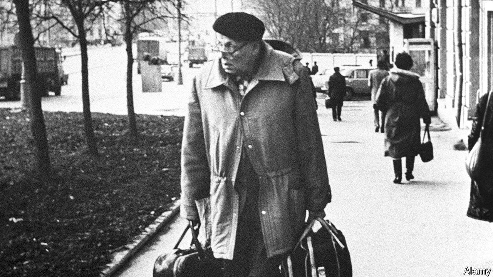

## Keeping the flame alight

# A chronicle of heroism in the Soviet Union

> Historians who think the dissident movement was ineffective are mistaken

> Apr 8th 2020

The Dissidents. By Peter Reddaway.Brookings Institution Press; 320 pages; $29.99 and £25.50.

IT IS FASHIONABLE for academics to argue that the doughty band of dissidents who fought for freedom in the Soviet Union, during the decades between the death of Josef Stalin and the collapse of communism under Mikhail Gorbachev, made little difference to the course of history: bigger forces—contradictions, in the old Sov-speak—caused the system to perish from within. Yet the likes of Andrei Sakharov and Alexander Solzhenitsyn surely did help pull down the creaking edifice of the totalitarian state by remorselessly exposing its falsehoods and speaking truth to power. Moreover, whether abroad or in internal exile or jail, the dissidents—and an array of less known heroes documented in Peter Reddaway’s remarkable memoir—did keep alive the notion of Russian decency and the flame of freedom.

As a student of Russian at Cambridge, Mr Reddaway was drawn into the dissidents’ shadowy world, making the first of three visits to the Soviet Union in 1960. He listened assiduously to a wide range of Soviet citizens, from taxi-drivers to academicians, recording their views in meticulous but engrossing detail. A stint at Moscow State University ended in his expulsion in 1964, five months before Nikita Khrushchev’s fall, probably because he helped the wife of a defector for whom he had briefly served as a guide in Cambridge. For the next 24 years he doggedly catalogued, translated and disseminated the campaigns and experiences—often in prisons, labour camps and mental asylums—of a vast range of dissidents.

By dint of their contacts with the likes of Mr Reddaway, they put the abuse of human rights in the Soviet Union under the world’s spotlight. The Kremlin pretended to be impervious to Western claims that, long after Stalin’s death, dissidents still languished behind bars. Yet it plainly minded when taken to task for flouting the human-rights provisions of the Helsinki Accords, which it had reluctantly signed in 1975 as a token of East-West detente, spawning the dissidents’ Helsinki Human Rights Group in Moscow a year later. This gave a fillip to Sakharov and others who argued for a “legalist” approach to opposition, which cited the authorities’ violations of their own rules and obligations.

Soviet leaders also minded when—thanks to papers smuggled out by dissidents dragged off to mental hospitals that were jointly overseen by venal psychiatrists and the KGB—the representative Soviet body was forced out of the World Psychiatric Association in 1983. Drawing on archives in Moscow that were briefly opened in 1992, Mr Reddaway reveals that Yuri Andropov, the long-serving head of the KGB who briefly became head of state, authorised in his own words “a plan to develop a network of psychiatric institutions to help defend the Soviet system”, and that from 1975 to 1988 some 2,438 dissidents, according to KGB records, were subjected to their malign care. Thanks to extraordinarily brave medics such as Anatoly Koryagin and Alexander Podrabinek (who both served long prison sentences), this abuse was exposed in the 1960s and 1970s. That was also a signal achievement for Mr Reddaway and his own dedicated coterie in Britain, America and the Netherlands.

The most impressive and durable of the dissident networks within the Soviet Union was probably the one that published 64 issues of the courageous Chronicle of Current Events in 1968-82, including, early on, a seminal essay by Sakharov. All but two editions were smuggled out and then translated and circulated by Mr Reddaway and others. From the early 1970s Amnesty International also distributed it, giving it a still wider reach. After the Soviet Union fell, one of its editors, Sergei Kovalev, became a prominent MP and leading light in the creation of Memorial, a valiant outfit that still seeks to chronicle all the victims of Soviet and now, under President Vladimir Putin, post-Soviet repression.

The memoir highlights two particularly noteworthy dissidents abetted by Mr Reddaway, Anatoly Marchenko and General Pyotr Grigorenko. Marchenko’s “My Testimony”, published in 1969 in the West (and in 1967 in samizdat), showed that the gulag—the web of labour camps across the Soviet Union—had by no means ended with the demise of Stalin. When Marchenko died in 1986, he had spent a total of 20 years in prison for non-violent dissent. Grigorenko was a military hero with a chestful of medals for valour. But when he started to agitate against the system, he was incarcerated in a string of mental asylums.

Mr Reddaway was also active in aiding those punished for promoting the rights of Christians, Jews, Crimean Tatars and other minorities. Many of the nationalist dissidents in far-flung parts of the Soviet empire became prominent when its fake federalism began to buckle during Mr Gorbachev’s reforms. This, too, contradicts the notion that the dissidents had scant effect as agents of change.

After a lifetime entangled with Russia, Mr Reddaway has a wealth of revealing anecdotes beyond the world of dissidents. He once watched Vyacheslav Molotov, Stalin’s erstwhile foreign minister, reading in a library in Moscow. He knew people close to Lazar Kaganovich, the longest-surviving of Stalin’s ministers, as well as a host of literary luminaries, such as Kornei Chukovsky and Bella Akhmadulina. Boris Pasternak’s brother and son confided in him. On his return to Moscow in the heady days of glasnost, after being banned for 24 years, he was embraced by an array of writers, from old-school communists to nationalists, Slavophiles to Westernisers.

Above all, like the people he defended, he never lost heart. Whereas most Western experts were sure the Soviet Union would endure, as far back as 1962 Mr Reddaway was writing: “Ultimately, I’m afraid, I see a new revolution as the only outcome—in 30 years’ time?” Most of the dissidents he befriended shared his view that the Soviet Union was unreformable unless the communist system was junked. In 1970 a Dutch publishing house set up with Mr Reddaway’s help issued Andrei Amalrik’s “Will the Soviet Union survive until 1984?”

Yet this book evinces no sense of triumphalism. How could it? Mr Putin has spent most of his life ensuring that dissent against the state be suppressed. Still, Mr Reddaway’s memoir makes clear that the dissidents’ cause will live on. ■

## URL

https://www.economist.com/books-and-arts/2020/04/08/a-chronicle-of-heroism-in-the-soviet-union
