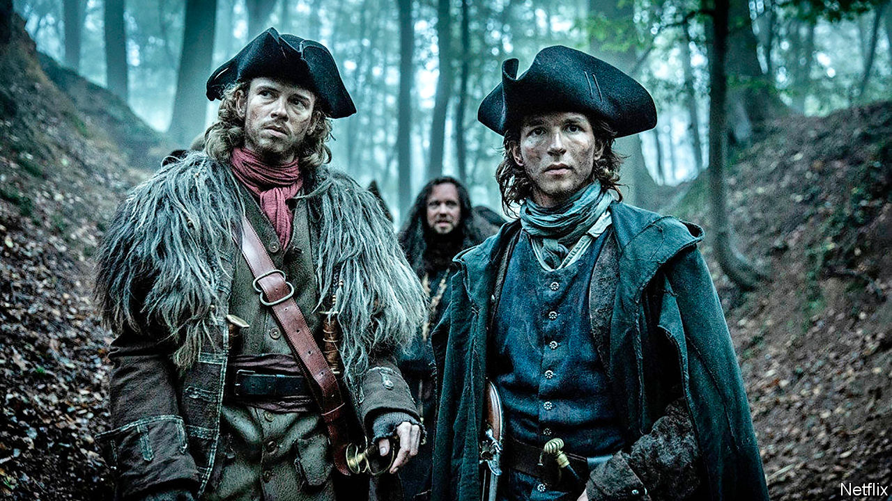

## Home Entertainment

# Armchair travel with a Flemish Robin Hood

> All the world’s a stage on Netflix

> Apr 11th 2020

THE SCENE is a small city in 18th-century Flanders. Some 50,000 French soldiers are stationed nearby; supplying them leaves little food for the peasantry. The first thing the new bailiff, Baru (Tom van Dyck), sees is a ragged family who stole two rabbits being flogged, branded and banished. “That’s a bit harsh, isn’t it?” he asks. “We’ll have no scum here,” says a new colleague.

At first, “Thieves of the Wood” tries a little too hard to demonise the bad guys. The mayor, after raising taxes on the poor, organises a party. “I’ll have fawns at my castle tonight,” he tells a fellow noble in an equally opulent wig. This turns out to mean that he and his friends put on terrifying animal masks and chase orphan girls into a dark wood. But soon the series starts to grip.

The hero is Jan de Lichte, a Flemish Robin Hood played by a soft-spoken Matteo Simon, who wages war on the toffs out of sympathy for their victims. He steals from the rich, gives to the poor and rallies them to resist their oppressors. His highway robberies and guerrilla raids are intricately planned, sumptuously filmed and teeth-clenchingly unpredictable.

The mayor may be a caricature, but the bailiff is not. Baru pursues Jan because he believes in the law—though he also lusts after the trappings of office (among other things). A battle of wills unfolds between the dashing rebel and the flawed defender of order.

One of the boons of Netflix is that you can watch box sets from anywhere, in their original languages with English subtitles. Particularly in a lockdown, it is a joy to explore the world via dramas in Galician (try “Bitter Daisies”, a murder mystery) or Zulu, one of several tongues spoken in “Queen Sono”, a sort of African James Bond.

Unlike Bond—or Robin Hood—Jan de Lichte was a real person. By all accounts he was a thug, robbing the poor and murdering rivals. (The romanticised version is based on “De Bende van Jan de Lichte”, a novel by Louis Paul Boon, a Belgian writer.) Still, many of the show’s details are accurate. The punishments endured by 18th-century Flemish outlaws were every bit as barbaric as they seem on screen. There are worse fates than being stuck on the sofa. ■

## URL

https://www.economist.com/books-and-arts/2020/04/11/armchair-travel-with-a-flemish-robin-hood
