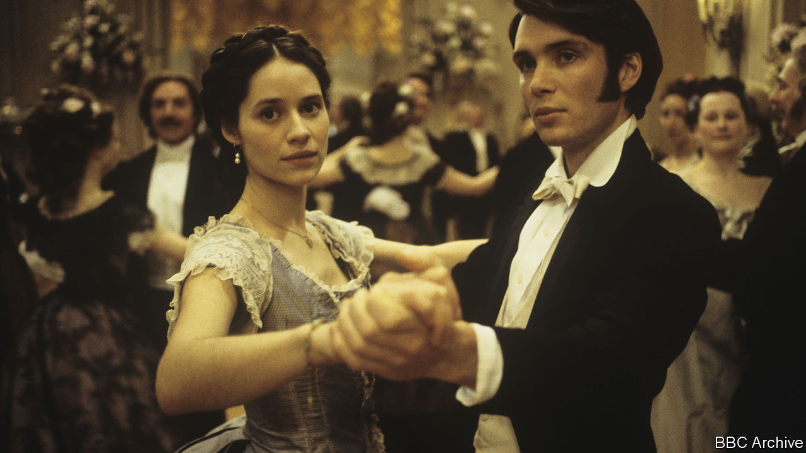

## Home Entertainment

# Rediscover Anthony Trollope , the king of Victorian box sets

> His novels are a perfect diversion in a time of isolation

> Apr 11th 2020

ANTHONY TROLLOPE’S novels are almost custom-made for prolonged confinement. There are a lot of them—47 in all, divided up between single-hits (“The Way We Live Now”) and “box sets”, such as the six parliamentary books and six clerical ones. And they are utterly addictive: pacier than Dickens and with a wider variety of characters than Austen. Timothy West’s superb audio versions of the best-known means you can listen to them while cooking or walking (if you are allowed out).

Trollope is sometimes considered a niche author for greying Anglophiles. He wrote about quintessentially British institutions such as the Houses of Parliament and the Church of England. He lived in the high Victorian era when women and servants knew their places and men wore gigantic beards. Don’t be put off: his appeal transcends his time and class. The lead singer of the Pet Shop Boys, Neil Tennant, wrote the song “Can You Forgive Her?” after reading Trollope’s novel of the same name.

His greatest theme is an eternal one: the lust for power and prestige, and the way it colours and warps human affairs. This theme dominates his ecclesiastical and parliamentary novels alike; it involves his female characters just as much as his men. Arguably, the most accomplished politician in his books is a woman, Lady Glencora Palliser, who brilliantly proves that, whatever the technical rules of the franchise, the dinner table was as much a centre of power as the Cabinet table.

Lady Glencora is only one of dozens of unforgettable characters, who are every bit as boldly drawn as Dickens’s, and more plausible. Obadiah Slope is an oleaginous young clergyman who divides his energies between ingratiating himself with the powerful and laying down the moral law to everyone else. Mrs Proudie is a clerical wife consumed by ambition—and by disappointment with her husband. Nathaniel Hawthorne described Trollope’s world as “just as real as if some giant had hewn a great lump out of the earth and put it under a glass case, with all its inhabitants going about their daily business and not suspecting that they were made a show of”.

Part of the appeal lies in Trollope’s ability to summon up a vanished society of vicarage tea parties, where clerical careers are decided, and country-house shooting weekends, where the fate of the nation may hang in the balance. But part also lies in Trollope’s knack for choosing subjects that echo powerfully today. “The Way We Live Now” (1875) is as much a portrait of the last few decades as it is of the high Victorian age, and every bit as addictive as HBO’s hit series “Succession”.

The novel’s anti-hero, Augustus Melmotte, is one of the great portraits of the businessman as ogre—a “horrid, big, rich scoundrel”, “a bloated swindler” and “vile city ruffian” who bears an uncanny resemblance to the late Robert Maxwell (and to living figures who had best not be named for legal reasons). Despite his foreign birth and mysterious past, Melmotte forces his way into British society by playing on the greed of bigwigs who despise him yet compete for his favours. He buys his way into the House of Commons; he floats a railway company that is ostensibly designed to build a line between Mexico and America but is really a paper scheme for selling shares. The Ponzi scam eventually collapses, exposing Britain’s great commercial empire for a greed-fuelled racket and its high society as a hypocritical sham.

“The Way We Live Now” is an excellent place to begin an affair with Trollope. It is relatively short by his standards and exquisitely executed. If you don’t like it, Trollope’s world is not for you. If you do, another 46 novels await you. ■

## URL

https://www.economist.com/books-and-arts/2020/04/11/rediscover-anthony-trollope-the-king-of-victorian-box-sets
