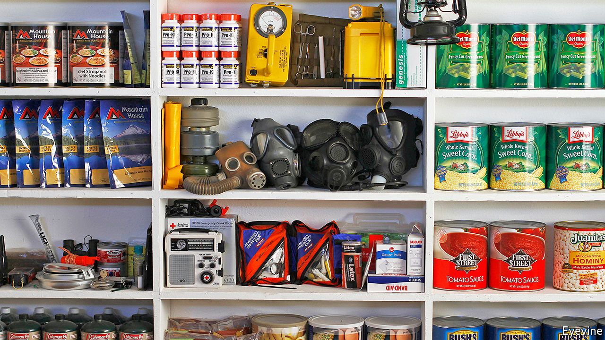

## This is the end

# The eccentric consolation of “Notes from an Apocalypse”

> Mark O’Connell’s postcards from doomsday are oddly uplifting

> Apr 8th 2020

Notes from an Apocalypse. By Mark O’Connell.Doubleday; 272 pages; $26.95. Granta; £14.99.

FOR MUCH of human history, Mark O’Connell points out in “Notes from an Apocalypse”, the world has been about to end. As St Augustine observed in the fifth century, the earliest followers of Jesus believed themselves to be living in the last days of creation. In the centuries since, humans have faced plagues and fires and floods and earthquakes and wars and the threat of nuclear annihilation—perpetually proclaiming the end of days. All the while, the world has continued spinning on its axis. But, the author asks, amid an increasingly irreversible climate crisis, what if now really is the end?

When he began writing this book, Mr O’Connell says, he was depressed, a malaise brought on by an obsession with the future—or rather, with the possible lack of it. He pondered the individual’s role in the age of climate change, and his own responsibilities as a father. “I couldn’t sneeze without thinking it was a portent of end times,” he writes. He was spending too much time on the internet (he had set his home-page to an online forum devoted to the topic of “collapse”). In the grip of this doomsday spiral, Mr O’Connell set out to probe both the reality and the idea of the looming crisis, embarking on what he calls “a series of perverse pilgrimages”.

He delves into the internet subculture of “preppers”, a group mostly comprising American men who stockpile freeze-dried food and guns. He treks to the Black Hills of South Dakota, where a property magnate is hawking survivalist bunkers, and stops at a Mars Society Convention in California. He goes on a nature retreat with a group that believes Western civilisation is destined to disintegrate and seeks alternative forms of society. For his best chapter, he goes to the ruins of Chernobyl and considers the ironies of apocalypse tourism.

These vignettes offer a fascinating insight into a species obsessed with its own demise—and into the ways humankind is trying to confront the hard-to-bear reality of climate change. These range from the absurd (colonisation of Mars), to the selfish (billionaires buying up New Zealand), to the poignant (difficult conversations with young children). Along the way, Mr O’Connell moves nimbly between scenes and eras, skipping from the poetry of Czeslaw Milosz to a history of the Grand Tour. It helps that he is funny, too. Oddly, all these ruins leave him feeling more peaceful, though the process of parenting might also have helped.

Readers, for their part, will emerge feeling doomed—yet oddly uplifted. “The fact that the world is continuing on as always—that the sun is shining, and the bees circling the clover, and the tomatoes ripe in the fields—doesn’t mean it hasn’t already come to an end,” Mr O’Connell reflects. One of the strengths of his book is that it simultaneously makes the reverse of that proposition clear: the world is ending, and, as usual, it is carrying on. “Notes from an Apocalypse” was written before the covid-19 pandemic, but it offers a timely if eccentric consolation all the same. ■

## URL

https://www.economist.com/books-and-arts/2020/04/08/the-eccentric-consolation-of-notes-from-an-apocalypse
