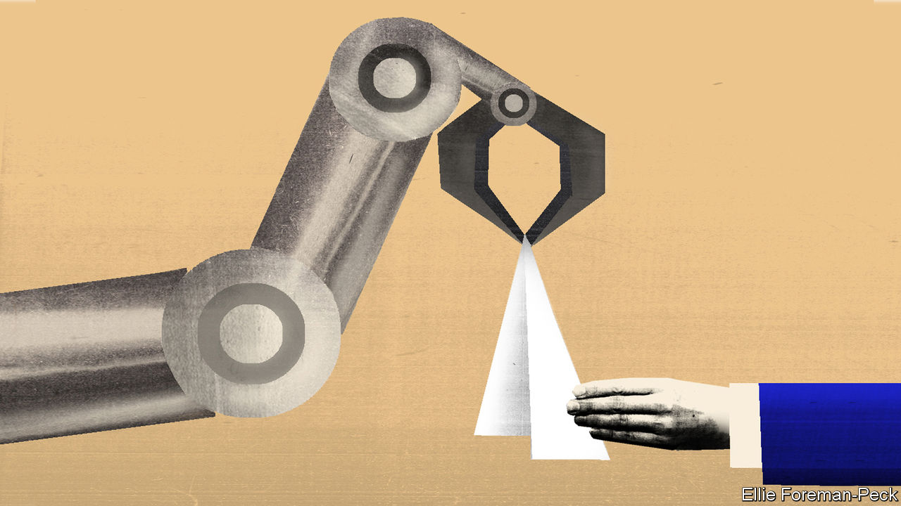
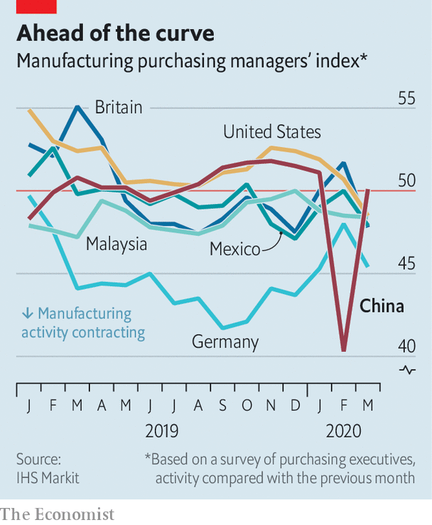

## Still made in China

# How to reopen factories after covid-19

> Hand gel and nanotechnology

> Apr 8th 2020HONG KONG

Editor’s note: The Economist is making some of its most important coverage of the covid-19 pandemic freely available to readers of The Economist Today, our daily newsletter. To receive it, register [here](https://www.economist.com//newslettersignup). For our coronavirus tracker and more coverage, see our [hub](https://www.economist.com//coronavirus)

MANY OF THE robots on factory floors operate in cages, fenced off from their human colleagues. The separation prevents the machines, in the routine and mindless pursuit of a bolt, from crushing the leg, hand or chest of a worker who happens to get in the way.

Now factory operators do not just need to keep human workers at a safe distance from robots; they have to keep them at a safe distance from each other, too. In China, fences between workers are among the measures bringing factories back to life.

Most Chinese factories are now back to operating at around 80% of capacity. Some are pushing 100%. Foxconn, the Taiwanese contract manufacturer which assembles the majority of Apple’s iPhones in China, says that with the help of tests for the virus and chest x-rays it has been able to get all its operations on the mainland back up and running with no risk to the health of its workers. In a call to investors on April 1st it reported that it was on target to provide Apple with all the 5G iPhones it needs for the launch of the device this autumn.

Many of the measures that made China’s great reopening possible were boring-but-important changes to existing protocols; more hygiene measures, more separation between workers, and screening (companies in China and elsewhere are trying to get their hands on a lot of tests for SARS-CoV-2 infection).

But there has also been investment in automation and remote operation that has brought forward improvements not expected for some time to come. Anna Shedletsky, the boss of Instrumental, a firm which uses machine learning to help manufacturers improve their processes, says that in electronics manufacturing “We’re going to do five years of innovating in the next 18 months.”

Modern high-tech factories already have systems in place to control who comes in or out and what they have on their person. The procedures which identify workers now take their temperatures, too. Many factories are also relying on a variety of “health code” apps developed by provincial Chinese governments. These run through portals inside WeChat and AliPay, two payment apps, to determine the worker’s health status and travel history. Willy Shih of Harvard Business School, who studies Chinese factories and supply chains, says such techniques were developed during the outbreaks of SARS and H1N1, in 2003 and in 2009, respectively. “Normally you change out of street clothes and go through a security check,” he says. “In many respects the [new protocols] are a small incremental addition.”

Once inside the factory, the changes required depend on what the workers are making. Those in car factories are already spread out and do not need much repositioning—though some manufacturers are using fences to enforce separation. The parts the workers handle are regularly disinfected as they pass through the assembly process, says Tu Le, a consultant. At a phone factory in Guangdong province, though, changes in layout are immediately apparent. Workers no longer cluster around each step of the assembly process in dense U-shaped cells; instead they are spread out, increasing their safety at the expense of some speed.

The obsessive and precise standards of modern global production make it comparatively easy for factories to adapt in such ways. However well a production process is adapted, though, things can still all go to pot if less cautious suppliers have to shut down and the parts the factory needs from them run out. As a result factories around the world have been stockpiling ferociously since news of the outbreak broke in January, going against the nature of modern just-in-time supply chains.

Another problem is new product introduction (NPI), a vital part of the business cycle in the electronics industry which is roughly 10% of Chinese manufacturing by value. During NPI, engineers from companies abroad fly in to tweak and tune the development of new products—something which today’s all-but-closed Chinese border makes impossible.

This has afforded Ms Shedletsky’s company a nice opportunity. The firm sells a system which uses machine learning to examine images of every single item a factory makes at every single stage of its assembly. It lets users explore the causes of any flaws, thereby increasing yields and reducing wasted time, money and materials. The amount of detail captured by the system also lets engineers from client companies inspect and manage production from halfway around the world—which under covid-19 has become a primary selling-point.

Engineers at P2i, a client of Instrumental’s which makes nanotechnology coatings for electronic devices, can sit at their headquarters in Oxford inspecting work at factories in China at a level of detail previously only accessible to someone on the spot. (Some of them have done the same while quarantined in hotels just down the road from the plant in question.) Neal Harkrider, the firm’s chief operating officer, says it has started connecting its manufacturing equipment to the internet, so that it can make the adjustments that Instrumental’s system recommends remotely, closing the developmental loop.

There is a near miraculous irony to the idea that the nanotechnology embodied in the protuberant proteins and RNA programming of SARS-CoV-2 is changing, through its decidedly macroscopic effects on human health and the world economy, the processes of a company like P2i that fashions its own wares back down on the virus’s own scale. But in truth it is merely accelerating a transformation that the world’s manufacturers were undergoing already. As products become more complex and their components more minute, there comes a point when human hands and eyes cease to be useful instruments for their assembly.

For a glimpse of that future, look at the world’s most complex manufacturing operations, those that produce semiconductors. Chip factories have hardly felt the impact of covid-19 at all. This is because laying down nanometre-scale transistors by the billion is far too complex for human minds to contemplate, let alone human hands to achieve, and so humans do not need to gather together on a shop floor to do it.

The world’s leading contract manufacturer of semiconductors, Taiwan’s TSMC, runs its most advanced facilities from central control rooms in which humans manage machines that move the silicon being engineered around in a hyperclean environment that human workers rarely visit. In Wuhan, ground zero for the pandemic, Yangtze Memory Technologies, a Chinese chip company that is a darling of Beijing, kept operating throughout the months of lockdown which ended in April 8th, its controlling engineers shuttled in on special trains.

For the manufacture of chips and screens, all-but-complete automation is unavoidable. In other contexts, the cost of re-engineering systems and buying new kit has kept people in the loop and on the floor. They will not vanish overnight. But covid-19 has provided a new spur for more factories to approach the machinic perfection of chip foundries. That new distancing between human and machine is likely to long outlive the disease itself. ■

Dig deeper:For our latest coverage of the covid-19 pandemic, register for The Economist Today, our daily [newsletter](https://www.economist.com//newslettersignup), or visit our [coronavirus tracker and story hub](https://www.economist.com//coronavirus)

## URL

https://www.economist.com/briefing/2020/04/07/how-to-reopen-factories-after-covid-19
