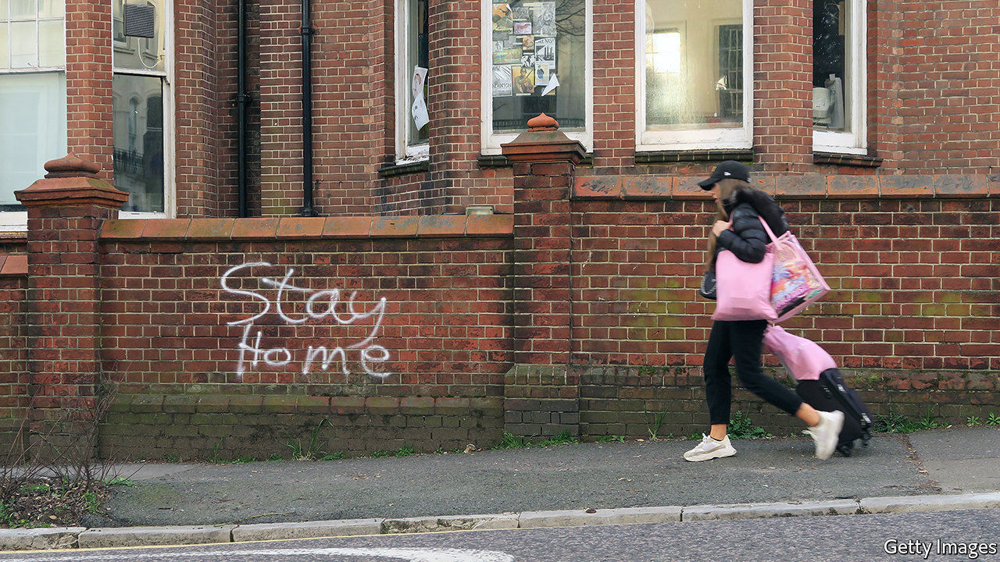
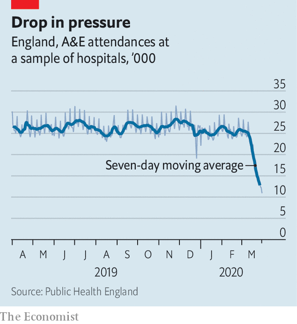

## Stay home, protect the NHS, unless...

# A sharp drop in accident-and-emergency admissions worries medics

> More hand-washing could explain fewer stomach bugs. It is unlikely to explain fewer heart attacks

> Apr 8th 2020

IT IS A curious feature of this pandemic that hospital emergency departments are unusually empty. An uptick in the number of pneumonia admissions has been more than balanced out by an enormous fall in the number of people coming in with other problems. “It is eerily quiet,” reports one emergency doctor. “You almost want it to be busy, so you feel all those preparations are useful.”

The government’s mantra, repeated at every opportunity, instructs people to “stay home, protect the NHS, save lives”. But the message is intended for healthy folk, so that they should not transmit the virus, not for those who need treatment for non-covid illnesses. Doctors are concerned that people are staying away from hospitals so as not to add to the pressure on the health service or because they fear catching the virus. Although intensive-care units are stuffed with people suffering from the coronavirus, early data suggests attendance in emergency departments is down by nearly half in England and by more than half in Wales.

This is not entirely bad. For one thing, the quiet has made reorganisation easier. And it is likely that some of the drop-off reflects a genuine decline in need. Many of the so-called “worried well” are now probably more worried by a trip to hospital than by their supposed illness. With more handwashing, it is little surprise that admissions for gastrointestinal illnesses have dropped. With pubs closed and roads empty, there are fewer accidents. Greater use of online and telephone consultations means that fewer people need to come into hospital to receive care.

Yet the scale of the drop in admissions has alarmed medics. Before the crisis, the health service estimated that just one in ten emergency attendances were “non-urgent”, meaning treatment could have been provided by a general practitioner outside of hospital. Emergency departments are not just seeing fewer stomach bugs. There has been a sharp fall in the number of emergency admissions with cardiac problems. Forthcoming data will show that referrals for cancer diagnosis have plunged. And one hospital even reports a 70% fall in admissions for detached retinas. None of these things is likely to be the result of cleaner hands.

The NHS is scrabbling to find out what other treatment people may be missing out on. Once these gaps have been identified, it will try to get in touch with people potentially at risk, telling them to seek treatment. As Carrie MacEwan, chair of the Academy of Medical Royal Colleges, notes, the worry is that the health service is storing up problems for once the first wave of the virus has passed. Having encouraged people to protect the NHS, the government now needs to encourage them to protect themselves.■

## URL

https://www.economist.com/britain/2020/04/08/a-sharp-drop-in-accident-and-emergency-admissions-worries-medics
