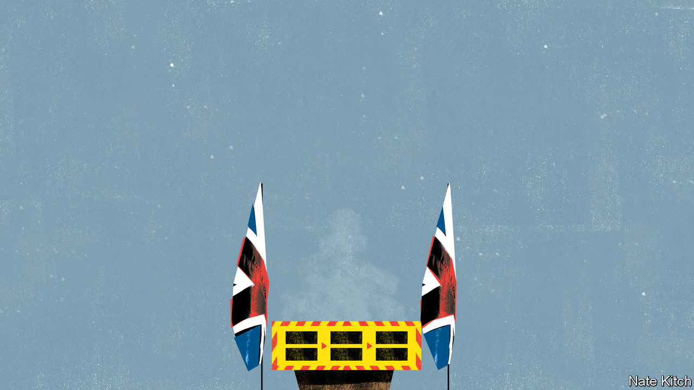

## Bagehot

# Boris Johnson’s illness has darkened Britain’s mood

> The illness of a man who once divided the nation has united it

> Apr 11th 2020

Editor’s note: The Economist is making some of its most important coverage of the covid-19 pandemic freely available to readers of The Economist Today, our daily newsletter. To receive it, register [here](https://www.economist.com//newslettersignup). For our coronavirus tracker and more coverage, see our [hub](https://www.economist.com//coronavirus)

BORIS JOHNSON has always believed that history was not made just by vast impersonal forces but by great men and women who change its course through their sheer talent and willpower. His admiration for Winston Churchill and Margaret Thatcher springs from this worldview; so did his decision to reject the belief widespread in the establishment that Britain’s destiny lay in the European Union and to lead the country out of it.

Just as Mr Johnson was fulfilling his ambition, with a recently acquired 87-seat majority in Parliament and grand plans to build a new one-nation Conservatism that might yet win him membership of the great-men club, the vast impersonal forces hit back. On March 27th Mr Johnson revealed that he had covid-19. On April 6th he went into intensive care. The government is in the hands of his cabinet and the first secretary of state, Dominic Raab. Mr Johnson’s Brexit plans have been sidelined in order to fight a rearguard action against a disease that is locking down the country and tanking the economy. The prime minister who wanted to be defined by Brexit will be defined by covid-19.

Mr Johnson’s condition is all the more shocking because he is normally such a force of nature. He has been blessed (or cursed) with Falstaffian appetites: witness his two marriages and a third in the offing; his five acknowledged children and another on the way; his string of mistresses; his enthusiasm for food, wine and, of course, cake; the mound of books and articles that he has produced while also pursuing his political career; and his extraordinary ability to light up a room. He has also been an omnipresent figure in British public life for several decades: editor of the Spectator, star columnist on the Daily Telegraph, mayor of London, principal Brexiteer, foreign secretary and tormentor-in-chief of his predecessor, Theresa May, until he finally got the job he always wanted.

He had thrown himself into the role of wartime prime minister with his usual brio. He has been broadcasting to keep up morale, driving the government machine and taking the big decisions. He led daily press briefings, visited hospitals and worked 15-hour days fuelled by vegan food. Even after he succumbed to the virus, and was forced to retreat into the flat above Number 11 Downing Street to self-isolate, he continued to work long hours, chairing the daily Cobra meetings (named after one of the Cabinet Office Briefing Rooms) and the weekly cabinet meeting.

His visibility has had the desired effect. Despite the lockdown that has put Britons in effect under house arrest, in the past few weeks they have rallied not just around the flag but around the person of the prime minister, with more than 70% agreeing that he is doing a good job. The news that he has been brought down by the virus, at least for the moment, has had an even more powerful unifying effect. Neighbourhood social-media groups were full of messages praying for his life. That the illness of a man who once so divided the country has brought it together is a measure of how vulnerable Britons feel.

Mr Johnson’s illness is powerful evidence that nobody is safe: not the young, the middle-aged nor the healthy. The prime minister belongs to a group well represented in critical care: men who are over 50 and overweight (his promise to his girlfriend to lose a few pounds and practise yoga seems to have been abandoned). But he has always prided himself on his robustness and endurance. He is rarely ill; indeed people who have worked closely with him say he regards illness as a sign of personal weakness. He is built like a rugby player and enjoys the rough-and-tumble of physical sports; he invented an idiosyncratic version of tug-of-war that involves pulling the other team into a swimming pool. He is a vigorous if eccentric tennis player and when mayor, would cycle around the city, though being prime minister put paid to that.

His illness is also an alarming proof of how vulnerable the machinery of government is. Mr Raab is struggling to project his authority. There are long-simmering rivalries between cabinet ministers and tensions between the Department of Health and the Treasury about how much longer Britain can keep the lockdown in place. The decision by Michael Gove, the cabinet-office minister, to self-isolate because a member of his family has come down with the virus is yet another blow to the government: he is an experienced and competent minister who is central to the campaign against covid-19.

Number 10 is struggling to cope with the effects of the virus and the difficulty of running government by video. Mr Johnson’s two leading advisers, Dominic Cummings and Eddie Lister, are both working from home. And although Mr Raab has responsibility to take decisions while Mr Johnson is ill, if the prime minister dies, it is not clear how another one is to be appointed. The Cabinet Office manual sets out what the procedure should be if the monarch dies, but has nothing to say about the demise of the prime minister. When, God willing, Mr Johnson is back in the job, that gaping omission will need to be remedied.

Sometimes nations are brought together by joyful moments, like the 2012 Olympics or the queen’s Diamond Jubilee, when Britain united around a common sense of patriotism and hope. Sometimes they are frightening ones, when the country is gripped by a common sense of vulnerability and anxiety. The second world war, to which the queen referred in a speech to the nation on April 5th, was one of those. So is this.

The sense of despondency that currently hangs over the nation may soon be dispelled. Mr Johnson was probably transferred to intensive care earlier than another patient would have been out of an abundance of caution. He has not, according to Number 10, been put on a ventilator. News that he is improving, if it comes, will lighten the public mood just as news of his illness has darkened it. Britons are praying that it comes quickly. ■

Dig deeper:For our latest coverage of the covid-19 pandemic, register for The Economist Today, our daily [newsletter](https://www.economist.com//newslettersignup), or visit our [coronavirus tracker and story hub](https://www.economist.com//coronavirus)

## URL

https://www.economist.com/britain/2020/04/11/boris-johnsons-illness-has-darkened-britains-mood
