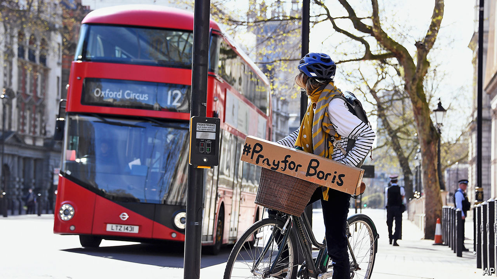

## Britain’s shaky government

# Boris Johnson’s illness will test Britain’s constitution

> It makes no provision for a prime minister’s long-term absence

> Apr 8th 2020

Editor’s note: The Economist is making some of its most important coverage of the covid-19 pandemic freely available to readers of The Economist Today, our daily newsletter. To receive it, register [here](https://www.economist.com//newslettersignup). For our coronavirus tracker and more coverage, see our [hub](https://www.economist.com//coronavirus)

AFTER A WEEK or so of sickness, during which they seemed to stabilise, patients suffering from covid-19 often then take a turn for the worse. So it has been with British politics. On April 5th, 13 days into a new life of strict lockdown and a daily rhythm of crisis meetings and press conferences, Downing Street announced that Boris Johnson had been hospitalised. The virus was attacking government itself.

The prime minister worked from his bed, but the following afternoon his condition deteriorated. He was given oxygen treatment, and taken into an intensive care unit “as a precaution”. He relayed a message that Dominic Raab, the foreign secretary and first secretary of state, should deputise for him “where necessary”.

As The Economist went to press, his office said he was “stable overnight and remains in good spirits”. He has not been put on a ventilator. Donald Trump said he had directed American drugs companies to provide the prime minister’s doctors with experimental treatments. Downing Street’s polite rejection of the offer allowed it to reiterate its support for the institution at the centre of the effort to combat the disease: “We’re confident the prime minister is receiving the best possible care from the National Health Service.”

For every covid-19 patient who has so far been discharged alive from critical care, another is dead. Those who, like Mr Johnson, don’t require ventilation in their first 24 hours have a much better chance of survival. And Mr Johnson is somewhat younger than the average patient: 55 compared with 60, and, though overweight, with no underlying health problems. Yet as Derek Hill, professor of medical imaging science at University College London, says, “There is no doubt this turn of events means Boris Johnson is extremely sick.”

Mr Raab now runs a war government from his desk in the Foreign Office. He said the prime minister has left “very clear plans” for running the government in his absence. He is chairing a daily meeting of the “c-19” cabinet, which, aside from the prime minister and senior officials, is made up of Rishi Sunak, the chancellor of the exchequer, Michael Gove, the cabinet office minister, Matt Hancock, the health secretary, and Mr Raab. Those four run the subcommittees on the economy, the wider public sector and critical infrastructure, health and foreign relations. Much business is done over Zoom, a videoconferencing app, as Mr Gove is self-isolating at home after a member of his family fell ill. So is Dominic Cummings, Mr Johnson’s senior aide, who has symptoms of the virus.

Up to now, the government’s performance has been mixed. Mr Johnson’s approval ratings soared as the crisis hit Britain, in common with other leaders, in evidence of the “rally round the flag” phenomenon that often occurs during crises. Some aspects of the management of the crisis are going well—the NHS has, for instance, rapidly expanded places in intensive care units, and the lockdown has worked better than many had feared. But the government has faced criticism for moving too slowly in imposing social-distancing measures and over its failure to implement a widespread testing regime to track the spread of the virus.

Divisions have appeared within the cabinet. There has been rivalry between Mr Gove and Mr Hancock over who takes precedence in the campaign to combat covid-19, and on April 7th Mr Raab distanced himself from a promise by Mr Hancock to reach a target of 100,000 tests every day by the end of the month, implying that Mr Hancock would be held accountable if the target is not met.

Disunity in government is never a good thing; in a time of crisis, when the leader is absent, it can be disastrous. And the government has a critical decision coming up.

By April 13th, ministers will need to decide whether to extend or relax the initial three-week lockdown. Chris Whitty, the chief medical officer, said there should be no talk of relaxation until Britain is beyond the peak of the outbreak, but Mr Sunak is known to be deeply worried about the speed with which the economy is shrinking. Gus O’Donnell, a former cabinet secretary, says the civil service will hanker for the prime minister to return and wield his authority.

Should Mr Johnson’s health worsen, the constitution could prove to be a problem. It makes no provision for a prime minister’s long-term absence or death. The Cabinet Manual, a handbook for government last updated in 2011, is silent on the issue.

Britain’s security state has sought to fill the gaps left by the constitution. During the cold war, the prime minister would appoint “nuclear deputies” responsible for retaliation if London were vaporised. The practice was revived by Tony Blair after 9/11. Mr Raab will chair the National Security Council in the prime minister’s absence. Mr Johnson’s instructions to Britain’s nuclear submarine fleet in case Britain is wiped from the map—known as the letters of last resort—will remain in force.

But the death of a prime minister in office, which has not happened since 1865, would cause serious problems, according to Vernon Bogdanor, professor of history at King’s College London. Mr Raab’s title of first secretary of state is a largely honorific indication of seniority and does not entitle him to claim the top job. A man with a reputation for coldness in a parliamentary party that favours collegiality, he would not be a popular choice.

The queen appoints as prime minister whoever can carry the support of the House of Commons—normally the leader of the largest party. Conservative Party rules require that the leader is elected by the membership. That would take too long, so a decision would need to be made on whether the new prime minister should be chosen by the cabinet or by a ballot of Conservative MPs, which is how the party got its leaders before 2001. Speed is of the essence, and the cabinet would be faster, but given the rivalries within it, hostilities might break out into the open. MPs, along with the entire nation, will be fervently hoping that it does not come to that.■

Dig deeper:For our latest coverage of the covid-19 pandemic, register for The Economist Today, our daily [newsletter](https://www.economist.com//newslettersignup), or visit our [coronavirus tracker and story hub](https://www.economist.com//coronavirus)