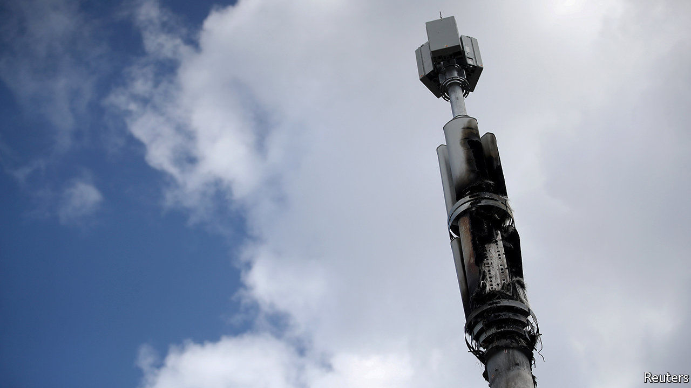

## Misinformation and mobile networks

# How 5G conspiracy theories used covid-19 to go viral

> Paranoid Britons are burning down mobile towers

> Apr 8th 2020

FOR AS LONG as there have been mobile networks, there have been health concerns about the radiation they emit. At first, people worried they would cause cancer. The fifth generation of networks, or 5G, aroused fears of headaches, rashes and severe skin burns.

Lack of evidence has not put paid to these suspicions. Last year councils in Frome, Glastonbury and Totnes banned the rollout of the technology, backbenchers in Parliament debated the matter, and EE, a mobile network, had so many concerned calls that it dedicated a team to dealing with them.

Covid-19 has given conspiracy theorists a new angle. Some pointed out that Wuhan, where the virus originated, was also one of the first cities in China to get 5G coverage. That was where their relationship with reality came to an end.

Several strains of the theory have emerged. One is that 5G weakens immune systems, another that it inhibits oxygen intake, exacerbating the disease, a third that covid-19 does not exist but is a cover for 5G-related diseases that governments are trying to hush up. Amanda Holden, a TV personality, tweeted a (now-deleted) petition linking 5G with coronavirus. On April 7th, YouTube removed an interview with David Icke, a conspiracy theorist, repeating the story, and said it would ban all such content.

The theories have spread like wildfire in Africa, America and Europe, says Hanna Linderstal of Earhart, a security and risk-management firm, with Europeans the most enthusiastic proponents. Last week, they led to literal fires: mobile networks’ tower masts were set alight in Birmingham and Merseyside. Workers laying fibre-optic cable have been harassed in the street.

Ms Linderstal analysed dozens of videos on social-media platforms. Many of them contain “expert advice” on “how you cure the virus with cold air and move away from 5G antenna or even destroy the 5G antenna to save your family”. Though the videos’ origins are unclear, the people spreading them are mostly worried rather than malign, she says. Yet at a time when Britons are stuck at home and unusually reliant on mobile networks and broadband to connect to the outside world, the actions of a small group of scared citizens risk causing real harm—unlike the tower masts they are burning down.

## URL

https://www.economist.com/britain/2020/04/08/how-5g-conspiracy-theories-used-covid-19-to-go-viral
