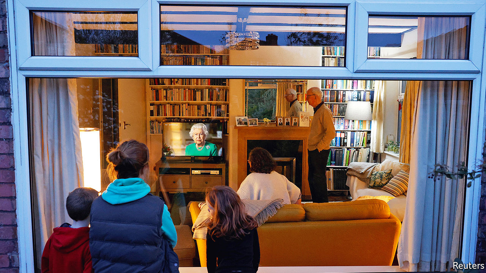

## Public order

# How to build social consensus around lockdown

> Having a queen and a National Health Service helps

> Apr 11th 2020

Editor’s note: The Economist is making some of its most important coverage of the covid-19 pandemic freely available to readers of The Economist Today, our daily newsletter. To receive it, register [here](https://www.economist.com//newslettersignup). For our coronavirus tracker and more coverage, see our [hub](https://www.economist.com//coronavirus)

THE QUEEN does not give interviews. Nor, indeed, does she say much in public at all, apart from her annual Christmas address. So it speaks to the gravity of the moment that she gave a special broadcast—only the fifth of her 68-year reign—on April 5th. Wearing the pearl necklace that came out for previous such broadcasts, during the Gulf war, to mark her Diamond Jubilee and on the deaths of her mother and Princess Diana, she reminded the 24m compatriots who tuned in to hear her of the country’s wartime resolve. “We will succeed,” she insisted.

This was her answer to a central question confronting the government: how to ensure compliance with a lockdown without resorting to force? Other countries face a similar challenge, but it is more acute in Britain, which has a long tradition of individual liberty and policing by consent. Identity cards are the norm in Europe, but opposition from civil-liberties groups in Britain has prevented their adoption.

The lockdown in Britain is looser than elsewhere. In Paris, daytime exercise is banned, and in Madrid, residents resort to working out on balconies. Even relatively gentle attempts by the police to halt the spread of the pandemic have prompted ridicule and accusations of overreach. “This is essentially voluntary,” says Gus O’Donnell, a former head of the civil service. “We know we couldn’t enforce it.” As sunshine and the looming Easter holidays tempt people outdoors, ministers are relying mainly on co-operation to keep the country under voluntary house arrest.

One tactic is shame. Tabloid newspapers rage at “covidiots” for such sins as sunbathing in parks, setting up barbecues and visiting tourist spots. Catherine Calderwood, Scotland’s chief medical officer, made a televised apology for contravening her own advice by twice visiting her second home; she later resigned. Some councils have closed parks, citing the misbehaviour of a minority. Matt Hancock, the health secretary, has hinted that such rule-breaking might lead to a ban on outdoor exercise.

The evidence suggests that guilt can be a useful public-health tool. But ministers risk alienating people who may just be doing their best to follow the guidance. Shoppers who have emptied supermarket shelves, for instance, do not think of their actions as hoarding but as stocking up on essentials during a crisis, points out John Drury of Sussex University.

Efforts to shame those who do not follow the rules could also prove counterproductive. Psychologists reckon people are likely to copy others’ behaviour in times of crisis. So reports of gatherings may encourage citizens to break the rules. “If you show images of people crowded on Brighton beach, people will think the done thing is to go out and do that,” says Hanna Zagefka, a social psychologist at Royal Holloway, University of London. Footage of deserted town centres would, she believes, be more effective in encouraging compliance. Jeremy Hunt, a former health secretary, says communications should play to people’s desire to be seen doing the right thing. “The best way to get people not to drop litter is to say, ‘Most decent people pick up their litter’,” he says.

Another approach is to emphasise that this is a national effort in which everybody plays a part. The queen made several references to the second world war, invoking tropes of collective sacrifice and “quiet good-humoured resolve”. A scheme to recruit volunteers to the National Health Service was oversubscribed threefold, suggesting it might be as useful in boosting morale and letting folk feel they are contributing as in supplying manpower. The wartime Home Guard, made up of platoons of men too old to fight, was intended to keep up spirits as much as to create a back-up defence force. As Edward Grigg, a minister, recognised at the time, “action raises morale.”

The NHS, long beloved of Britons, has assumed totemic status. Cabinet ministers, celebrities and members of the royal family join a nationwide “clap for carers” every Thursday evening. Even from his hospital bed, Boris Johnson tweeted that NHS staff are “the best of Britain”. The breadth of this veneration ensures that public-health messages are not dependent on support for a particular politician or party. “Britain has got an advantage in that the NHS is so important for British self-definition,” says Ms Zagefka. Government advertisements urge Britons to stay at home to “protect the NHS”.

A final way to boost compliance is to stress the benefit to others. The broad range of outcomes of those who contract covid-19 risks exacerbating optimism bias, notably among the young, who are less likely to die from the virus. Communicating the message that even asymptomatic people can spread it, with disastrous results, is important. In a recent article in the Lancet, a medical journal, several psychologists concluded that such a message would mitigate the damage quarantine might do to mental health as well as improving adherence.

For now, the lockdown seems to be holding. Polls by Ipsos MORI suggest compliance with official advice is increasing week by week. In mid-March, about a quarter of Britons said they were avoiding leaving the house more often because of covid-19. A week later, that share had risen to half, and by the end of the month to nearly four-fifths. “The story of this is just how high the compliance has been,” says Lord O’Donnell. “Who would have thought that in a liberal democracy so many people would do what they are told?” Ministers will be anxious to keep it that way.■

Dig deeper:For our latest coverage of the covid-19 pandemic, register for The Economist Today, our daily [newsletter](https://www.economist.com//newslettersignup), or visit our [coronavirus tracker and story hub](https://www.economist.com//coronavirus)