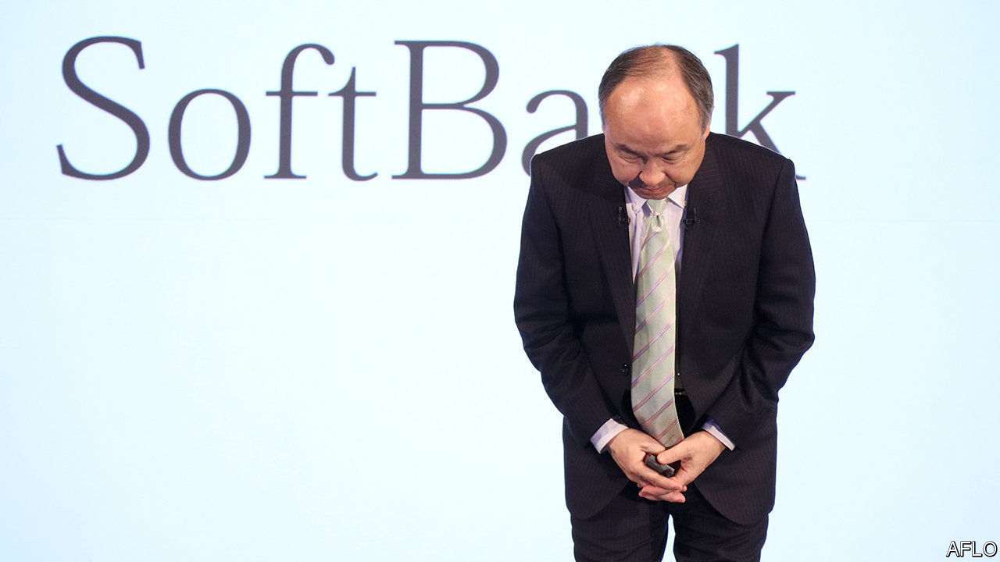
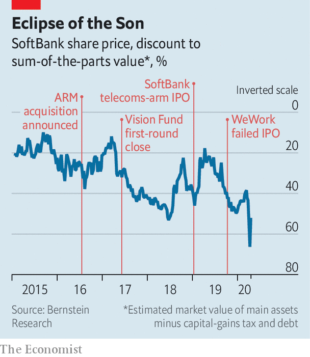

## SoftBank and sensibility

# Is SoftBank’s boss changing his ways?

> Meet the new Son Masayoshi

> Apr 8th 2020

“STONE-COLD crazy” was how a private-equity boss described the $1.7bn golden parachute that SoftBank, a Japanese conglomerate, gave Adam Neumann, co-founder of WeWork, as part of the co-working empire’s bail-out last autumn. SoftBank appears to have come to its senses. On April 2nd it scrapped a deal to buy up to $3bn in WeWork shares, which would have made Mr Neumann a billionaire. SoftBank says American government probes into WeWork, whose initial public offering imploded in part over governance concerns, mean it doesn’t have to make the purchase. Two WeWork shareholders who would have benefited from the deal are suing SoftBank; Mr Neumann has yet to respond.

Breaking with Mr Neumann is just one example of a new, sober Son Masayoshi. In March SoftBank’s billionaire boss manoeuvred to reduce risk at his company. It is to sell $41bn of assets over 12 months to fund an $18bn share buy-back and pay off $23bn of debt. He may part with some of a prized 26% stake in Alibaba, a Chinese e-commerce titan. He even let a beloved startup go bust. OneWeb, which filed for bankruptcy on March 27th, planned to transmit broadband from satellites—a key part of Mr Son’s vision of ubiquitous connectivity.

He is under pressure to make concessions. Over the past few years SoftBank took on more debt. Mr Son spent $52bn to buy Sprint, an American telecoms group and Arm Holdings, a British chip-designer (SoftBank has just sold Sprint to T-Mobile, a telecoms rival). He then set up a $100bn tech-investing vehicle with cash from SoftBank, Saudi and Emirati sovereign-wealth funds, and a few private-sector investors. He splurged $75bn from it on stakes in 88 big tech startups (including WeWork).

As investors took fright at heavily indebted firms amid a pandemic-related market sell-off, SoftBank’s vital signs weakened. In February and March the cost of insuring its debt against default leapt by 2.72 percentage points. Standard & Poor’s, a credit-rating agency, cut SoftBank’s outlook to negative. The gap between SoftBank’s market value and that of its main underlying assets, such as its Alibaba stake, widened to 66% (see chart). That led Mr Son to announce the $41bn asset sale. Then Moody’s, another rating agency, added a two-notch downgrade, far into junk territory: selling prize assets amid a markets rout, it implied, looked desperate.

As long as Mr Son can pull off the asset sale and cut debt, says Mary Pollock of CreditSights, a research firm, SoftBank’s balance-sheet will emerge stronger. The Alibaba stake is still a get-out-of-jail-free card, she says. For the time being, Mr Son has probably eased fears about his entire empire collapsing under its weight of debt.

That will not stop investors worrying. If Vision Fund firms run into trouble during the pandemic, they fear, SoftBank may rescue them, as it did WeWork, which got $1.5bn on top of the cancelled share purchase. The fund has $15bn left for follow-on investments, enough for a few years. SoftBank has put in $27bn and pledged another $6bn. It could end up coughing up more.

“Masa is a visionary who loves big projects, and founders get star-struck by him,” says an investor close to SoftBank. “This needs to be tempered to be sustainable.” Mr Son overrode colleagues who asked about cashflow and profits at portfolio companies. Now things are changing at the Vision Fund, too. The dissenters are taken more seriously and the fund is being harder-headed. Firms are being asked to find other sources of capital. Profit, not just growth, has become more of a priority. Governance at certain firms is being scrutinised, sometimes at the behest of the two big Gulf investors, says a person close to the funds.

The Vision Fund could continue spilling red ink over SoftBank’s accounts for a while. In the last quarter of 2019 its $2bn loss all but wiped out the group’s profits. As markets tumble, unlisted startups will lose value in line with listed firms. But some of its companies, notably in e-commerce and health care, are thriving. Business at Coupang, a South Korean e-commerce firm, has soared. Vision Fund executives see Bytedance, the parent of TikTok, a video-sharing app, as another Alibaba in waiting.

Venture capitalists liken Mr Son to a Mississippi riverboat gambler. His risk-loving style is not going away, they say. But his recent losing streak will force him to play things safer—for a while.■

## URL

https://www.economist.com/business/2020/04/08/is-softbanks-boss-changing-his-ways
