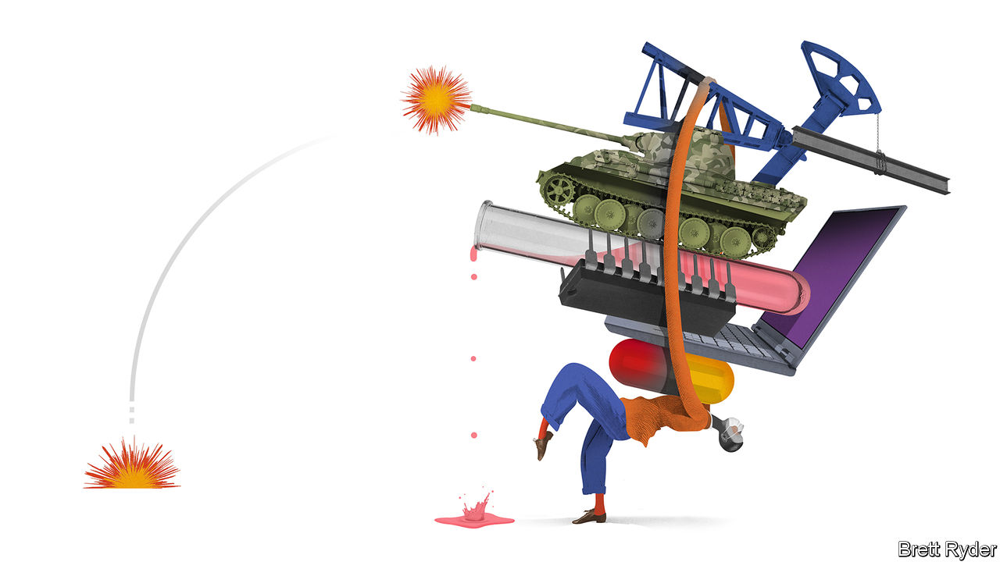

## Schumpeter

# Strategic pile-up

> The idea that some industries are too important to leave to markets is back on the agenda

> Apr 8th 2020

“IF WE LEARN anything from this crisis, [it is that] never again should we have to depend on the rest of the world for our essential medicines and counter-measures,” thundered Peter Navarro, a White House trade adviser, on April 3rd. A few days later President Donald Trump pressed 3M, an American multinational which makes medical masks, to divert more of them home, at the expense of other countries. 

Mr Navarro and his boss are knee-jerk protectionists. But with the market for masks broken by covid-19 (see [article](https://www.economist.com//finance-and-economics/2020/04/11/many-economists-defend-disaster-profiteers-they-are-wrong)), their worries are understandable. So are similar noises by other national leaders. Emmanuel Macron, the French president, often painted by critics as a free-trading neoliberal, has called relying on others for food supplies “madness” and his finance minister instructed supermarkets to buy only domestic produce. The EU has curbed exports of some medical gear. India, the world’s biggest maker of generic drugs, has done the same with hydroxychloroquine, an antimalarial drug that some suggest (with little evidence) might treat covid-19. Countries from Kazakhstan to Vietnam have cut food exports, leading the UN to warn of shortages. 

Many of the restrictions will be lifted once the pandemic has passed. But not all, for the virus has reinforced an old idea that was already gaining ground again: that in an uncertain world, some industries are “strategic”, simply too important for countries to leave to unfettered markets, and so deserving of special protection. The notion is attractive in theory, but perilous in practice. 

If the copious academic literature on strategic industries has a conclusion, it is that no one can agree on what counts as one. The narrowest definition covers sectors directly vital to war-fighting: makers of weapons and of stuff needed to forge them (steel) and operate them (energy). Even in the tightly integrated EU most countries shield national defence firms. At its most expansive, the concept can encompass any economic activity, since all of it contributes in some roundabout way to a state’s defensive capability. Everything is strategic in North Korea.

Many reasonable opinions fall somewhere between these two extremes. After the first world war Britain created the Forestry Commission to ensure a strategic supply of timber. Today America and China treat things like computer chips, artificial intelligence or genetic engineering as strategic. A government body called the Committee on Foreign Investment in the United States (CFIUS) scrutinises the national-security implications of deals involving American firms. Worried about losing strategic assets cheapened by the market rout to foreign buyers, Australia has just tightened its takeover rules. The EU is urging member states to do the same in sectors like utilities and transport.

In principle such rules are sensible. The trouble begins when their opacity—CFIUS rules, for instance, are notoriously hazy—allows politicians to extend the definition of “strategic” to include things that are tied not to national survival, but to perceived national greatness. Governments have long pampered loss-making national airlines, sometimes pretending that this has to do with the strategic importance of aircraft. In 2005, after PepsiCo briefly eyed Danone, a French yogurt-maker, France’s government vowed to protect it and other “strategic” companies from foreign suitors.

Many businesses covet the designation. No wonder: it can be a ticket to cushy cost-plus contracts (think Boeing), state subsidies (Chinese national champions like Huawei) and protection from irksome foreign competitors (just about anyone). And with a little ingenuity, almost any firm can argue its products deserve the label. After all, who can predict what will be useful in a crisis? In the second world war Britain retooled its furniture factories to produce parts for the Mosquito, a capable wooden fighter-bomber. Amid the current pandemic LVMH, a French luxury group, is turning some perfume factories over to make hand sanitiser.

Still, governments should resist indulging firms too liberally, for two reasons. First, sheltering them behind national-security arguments is, like all protectionism, expensive. The semiconductor industry, for instance, is ferociously high-tech. Its planetary-scale supply chain comprises ultra-specialised companies in Taiwan, Japan, South Korea and the Netherlands, each spending billions on research. Even a superpower would struggle to replicate all this within the borders of a single country, as America and China have both discovered. Makers of generic drugs are easier to nurture at home. But even there, global supply chains have arisen because they are efficient. Unwinding them will thus be costly, and the costs will be borne by consumers and taxpayers.

So will those stemming from protected firms’ tendency to grow bloated, inefficient or—as has happened with Boeing’s ill-fated 737 MAX plane—potentially dangerous. All this, critically, also makes them less able to respond effectively when a crisis does strike. 

The second reason for governments to go easy on strategic protectionism is that it risks ushering in the baleful logic of the prisoner’s dilemma. Actions that appear to be in the interest of individual countries lead to a nationalistic, distrustful world that is bad for everyone. The present scramble for medical equipment is causing bitter rows, even between allies. Germany has accused America of diverting shipments of face-masks bound for Europe, decrying its actions as “modern piracy” and “Wild West tactics”. After the EU’s ban on the export of medical equipment, Aleksandar Vucic, Serbia’s president, declared that European solidarity “does not exist”.

The more that some states pursue such policies, the more it becomes rational for others to do the same. That risks leaving the world divided in the face of the next crisis, whether that is another pandemic, the next financial crash or a slow-burn disaster such as climate change. A few industries may indeed be “strategic”. But governments should anoint them cautiously. ■

## URL

https://www.economist.com/business/2020/04/08/strategic-pile-up
