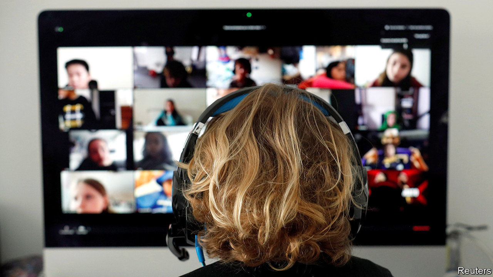

## Zooming in, Zoom out

# Zoom’s popularity has brought problems

> The videoconferencing service is facing increased scrutiny

> Apr 8th 2020SAN FRANCISCO

ERIC YUAN likes to crack jokes. But these days the boss of Zoom, a videoconference service of coronavirus-fuelled popularity, is in no mood for laughs. His firm, whose share price has surged by 49% since the end of January, is trying to avoid a serious case of whiplash.

Zoom, founded in 2011, is part of a trend in tech known as “the consumerisation of IT”. The idea is that corporate services should be as easy to use as consumer ones. Meetings on Zoom can be called with a few clicks and are free if they last no longer than 40 minutes and have fewer than 100 participants. Zoom also keeps oodles of spare capacity, ensuring a good service. Its 17 data centres around the world were built to withstand double the expected peak load. But as a consumer-business hybrid the company has focused much less on privacy and security than old-style corporate-IT firms.

The combination became a problem after the coronavirus hit. The number of daily users has exploded from 10m in December to more than 200m today. This is technically manageable. But with popularity comes scrutiny. Worrying reports come almost daily about data leaks, iffy encryption and “zoombombing”, the childish practice of gatecrashing meetings and showing porn or worse. “I really messed up,” admitted Mr Yuan on April 3rd, promising that the firm would make amends.

Zoom has every reason to relieve the tension inherent in a model that aims to provide a corporate service but is now used by people stuck at home and craving contact with the world beyond. Unless it does so it will create an opening for more business-oriented services, in particular Microsoft Teams, whose video service lags behind Zoom both in quality and popularity.

Rivalry between Zoom and Teams highlights a battle that has been brewing for a while. On one side are firms that provide specialised tools for online collaboration, such as Zoom and Slack, a corporate-messaging app. On the other are those that offer a complete range of such services, like Microsoft and Google. If, as many predict, working remotely becomes far more common even after the virus recedes, the competition to create the virtual office will intensify. Expect to hear more about Microsoft trying to entice customers into its world—and startups complaining that the ex-evil empire is back to its old tricks.■