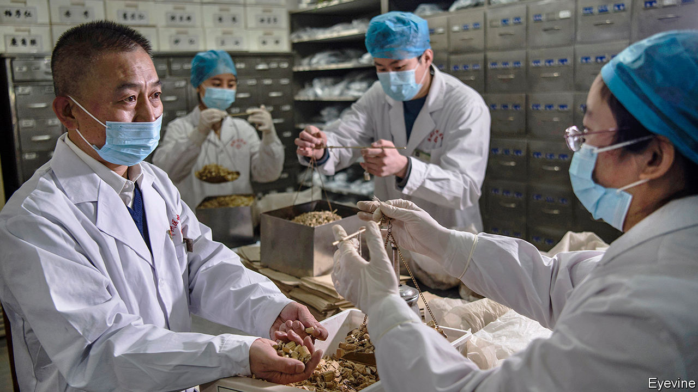

## Fighting it the Chinese way

# China backs unproven treatments for covid-19

> Traditional medicine is not just a placebo, claims the government

> Apr 11th 2020BEIJING

Editor’s note: The Economist is making some of its most important coverage of the covid-19 pandemic freely available to readers of The Economist Today, our daily newsletter. To receive it, register [here](https://www.economist.com//newslettersignup). For our coronavirus tracker and more coverage, see our [hub](https://www.economist.com//coronavirus)

WANG DASHAN (not his real name), a bus driver from Hubei province, thinks a herbal broth may have saved his life. The yellow-brown tonic, made by a large state-owned company, was one of several traditional remedies that doctors used to treat Mr Wang during the two weeks that he spent with covid-19 at a makeshift hospital in Wuhan, the provincial capital. He says his cough and fever subsided a few days after he started drinking it. He does not think he would have got better on his own, though most patients with the coronavirus recover.

Around the world officials are advising people to be wary of alternative treatments for covid-19. The opposite is true in China, where remedies known as traditional Chinese medicine, or commonly, TCM, are being heavily promoted by the state. In January, as the crisis escalated, the health ministry listed TCM treatments among those it recommended for the disease. It sent nearly 5,000 specialists to Hubei to administer them to patients (including sufferers at a sports centre in Wuhan that was turned into a TCM hospital for people with mild symptoms). On March 23rd a senior official from the government’s TCM administration said more than 90% of all sufferers of covid-19 had received traditional therapies, and these had been “effective” 90% of the time. She offered no data to support this claim.

The epidemic has subsided in China. On April 8th Wuhan, the worst-affected city where the covid-19 outbreak took off, lifted its cordon sanitaire (it closed its 16 field hospitals, including the TCM one, in March). Now China is keen to promote its remedies abroad. TCM practitioners have joined Chinese medical teams sent to help manage outbreaks in Cambodia, Iraq and Italy. The government says it has donated traditional medicines to other countries, too. Global Times, a newspaper in Beijing, says 90,000 people from 64 countries joined a recent conference-call to learn from Chinese TCM specialists how they battled the virus. In mid-March state media quoted a Tanzanian health official saying that China’s use of TCM for covid-19 may be “a model” for Africa to follow.

China’s government does not promote using only TCM. Those with serious symptoms of covid-19 are given conventional treatment. TCM practitioners seldom deny that what they call “Western medicine” is useful, especially for acute illness. But the government does claim that TCM is more than just a palliative or placebo. In a white paper issued in 2016, it called TCM a “medical science” and said the time had come for it to “experience a renaissance”.

TCM is about far more than herbal remedies such as Mr Wang’s soup (among its ingredients are betel nuts, almonds and Ephedra sinica, a plant used in China for centuries to treat flu). It includes acupuncture and moxibustion (the burning of dried plant materials near the skin). It can also apply to slow-motion kung-fu-like exercise known as qigong, which is supposed to cultivate a mystic energy in the body known as qi—TCM blends into the occult. Patients at Wuhan’s TCM field hospital performed mass qigong routines.

For most people, all this is harmless. But the government’s hard sell of TCM presents two main dangers. One is that some people prefer it to conventional treatments that, unlike TCM therapies, are proven to save lives. The other is of a threat to wildlife. Animal parts are often considered vital components of TCM. The government bans the use of endangered species, but there remains a widespread belief that tiger penis, rhinoceros horn and other parts of rare animals have powerful medicinal properties.

The use of animals sometimes involves appalling cruelty. One of the TCM remedies that the health ministry has recommended for use in the treatment of covid-19 patients includes powdered bear bile. In China this is often extracted from live bears kept in grim farms even though its active ingredient can be created synthetically. In February China banned the sale of wild animals as food—close contact in markets between live specimens and merchants may have helped the coronavirus to leap from animal to human. But the new rules do not prevent trappers and breeders from selling animal parts for use in TCM.

There is huge demand for it, fuelled by the government’s health-insurance schemes which cover some TCM remedies. Spending on TCM accounts for 40% of China’s drug market, according to analysts at Jefferies, a bank. Nearly 15% of China’s hospitals specialise in traditional treatments. Of more than 8.4m hospital beds in 2018, 1.2m were in such facilities. There are more than 700,000 people who practise traditional medicine or dispense it.

China’s leaders support this partly for reasons of national and cultural pride. TCM has ancient origins, drawing on treatises dating back 2,000 years or more. President Xi Jinping has been particularly keen to promote such pride and redefine the Communist Party as an embodiment of ancient wisdom. China must “adhere to using Chinese medicine alongside Western medicine” in the fight against the coronavirus, he said last month.

Officials do not say that traditional remedies can cure covid-19. But they do claim that TCM can reduce death rates by preventing patients with mild or moderate symptoms from developing more serious ones. They also say that TCM can speed up recovery. A website set up by China Daily, a state newspaper, called “Fighting covid-19 the Chinese way”, says that TCM can “remove the trash which causes illness”, leaving the virus “no room to survive”.

TCM enjoys some cover from the World Health Organisation. Last month the WHO deleted advice it had posted on its website saying that herbal remedies were not effective against the coronavirus and might be harmful. It said the statement it had issued was too “broad”. In a report published in 2014 it said that traditional medicine was “an important and often underestimated” resource and that such remedies, if of “proven quality, safety and efficacy”, could help plug gaps in health-care provision. That, however, would rule out much TCM. ■

Dig deeper:For our latest coverage of the covid-19 pandemic, register for The Economist Today, our daily [newsletter](https://www.economist.com//newslettersignup), or visit our [coronavirus tracker and story hub](https://www.economist.com//coronavirus)

## URL

https://www.economist.com/china/2020/04/11/china-backs-unproven-treatments-for-covid-19
