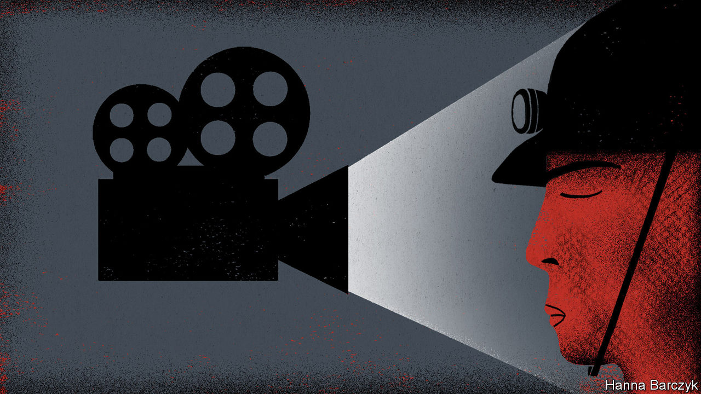

## Chaguan

# China stifles documentary-makers, but their art still shines

> A director makes personal appeals to strangers to download his hard-hitting film

> Apr 11th 2020

IF INDEPENDENT documentary-makers in China are squeezed much harder by the authorities, their plight will soon be a question fit for philosophers. Namely, if a film has no viewers, in what meaningful sense does it exist?

For some years now, the makers of non-fiction films have understood that, without the letter of approval from censors that they call a “dragon seal”, their work will reach only a handful of hardy Chinese fans—perhaps via a semi-underground film screening at a bar near a university, or in a small festival sponsored by a foreign diplomatic mission. Losing money is taken for granted.

Even so, documentary enthusiasts were shocked to realise in late March that a respected film-maker was quietly distributing his latest work by sending individual strangers instructions on how to get it from the internet, without paying. These download links arrived as private messages from the director, Jiang Nengjie, to film-lovers who clicked a button marked “Want to watch” when reading about his new project on Douban, a leading review site. Mr Jiang’s documentary* is called “Miners, the Horsekeeper and Pneumoconiosis”. It is about coal workers afflicted with a fatal lung disease. Shot over eight years, the film takes viewers down illegal mine shafts in the central province of Hunan, inside shabby rural clinics and, finally, into a village home where children watch their father fighting to breathe, like a man drowning on dry land. The work has sparked a revealing debate. There have been scattered attacks from nationalists on Weibo, a microblog platform, one of whom demanded Mr Jiang’s arrest for his “enraging” refusal to show China’s good side. Overall the film has a high rating from Douban’s users. A supporter earned 40,000 likes and 2,000 comments with a post on Weibo expressing shock that Mr Jiang was giving work away free. “Shit, independent film-makers have it so rough!” it said. Some users sent Mr Jiang the cash equivalent of a cinema ticket.

This is not dissident art. The documentary offers no political opinions about the Communist Party. It eavesdrops on miners who talk of the authorities with wary cynicism and resignation, rather than love or conspicuous dislike. The state is mostly conspicuous by its absence. To avoid unseen inspectors, miners move at night and dig illegal pits on mountain tops in weather too cold for any official to brave. “Corruption cannot be solved,” a villager sighs. “There are still many corrupt officials.” Mr Jiang’s film has no voice-over. The contrast is striking with state television documentaries featuring bossy, relentless narrators declaiming upbeat slogans. This is film-making that is content to show, not tell.

Reached by telephone, Mr Jiang insists that he has cautious, limited ambitions for his work. Many of those who appear in his new film are his own relatives, for he was born in the mountains of rural Hunan in 1985. China’s millions of pneumoconiosis sufferers need more help from health officials, he says. “I want more people to know about them. To see them.” A film-maker since 2009, he supports his documentary projects by videoing weddings and commercial events. He did not consider entering this film for a foreign festival, as too much attention can be troublesome. Mr Jiang did not ask censors to approve the work, knowing that they would either say no, or demand a long list of edits. “I’d have to turn my film upside down, and I don’t want that.”

Some Chinese film-promoters have given up all ambitions, as political controls tighten remorselessly under President Xi Jinping. In January the China International Film Festival, an influential event first staged in the eastern city of Nanjing in 2003, announced it was suspending operations indefinitely. Organisers called it impossible to hold a truly independent film festival, after 20 years of relative openness.

Karin Chien co-founded dGenerate, a film-distribution company, to bring uncensored Chinese works to worldwide audiences. “That was in 2008, and we didn’t know then it was a golden age,” explains Ms Chien. Technology helped. She watched hundreds of independent films emerge from China as artists, poets and other writers picked up digital video-cameras. She recalls the ingenuity of the Beijing Queer Film Festival which in 2014 staged a screening-on-rails by telling festival-goers to take a specific train, to bring laptops and sit in the same carriage. There, memory sticks were handed out so all could watch the opening film together. Since about 2014, alas, she has seen a steady stream of film-makers emigrate from China. Some others surrender to commercial forces.

The power of documentaries to shake public opinion in modern China has been shown more than once. In 1988 state television broadcast “River Elegy”, a six-part call to embrace outside influences and break with stifling traditions. The questions it raised were echoed by the protesters in Tiananmen Square the next year. In 2015 “Under the Dome”, a scathing documentary about air pollution, was viewed online hundreds of millions of times and praised by China’s new environment minister, before censors swooped. It is hard to imagine either work being screened today.

Independent documentaries offer a sense of immediacy and of bearing witness “on the spot”, says Kiki Tianqi Yu, a Chinese film-maker who is a lecturer in London. Film–makers document history that the government will not, she adds. Those Chinese who are likely to hear about and see non-approved documentaries are a rather privileged bunch: university students, intellectuals, art-lovers, urban professionals and the like. Mr Jiang’s new film lets them hear a gruff ex-miner lament: “My poor little boy. I can’t die. His life will be difficult if I die.” Soon after his 50th birthday though, sensing that his end is near, he tells the camera, “I spat out blood yesterday. Damn it.” Perhaps only a few thousand people in China will see the film. But just for a moment, a father’s pain and fear bridges the gulf that separates urbanites from poor villagers in China, a horribly unequal society. Reason enough for art to exist. ■

* Editor’s note: the documentary described in this column may be seen via this [link](https://www.economist.com/https://www.orientindiefilms.com/content/cast-crew/jiang-nengjie/?from=singlemessage&isappinstalled=0)

## URL

https://www.economist.com/china/2020/04/11/china-stifles-documentary-makers-but-their-art-still-shines
